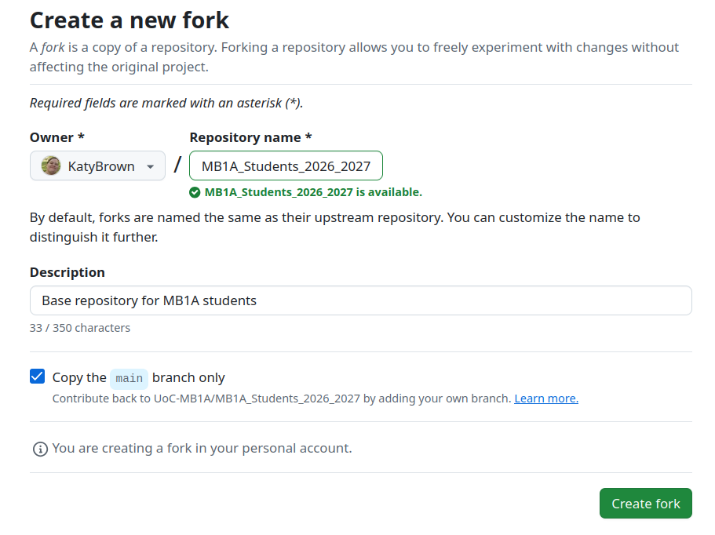
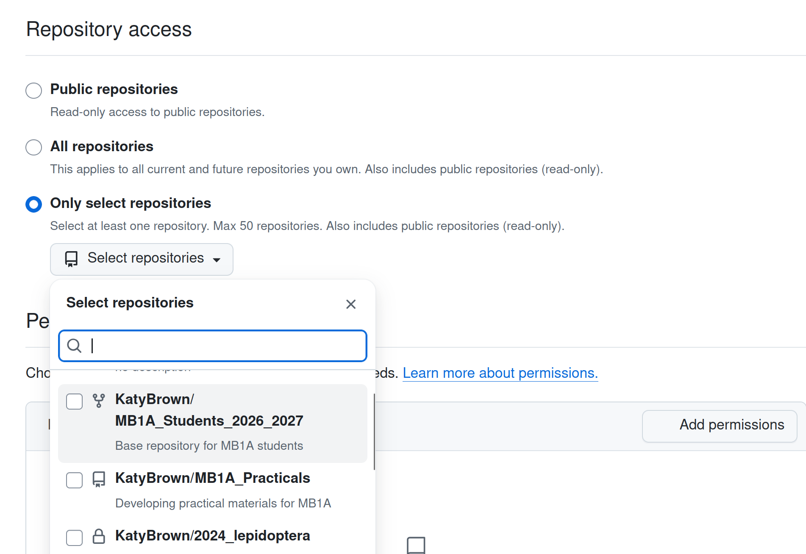
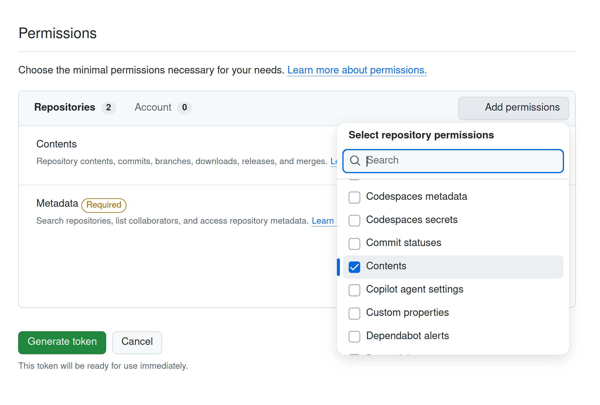
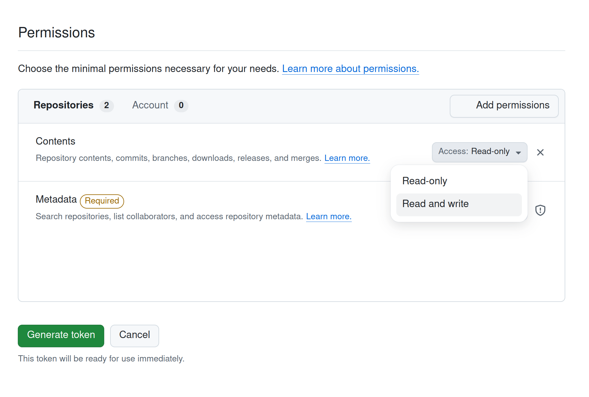
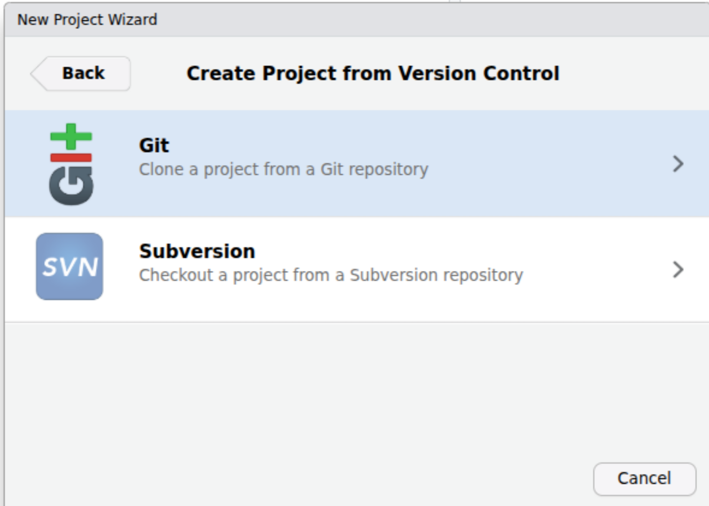

# Setting Up RStudio and GitHub {#sec-p1_setup}

::: {.callout-note .partmenu #parts-0101}
## Sections
- @sec-git_github
- @sec-token
- @sec-setup_rstudio
- @sec-summary_gh
:::

:::{.callout-tip .objectives #objectives-0101}
#### Learning objectives
By the end of this part of the practical you should be able to:

- Explain what Git and GitHub are
- Create a GitHub account and fork a repository
- Set up a personal access token
- Clone your repository into RStudio
:::

## Setting up Git and GitHub {#sec-git_github}

[↑ top](#)

Before we start running code, we should make sure our RStudio session is set up correctly.

In this course, we will use **Git** and **GitHub** to track changes to our code and store the code online. We can use these tools directly in RStudio.

### Git

{#fig-gitlogo .screenshot width="50%"}

[Git](https://git-scm.com/) is a **version control** system for code (and other files). It keeps track of changes you make to your files over time, allowing you to return to earlier versions if something goes wrong. It also makes it easier for multiple people to work on the same project.

Usually, Git is used to track all the changes within a folder, called a **Git Repository**.

### GitHub

{#fig-githublogo .screenshot width="50%"}

[GitHub](https://github.com/) is an **online platform for storing Git repositories**. It lets you back up your work in the cloud, share your code with others, and collaborate on projects. GitHub uses Git to track changes, but also provides additional features.

### Setting up your GitHub account

Throughout this course, you'll use **Git** to record the history of your code and **GitHub** to store a copy of your work online.

This means you'll always have a backup of your work, you'll be able to recover previous versions if you make a mistake, and you'll be learning to use the same tools that are widely used in research and industry.

For the  practicals, we would like you to create a free GitHub account (unless you already have an account you're happy to use).

::: {.callout-important #note-set_up_github}
Please [set up a GitHub account now](https://github.com/signup?source=form-home-signup&user_email=), preferably using your University email address.

You will not need Copilot for these practicals.

Feel free to [turn off or reroute notifications](https://github.com/settings/notifications).

When you have set up your account, please send us your CRSID and GitHub username using [this form](https://forms.cloud.microsoft/e/ddDty0g542).
:::

### Forking the  Students account

Once you have an account, log in and then visit the following page:

[https://github.com//](https://github.com//)

This repository contains all of the data we will use in these practicals and will provide you with a robust, reproducible setup in which to run your code.

At the top of your GitHub browser page, you should see a button labelled `Fork`.

- [Forking](https://docs.github.com/en/pull-requests/collaborating-with-pull-requests/working-with-forks/fork-a-repo) a GitHub repository creates a full copy of everything in the repository inside your own account
- You can change your copy without affecting the original.
- If the original repository is updated, you can sync your fork to copy those changes into your own repository.

Click on the `Fork` button on your GitHub browser page.

{#fig-gitfork .screenshot width="100%"}

On the next page, you should see the following:

{#fig-newfork .screenshot width="100%"}

The default settings are fine for our purposes, choose `Create Fork`.

## Set up a personal access token {#sec-token}

[↑ top](#)

You will also need to set up a **personal access token** which allows your GitHub account to connect to your RStudio session.

To do so, go to the GitHub [Personal Access Tokens](https://github.com/settings/personal-access-tokens) settings page and click on `Generate New Token`.

Give your token the name <code></code>.

In the `Repository Access` section, choose <code></code>

{#fig-token_choose_repo .screenshot}

Under `Permissions` choose `Select repository permissions` and then `Contents`.

{#fig-token_set_permissions .screenshot}

Click on `Access Read-only` in the `Contents` section and change it to `Read and write`

{#fig-token_read_write .screenshot}

Click `Generate token`.

GitHub will give you a code to use as your personal access token. Do not close the page, as you'll need this token shortly.

## Cloning a repository with RStudio {#sec-setup_rstudio}

[↑ top](#)

Now we're ready to load this repository in RStudio. You should already have installed R and RStudio on your computer, following the instructions here: @sec-install

Now we want to import our new fork of the Git repository into RStudio.

To do this, in your RStudio session, select `File` > `New Project`.

{#fig-newrstudio .screenshot}

In the window which pops up, choose `Version Control`.

{#fig-newrstudio_vc width="70%"}

Select `Git - Clone a project from a Git repository`.

{#fig-new_rstudio_fromgit width="70%"}

Copy and paste the URL of your forked repository into the `Repository URL` box.

::: {.callout-important #note-check_fork_url}
Make sure you are using the URL for your forked repository, not the original! Your username should be in the URL. If you're not sure, please talk to a demonstrator.
:::

The rest of the boxes should fill in automatically.

Click `Create Project`.

{#fig-new_rstudio_clone width="70%"}

RStudio will download a copy of your repository (known as a **clone**) and open it as a new project.

You now have a local copy of the practical repository on your computer, where you can edit files, save your work and upload your changes to GitHub.

To see where this folder is saved on your computer, go to the `Files` panel - the bottom right corner of the RStudio interface. You may need to click on the `Files` tab.

Click on `More` then `Show Folder in a New Window`

{#fig-find_proj_folder .screenshot}

Inside this folder there should be a file called `_Students_.Rproj`.

At the start of each practical session, you should follow the instructions below (we will remind you!). You don't need to today, as everything should already be set up.



At the end of each session, you should follow the instructions below (again, we will remind you!). You will need to do this at the end of the session today.



Although this seems like a lot of steps, you'll quickly get used to the workflow. Using Git and GitHub from the start of the course will help you keep your work organised and introduce you to tools that are widely used in research and industry.

## Review {#sec-summary_gh}

[↑ top](#)

::: {.callout-note #note-summary_gh}
## Summary

- **Git** keeps track of changes to your files.
- **GitHub** stores your Git repository online.
- A **fork** is your own copy of an online repository on GitHub.
- A **clone** is a copy of a repository on your computer.
:::
