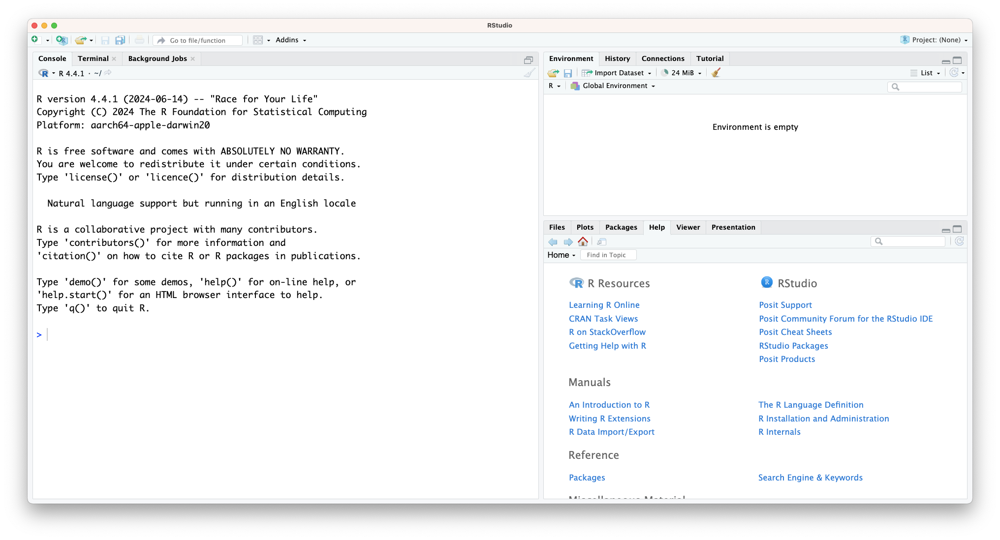
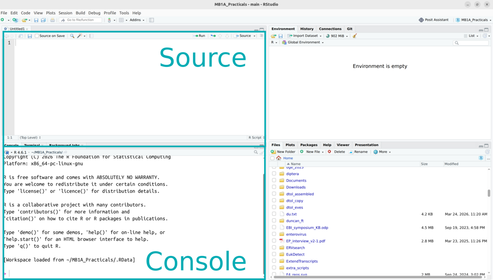

```{r setup, include=FALSE}
library(tidyverse)
```

::: callout-tip
#### Learning objectives
Part 1 - Setup and Introduction
- Setting up and using Git and GitHub.
- Setting up RStudio.

Part 2 - Introduction to R and RStudio
- Introduction to the R language.
- The RStudio interface.
- The console, scripts and notebooks.
- Documenting and formatting your code

Part 3 - Introduction to Data Analysis in R
- Variables and variable names
- Types of variable
- Multi-Element Variables
- Vectors
- Indices
- Data frames
- Introduction to plotting in R

Part 4 - Additional Exercises


:::

## Setting up Git and GitHub

Before we start running code, we should make sure our RStudio session is set up correctly.

For the MB1A practicals, we would like you to set up a free account on the website [GitHub](https://github.com/), unless you already have an account you're happy to use. 
GitHub is 

## The R Language

{#fig-rlogo}

In this session, we will learn the basics of using the programming language *R*, which we will use for data analysis and visualisation throughout the MB1A course.

The R language was initially developed by two programmers, Ross Ihaka and Robert Gentleman, in 1993, for teaching introductory statistics. It has become one of the most commonly used languages in scientific computing, particularly amongst biologists.

## Why Learn R?

R provides many of the same functions as spreadsheet tools such as MS Excel and Google Sheets, and statistics and graphing software like SPSS and GraphPad.

However, R has lots of advantages over these tools:

- It has many additional, powerful functions.
- Repetitive tasks can be automated.
- As a scientist, using a programming language such as R to perform data analysis means that your analysis is *reproducible* by other scientists - everything you have done to process the data is explicitly recorded.

## The RStudio Interface

[RStudio](https://posit.co/products/open-source/rstudio/) is an interactive development environment (IDE) - a piece of software designed to make working with R as easy as possible. It's free, open-source and well-supported.

{#fig-rstudio_main}

In the image above you can see that the window is divided into three main parts, each with various tabs. In clockwise order we have:

1.  **Console** / Terminal / Background jobs
2.  **Environment** / History / Connections / Tutorial
3.  Files / Plots / Packages / **Help** / Viewer / Presentation

In bold we've highlighted the tabs we'll be using most.

In the **Console** we can directly run code. The **Environment** shows any information that is stored in R's memory (empty in the figure above). The **Files** tab is a mini file browser; **Plots** shows you any plots that have been created and **Help** is where you can go for help.


## Running Code in RStudio

The basis of programming is that we create or *code* instructions for the computer to follow. Next, we tell the computer to follow the instructions by *executing* or *running* those instructions.

There are three main ways of interacting with the R language: using the console, using script files (plain text files containing only code), or using Rmarkdown.

### The Console

In the console, commands can be typed and executed immediately by the computer. When you type a line of code and press , it is transferred to the R **interpreter**. Results will be shown straight after the command is executed. However, no record is kept and any information is lost once the session is closed.

Try typing the following into the console, then press .

```{r console_add}
3 + 5
```

You should immediately see the answer.

Now, try the following. Here, you are creating a new **variable**, `x`, with a value of 8. In R, the operator `<-` associates a specific name (here the name is `x`) with a specific value.

```{r console_var}
x <- 3 + 5
```

To see the value of `x`, type `x` into the console, then press .

```{r console_var_res}
print (x)
```

Running code like this directly in the console is generally not a good idea, because then we can't keep track of what we have done.

However, it can be useful, for example to quickly try something or to check the value of a variable.

::: callout-warning
## The R prompt

If R is ready to accept commands, the R console shows a `>` prompt. If it receives a command (by typing, copy-pasting or sent from the script editor using  + ), R will try to execute it, and when ready, will show the results and come back with a new `>` prompt to wait for new commands.

If R is still waiting for you to enter more data because it isn't complete yet, the console will show a `+` prompt. It means that you haven't finished entering a complete command. This is because you have not 'closed' a parenthesis or quotation, i.e. you don't have the same number of left-parentheses as right-parentheses, or the same number of opening and closing quotation marks. When this happens, and you thought you finished typing your command, click inside the console window and press . This will cancel the incomplete command and return you to the `>` prompt.
:::

### Scripts

In your RStudio window, choose `File` > `New File` > `R Script`. This will add a new panel to your RStudio session, the **Source** panel.

{#fig-rstudio_labelled}

Here, we can save our code as a script. This is a list of commands which the R interpreter will execute in order.
The script represents a complete record of what we did, and anyone (including our future selves!) can easily replicate the results on their computer. We can also use a script to repeatedly perform the same or similar tasks.

| Console <i class="fa fa-terminal fa-1x"></i> | Script <i class="fa-regular fa-file-lines fa-1x"></i> |
|------------------------------------|------------------------------------|
| runs code directly | in essence, a text file |
| interactive | needs to be told to run |
| no record | records actions |
| difficult to trace progress | transparent workflow |


In order to write our first script, we need to 


## Working directory

A good way of staying organised is to keep all the files related to a given project together. Using that concept when programming is really helpful, because it makes it easier for the computer to find all the data, scripts and other information related to an analysis.

We often refer to this as the **working directory**. This simply is the starting point for the computer to look for stuff.

Because you easily accumulate a lot of files when analysing data, it's good to be organised. During this course we'll create a project folder called `data-analysis`, which we'll make our working directory.

Within this folder we'll have sub folders that allow us to further organise our data. We'll use the following structure:

{#fig-working_directory width="50%"}

| Folder | Description |
|--------------------|----------------------------------------------------|
| data | Contains the data files we'll use in this course, for example `surveys.csv`. For your own analysis you might want to consider adding another folder within this to contain the `raw` data. It's good practice to always keep an untouched copy of your raw data. This helps with transparency and allows you analyse data differently in the future. Aim to keep your data cleaning and analyses programmatically. |
| images | This folder will contain any images you might produce, for example for publications or data exploration. |
| scripts | Here we can store any scripts we create. Here it's also good to be structured and organised, something we cover a bit more in @sec-splitting_code. |
| ... | The opportunities are endless. You can add folders for documents, presentations, etc. How you do things matters less than being *consistent*! |

All the files in the working directory can be referenced using **relative paths**. This allows you to move you working directory across your computer - or to other computers - without breaking any of the links within your scripts.

::: callout-important
## Relative versus absolute paths

Relative paths are relative to a certain location on your computer. Absolute paths start from the absolute start of your hard drive. This is easiest illustrated with an example:

{#fig-working_directory_example}

The advantage of using relative paths instead of absolute paths is that they still work if you move your analysis to another computer (or you send your analysis to a collaborator). This means that it greatly **improves reproducibility of the code**, since your code will still work on other people's computers!
:::

### Creating a working directory

Before we start writing any code we'll set up our working environment properly. To do this, we'll create our `data-analysis` working directory, with all its sub folders.

:::: {.panel-tabset group="language"}
## R

The easiest way to set up a working directory in R is to create an **R-project**. This is simply a folder on your computer with a shortcut in it (ending in `.RProj`). When you double-click on the shortcut, it opens RStudio and sets the working directory to that particular folder.

To create an "R Project":

::: {.carousel data-caption="Setting up a new working directory (click to toggle)."}
   
:::

1.  Start RStudio.
2.  Under the `File` menu, click on `New Project`. Choose `New Directory`, then `New Project`.
3.  Enter a name for this new folder (or "directory"), and choose a convenient location for it. This will be your **working directory** for the rest of the day (*e.g.,* `~/data-analysis`).
4.  Click on `Create Project`.
5.  Tick `Open in new session` to ensure RStudio starts afresh.

R will show you your current working directory in the `Files` pane. Alternatively, you can get it by typing in and running the `getwd()` command.
::::

::: callout-important
Complete [setting up a working directory](#ex-createwd) before proceeding.
:::

## Working with R or Python
