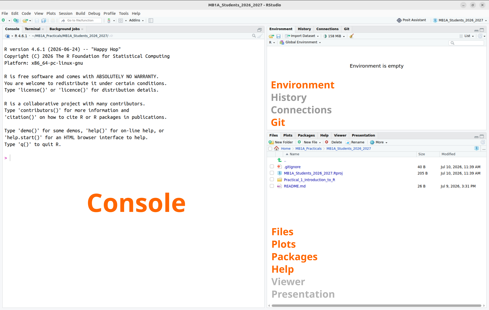
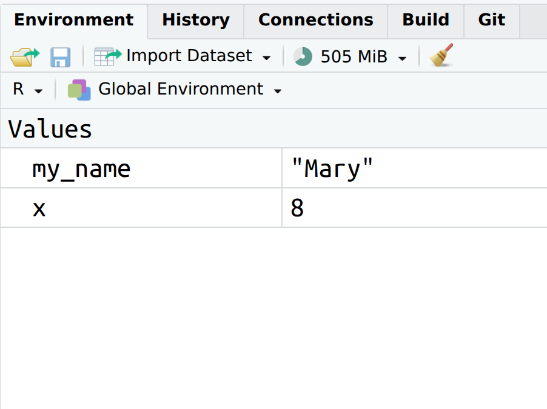
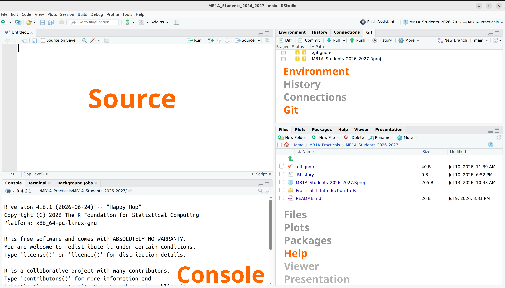
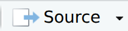
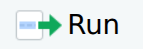

```{r setup0101, include=FALSE}
library(styler)
```

# Part 1: Using R and RStudio {#sec-p1_r_and_rstudio}

::: {#parts-0101 .callout-note .partmenu}
## Sections

- @sec-open_r
- @sec-r_language
- @sec-coding_in_the_console
- @sec-rstudio_interface
- @sec-console_scripts
- @sec-summary_0101
:::

::: {#objectives-0101 .callout-tip .objectives}
#### Learning objectives

By the end of this part of the practical you should be able to:

- Explain what R is and why it is useful for biological data analysis.
- Use some features of the RStudio interface.
- Use the R console and R scripts to run R code.
:::

## Loading RStudio and syncing {#sec-open_r .core}

[**Core**]{.core-text}

[↑ top](#)



## The R language {#sec-r_language .core}

[**Core**]{.core-text}

[↑ top](#)

{#fig-rlogo fig-alt="The R logo - a big blue R in front of a grey oval"}

In this session, we will learn the basics of using the programming language **R**, which we will use for data analysis and visualisation throughout the  course.

::: {.callout-important}

### Levels

If you've **never programmed before**, don't worry about the extension and bonus material in this practical! The material marked [**core**]{.core-text} is all you will need to progress through this course. You should also **read** the material and exercises marked [**recommended**]{.rec-text}, but if you are running short of time, don't worry about completing all of the recommended exercises.

If you are an **experienced programmer**, please still **read** all of the [**core**]{.core-text} and [**recommended**]{.rec-text} materials to understand some of the differences between R and other programming languages, and how we will interact with R in these practicals. However, if you are confident, you do not need to complete all of the introductory exercises. Instead, there are [**extension**]{.extension-text} and [**bonus**]{.bonus-text} exercises for you to try (but there is no requirement to complete all of them).

If you are somewhere in between, please read all of the [**core**]{.core-text} and [**recommended**]{.rec-text} materials and choose whichever exercises feel more helpful to you. 
:::


The R language was initially developed by two programmers, Ross Ihaka and Robert Gentleman, in 1993, for teaching introductory statistics. It has become one of the most commonly used languages in scientific computing, particularly amongst biologists.

### Why learn R? {#sec-why_R .core}

R provides many of the same capabilities as spreadsheet tools such as MS Excel and Google Sheets, and statistics and graphing software like SPSS and GraphPad.

However, R has lots of advantages over these tools:

- It provides thousands of functions for statistics, visualisation and data analysis.
- It allows you to automate repetitive tasks rather than repeating the same steps manually.
- It creates reproducible workflows: every step of your analysis can be recorded, checked and repeated by yourself or others.

## Coding in the console {#sec-coding_in_the_console .core}

[**Core**]{.core-text}

[↑ top](#)

Before we go any further, let's try writing some R code.

When you first open your RStudio project, your screen will look like this.

{#fig-rstudio_main width="100%" fig-alt="Image of the Rstudio interface. The left section is labelled Console, highlighted in orange. The top right section is labelled Environment, History, Connections, Git, with Environment and Git highlighted in orange. The bottom right section is labelled Files, Plots, Packages, Viewer, Presentation, with Help highlighted in orange."}

We will look at other parts of the screen shortly, but for now let's focus on the **Console**.

In the console, R commands can be typed and executed immediately by the computer. When you type a line of code and press , it is transferred to the R **interpreter**. Results are shown straight after the command is executed. Results are shown straight after the command is executed. However, unlike code saved in a script or Quarto document, you do not have a clear, reproducible record of your analysis.

Try typing the following text (everything in the grey box), into the console, then press .

```{r console_sayhi}
print("Hello! First contact with R successful!")
```

You should immediately see the message on the screen.

Now, try the following. Here, you are creating a new **variable**, `x`, with a value of 8. In R, the operator `<-` associates a specific name (here the name is `x`) with a specific value (we will discuss this in more detail later).

```{r console_var}
x <- 3 + 5
```

To see the value of `x`, type `print (x)` into the console, then press .

```{r console_var_res}
print(x)
```

Usually in these practicals, we won't run most of our code directly in the console like this, because we want to keep a record of the code we write. Instead, we will use Quarto documents, as we will discuss in Part 2. Coding in the console is a bit like cooking without a recipe - the results can be great, but if you want to make the same thing again, you may not remember exactly what you did.

However, it can be useful to use the console, for example to quickly try something out or check the value of a variable.

::: {#ex-creating_objects .callout-exercise .core}

### Create a variable

[**Core**]{.core-text}

- In your console, create a variable with your first name. The syntax you will need to use is as follows - replace "[Mary]{.red-text}" with your own name.

```{r name_var}
my_name <- "Mary"
```

Then, have R write you a message as follows:

```{r name_show}
print(paste("Hi", my_name, "- welcome to R!"))
```
:::

::: {#note-r_prompt .callout-important}
## The R prompt

If R is ready to accept commands, the R console shows a `>` symbol.

If the console shows a `+` symbol, this means it is waiting for something - you have most likely not 'closed' a parenthesis or quotation e.g. you have opened a parenthesis `(` but not closed it `)`. When this happens, and you thought you finished typing your command, click inside the console window and press . This will cancel the incomplete command and return you to the `>` prompt.
:::

## The RStudio interface {#sec-rstudio_interface .core}

[**Core**]{.core-text}

[↑ top](#)

Now we will learn a bit about the rest of RStudio.

[RStudio](https://posit.co/products/open-source/rstudio/) is an interactive development environment (IDE) - a piece of software designed to make working with R as easy as possible. It's free, open-source and well-supported.

{#fig-rstudio_main2 width="100%" fig-alt="Image of the Rstudio interface. The left section is labelled Console, highlighted in orange. The top right section is labelled Environment, History, Connections, Git, with Environment and Git highlighted in orange. The bottom right section is labelled Files, Plots, Packages, Viewer, Presentation, with Help highlighted in orange."}

In the image above you can see that the window is divided into three main parts, each with various tabs. In clockwise order we have:

1.  [**Console**]{.orange-text} / Terminal / Background jobs
2.  [**Environment**]{.orange-text} / History / Connections / Tutorial / [**Git**]{.orange-text}
3.  Files / Plots / Packages / [**Help**]{.orange-text} / Viewer / Presentation

In orange we've highlighted the tabs we'll be using most.

- In the [**Console**]{.orange-text} we can directly run code, as you did above.
- The [**Environment**]{.orange-text} shows any information that is stored in R's memory (empty in the figure above).

Click on the environment now - you should see two variables: `x`, with a value of 8 and `my_name`, with whatever you entered as your name above.

{#fig-env_tab width="50%" fig-alt="The RStudio Environment tab showing the variables x with a value of 8 and my_name with a value of whatever you entered as your name"}

- The [**Git**]{.orange-text} tab allows you to interact with Git and GitHub, as we saw above.

- [**Help**]{.orange-text} is where you can go for help.

:::: {#ex-r_help .callout-exercise .core}

### Using help

[**Core**]{.core-text}

In the search box on the Help tab, search for the function `sum`.

Using the **Examples** section as a guide, calculate the sum of the numbers 2, 3, 4 in the console.

::: {#ex-r_help_ans .callout-answer collapse="true"}
```{r r_help_ans}
sum(2, 3, 4)
```
:::
::::

## R Scripts {#sec-console_scripts .core}

[**Core**]{.core-text}

[↑ top](#)

The basis of programming is that we create or **code** instructions for the computer to follow.

Next, we tell the computer to follow the instructions by **executing** or **running** those instructions.

In your RStudio window, choose `File` \> `New File` \> `R Script`. This will add a new panel to your RStudio session, the **Source** panel.

{#fig-rstudio_labelled .screenshot fig-alt="Image of the Rstudio interface with the script panel now showing. This is the same as above but now the left side of the screen is divided vertically, with the top labelled as Source and the bottom labelled as Console, both highlighted in orange."}

Here, we can save our code as a script. This is a list of commands which can be sent to R to execute in order. The script represents a complete record of what we did, and anyone (including our future selves) can easily replicate the results on their computer. We can also use a script to repeatedly perform the same or similar tasks.

| Console                     | Script                  |
|-----------------------------|-------------------------|
| runs code directly          | in essence, a text file |
| interactive                 | needs to be told to run |
| no record                   | records actions         |
| difficult to trace progress | transparent workflow    |

### Creating a script {.core}

To create a script, we put a list of commands for R to run into the `Source` panel.

Try entering the following into the `Source` panel, then press the {.inline-icon} button. The {.inline-icon} button runs all of the code in the `Source` panel, while the {.inline-icon} button will only run the active line - the line where your cursor is currently or anything which is highlighted. The answer should show in the **console**.

```{r first_script}
x <- 8
y <- 10
z <- x + y

print(z)
```

:::: {#ex-first_script .callout-exercise .core}

### Writing an R script

[**Core**]{.core-text}

Here is the code we wrote in the console above:

```{r name_second}
my_name <- "Mary"
print(paste("Hi", my_name, "Welcome to R!"))
```

Write a script based on this code but to display, for example, "My name is Jeremy and I am 27 years old", but with your own (or another) name and age. Run your script using the {.inline-icon} button.

Save your script as `my_first_script.R` (using `File` \> `Save As`). You can save it directly into the **``** folder.

::: {#ex-first_script_ans .callout-answer collapse="true"}

```{r first_script_ans}
my_name <- "Jeremy"
my_age <- 27
print(paste("My name is", my_name, "and I am", my_age, "years old"))
```

:::
::::

## Review {#sec-summary_0101}

[↑ top](#)

::: {#note-summary_0101 .callout-note}
## Summary

- **R** is a programming language commonly used by biologists for data analysis, statistics and visualisation.
- **RStudio** is an interactive development environment (IDE) with various features to make coding in R easier.
- We can code interactively in the **console** but it is not easy to track or document.
- **Scripts** contain simple lists of commands for R to carry out.
:::

For this part of the practical, the main files you have created are:

- `my_first_script.R`

These are the files you should select when making your Git commit.


