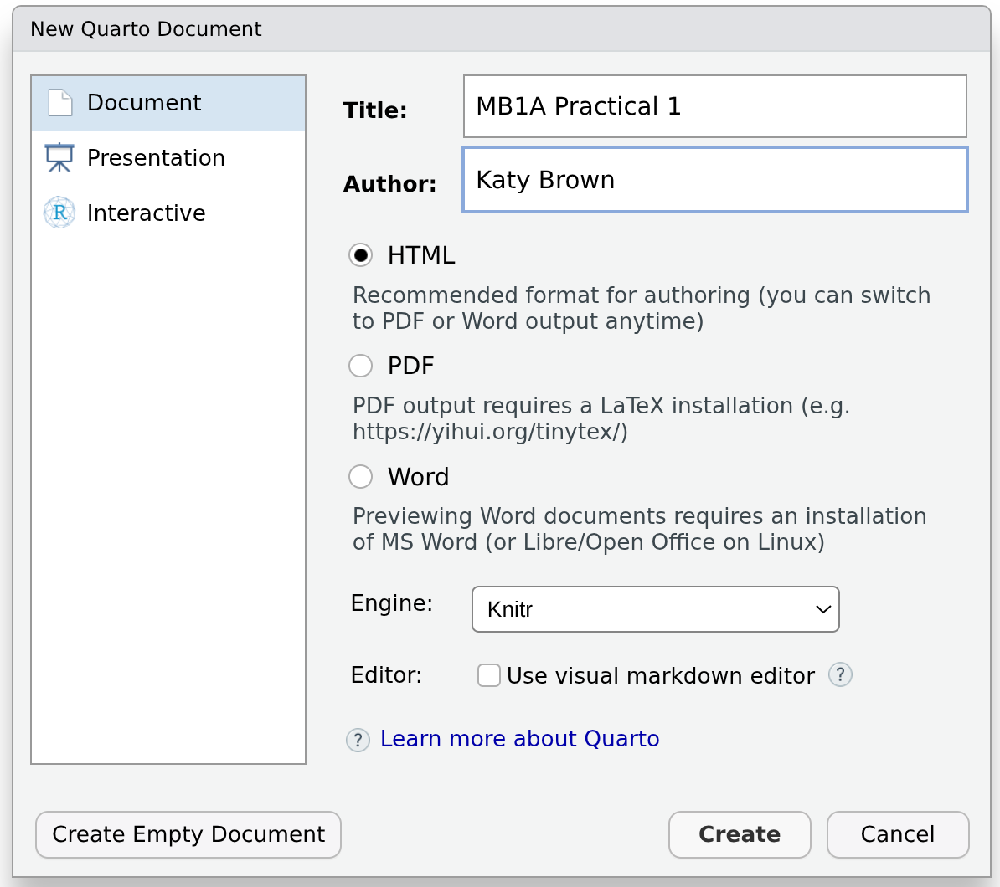
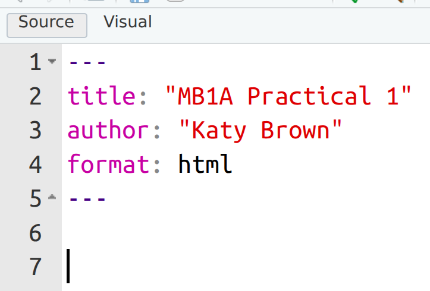
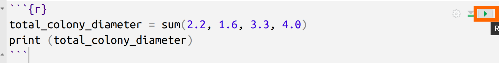
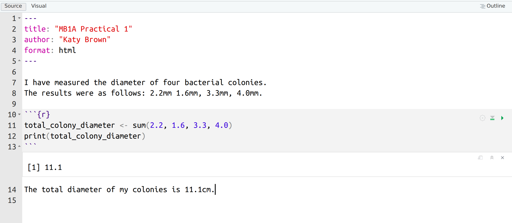
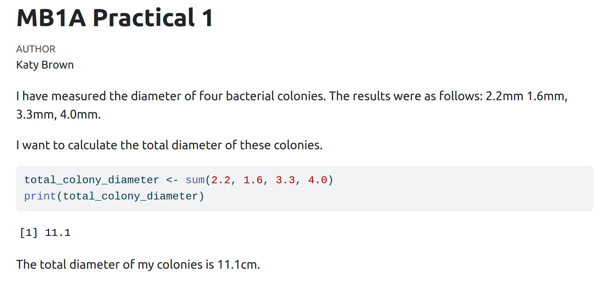
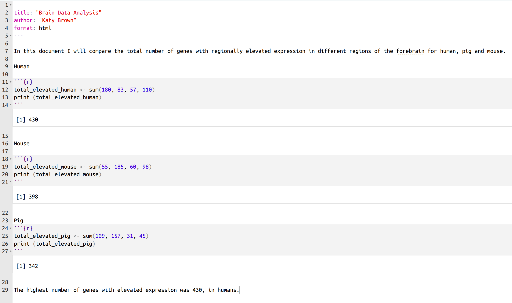
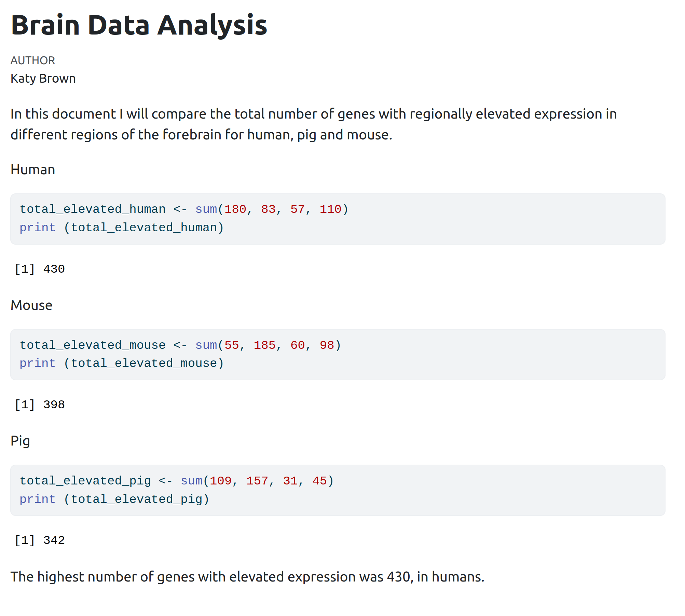
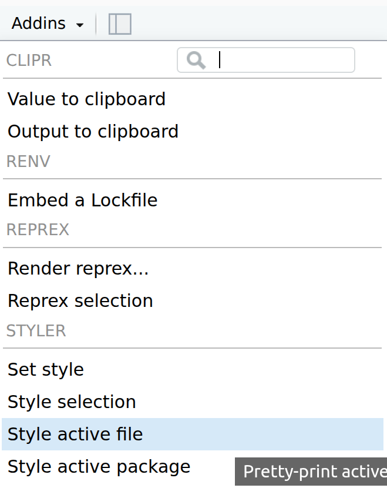
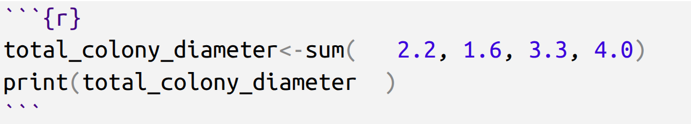
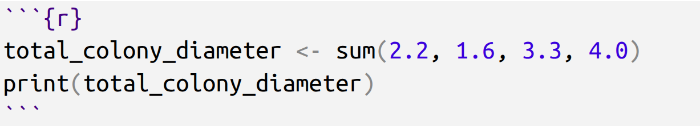

```{r setup0102, include=FALSE}
library(styler)
```

# Part 2: Reproducible Analysis with Quarto {#sec-p2_quarto}

::: {.callout-note .partmenu #parts-0102}
## Sections
- @sec-quarto
- @sec-documenting_and_formatting_your_code
- @sec-summary_0102
:::

:::{.callout-tip .objectives #objectives-0102}
#### Learning objectives
By the end of this part of the practical you should be able to:

- Use Quarto documents to run R code.
- Create a simple reproducible analysis using Quarto.
- Understand the benefits of writing clear, well-formatted and documented R code.

:::

### Quarto {#sec-quarto}

[↑ top](#)

Throughout this course, we will write our code in Quarto documents (with the suffix .qmd) rather than using the R Console or standalone R scripts. 

* The console is useful for trying out individual commands, but anything you type there is easily lost.
* R scripts allow you to save your code, but it is not easy to include explanations, figures, or results in the same file.
* Quarto documents combine text, code and output into a single file, making it easy to explain what you are doing, present your results, and reproduce your analysis. This helps you keep an organised record of your work and is widely used for teaching, research and data science.

Quarto allows you to create quite complex documents, for example, these teaching materials are written in Quarto.

The main reason to use Quarto is to make your research **reproducible**. You will likely have learned about this previously for lab-based research, but reproducibility is just as important for computer-based science.

Optional homework: There is an interesting lecture [here](https://youtu.be/7gYIs7uYbMo?si=uU9m308A8AtqvKCC) about the importance of reproducibility in computational biology.


#### Creating a Quarto document

To create a new Quarto document in RStudio, select `File` > `New File` > `Quarto Document`. Give the document a title and add your own name as the author, then uncheck the box next to `Use visual markdown editor` and select `Create empty document`.

{.screenshot #fig-new_quarto width="50%"}

You should see something like this:

{#fig-first_quarto .screenshot width="50%"}

In this document, we can combine code, text and images.

We can type explanatory text directly into the document.

To add code, click on the `Insert a New Code Chunk` {.inline-icon} button and choose `R`. Anything within this chunk will be interpreted as R code.


Type the following into your Quarto document, below the header.

```markdown
I have measured the diameter of four bacterial colonies.
The results were as follows: 2.2mm 1.6mm, 3.3mm, 4.0mm.

I want to calculate the total diameter of these colonies.
```

Then, using the {.inline-icon} button, add the following code chunk.

```{r}
total_colony_diameter <- sum(2.2, 1.6, 3.3, 4.0)
print(total_colony_diameter)
```

You can run just this code chunk by clicking the small play button in the corner of the chunk, or by clicking on it and then pressing   +  + .

{#fig-code_chunk}

Below your code chunk, type the following:

```markdown
The total diameter of my colonies is 11.1cm.
```

Your whole document should look something like this:

{#fig-quarto_doc}

Running a code chunk with the play button executes only that piece of code. Rendering a Quarto document runs all the code and creates the final report.

You can produce a report based on your document by clicking the `Render` button - {.inline-icon}. This runs all of the code and formats the document into **html** format, so it is easy to read and share. 

Save your document in the `` folder as `my_first_quarto.qmd`. Then click on the {.inline-icon}.

Your first Quarto report should open in a new window. A **html** file will also be created in the same folder as your Quarto file, which you can open in a web browser.

{#fig-first_quarto_rendered .screenshot}

As our code becomes more complicated, the value of using Quarto will become much clearer.

:::{.callout-note #note-markdown}

Text in Quarto outside of code chunks is interpreted using a language called **Markdown**, and as well as plain text you can format it in various ways.

Some options for formatting are listed [here](https://quarto.org/docs/authoring/markdown-basics.html).

For example:

```markdown
**bold text**
*italic text*
[link text](https://www.youtube.com/watch?v=dQw4w9WgXcQ)
# Header
```
produces

**bold text**

*italic text*

[link text](https://www.youtube.com/watch?v=dQw4w9WgXcQ)

# Header

:::

::: {.callout-exercise #ex-quarto}



The Human Protein Atlas (HPA) is a research project which was initiated in 2003 with the aim to map all the human proteins in cells, tissues, and organs using  various omics technologies.

We are going to look at a small amount of data from the HPA brain resource, which explores the distribution of proteins in various regions of the mammalian brain.

There is a description of the brain data [here](https://www.proteinatlas.org/humanproteome/brain).

On the [brain data](https://www.proteinatlas.org/humanproteome/brain) page, the **BRAIN SUMMARY** table shows the number of genes which were categorised as *regionally elevated* in different regions of the brain. Genes were classed as regionally elevated if they showed distinctly higher expression in these regions than in the rest of the brain.

Create a new Quarto document and, based on the brain summary table, using the `sum()` function in R, calculate the total number of genes with regionally elevated expression in the **forebrain** - that is, the cerebral cortex, basal ganglia, thalamus and hypothalamus - regions in human, pig and mouse. 

In your Quarto document:

* Briefly (1-2 lines of text) describe the question you are answering.
* Show the code used to calculate your results.
* Write one line stating which species had the highest number of genes with regionally elevated expression.
* Save the document as `hpa_quarto.qmd` in the `` folder.

::: {.callout-answer collapse="true" #ex-quarto_ans}

Example (before rendering)

{#fig-hpa_quarto_unrendered .screenshot}

Example (after rendering)

{#fig-hpa_quarto .screenshot}
:::
:::

## Documenting and formatting your code {#sec-documenting_and_formatting_your_code}

[↑ top](#)

### Documentation

It's always a good idea to add explanations to your code. We can do so in Quarto, by writing a description of what we're trying to do.

Within a code chunk, we can also use  the hash tag `#` symbol to add comments, as shown below.

```{r code_chunk}
#| eval: false

# This code calculates the sum of two numbers
1 + 9
```

It's always a good idea to add lots of comments to your code. What makes sense to you in that moment, might not a week later. Similarly, when sharing code with colleagues and collaborators, it's always good to be as clear as possible.

### Formatting your code

Writing code that is well formatted - arranged neatly on the page with appropriate line breaks and spaces -  makes it easier for you and others to understand, check, and reuse. 

Good formatting:

* Helps you to structure of your code
* Makes mistakes easier to spot
* Allows collaborators to quickly see what your code is doing.

In research and industry, code is often shared between people and revisited months or years later, so clear and consistent formatting is an important part of writing reproducible and maintainable analyses.

In this course, we will use the [tidyverse style guide](https://style.tidyverse.org/syntax.html) where possible. This document contains lots of references to things we haven't covered yet. However, RStudio has an option to automatically style code, which we'll use for now.

In the HPA Quarto document you created above, click on `Addins` on the menu and then `Style active file` - this will automatically change your code to the tidyverse style where possible. 

::: {.callout-important #note-quarto_errors}
This function will only work if your code is able to run without errors and you've saved your Quarto document
:::

{#fig-styler .screenshot width="50%"}

For example, the `Style active file` feature removes the extraneous spaces from the following code.

Before:

{#fig-bad_formatting width="50%"}

After:

{#fig-good_formatting width="50%"}

Also, where you need to give something a name in R, it is helpful to use a name which describes what it is. For example, rather than `x <- 12` it is preferable to write e.g. `mean_size <- 12`.

::: {.callout-exercise #ex-formatting}



Format the code in the HPA data Quarto document you created earlier using the `Style active file` feature. It may not change at all, or it may change a lot. Change any variable names to be informative, if they are not already.

Save the document and render it again.

:::

## Review {#sec-summary_0102}

[↑ top](#)

::: {.callout-note #note-summary_0102}
## Summary
- **Quarto** documents combine text, code and images to make your analysis clear and reproducible.
- Code **formatting** and **documentation** are important to keep your code readable and reusable.
:::

For this part of the practical, the main files you have created are:

- `my_first_quarto.qmd`
- `hpa_quarto.qmd`

These are the files you should select when making your Git commit.


