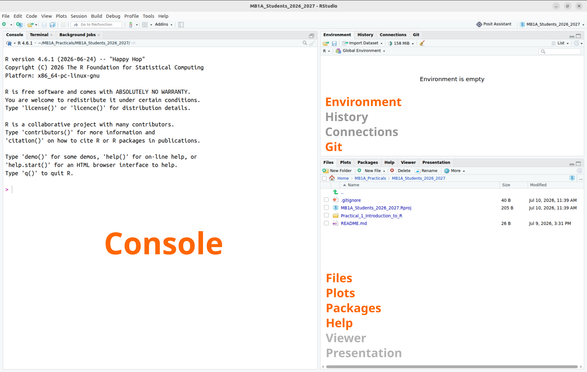
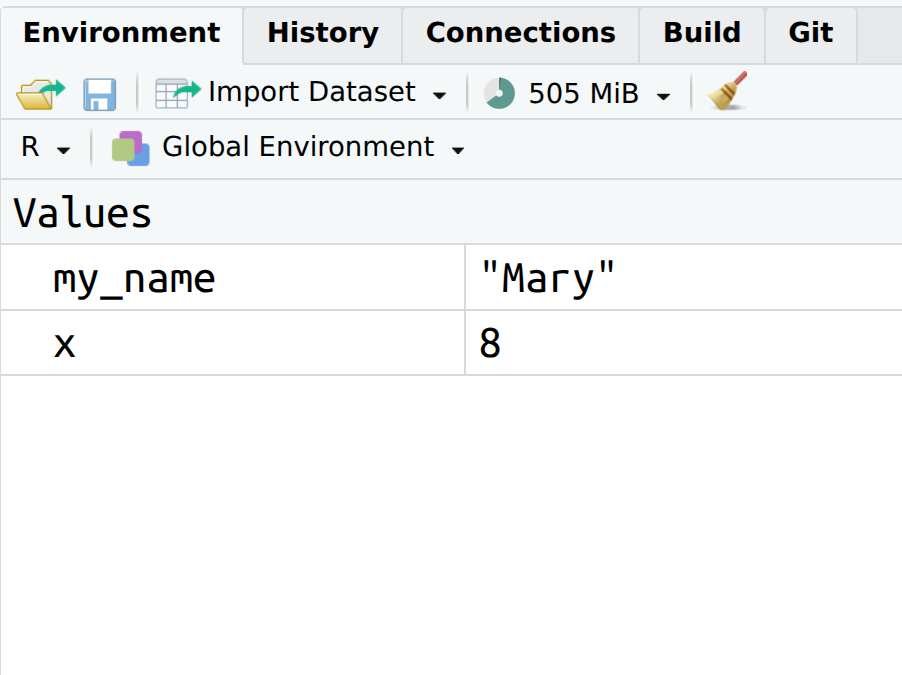
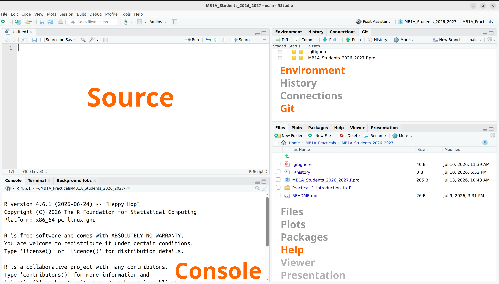
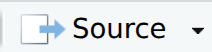
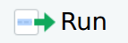

```{r libraries, include=FALSE}
library(styler)
```

# Part 2: Using R and RStudio {#sec-p2_r_and_rstudio}

::: {.callout-note .partmenu}
## Sections
- @sec-r_language
- @sec-coding_in_the_console
- @sec-rstudio_interface
- @sec-console_scripts_quarto
- @sec-documenting_and_formatting_your_code
- @sec-summary_0102
:::

:::{.callout-tip .objectives}
#### Learning objectives
By the end of this part of the practical you should be able to:

- Explain what R is and why it is useful for biological data analysis.
- Use some features of the RStudio interface
- Use the R console, scripts and Quarto documents to run R code.
- Create a simple reproducible analysis using Quarto.
- Understand the benefits of writing clear, well-formatted and documented R code.

:::

## The R language {#sec-r_language}

[↑ top](#)

{#fig-rlogo}

In this session, we will learn the basics of using the programming language **R**, which we will use for data analysis and visualisation throughout the  course.

The R language was initially developed by two programmers, Ross Ihaka and Robert Gentleman, in 1993, for teaching introductory statistics. It has become one of the most commonly used languages in scientific computing, particularly amongst biologists.

### Why Learn R?

R provides many of the same functions as spreadsheet tools such as MS Excel and Google Sheets, and statistics and graphing software like SPSS and GraphPad.

However, R has lots of advantages over these tools:

- It provides thousands of functions for statistics, visualisation and data analysis.
- It allows you to automate repetitive tasks rather than repeating the same steps manually.
- It creates reproducible workflows: every step of your analysis can be recorded, checked and repeated by yourself or others.

## Coding in the Console {#sec-coding_in_the_console}

[↑ top](#)

Before we go any further, let's try writing some R code.

When you first open your RStudio project, your screen will look like this.

{#fig-rstudio_main width="100%"}

We will look at other parts of the screen shortly, but for now let's focus on the **Console**.

In the console, R commands can be typed and executed immediately by the computer. When you type a line of code and press , it is transferred to the R **interpreter**. Results are shown straight after the command is executed. However, no record is kept and any information is lost once the session is closed.

Try typing the following, in the grey box,  into the console, then press .

```{r console_sayhi}
print("Hello! First contact with R successful!")
```

You should immediately see the message on the screen.

Now, try the following. Here, you are creating a new **variable**, `x`, with a value of 8. In R, the operator `<-` associates a specific name (here the name is `x`) with a specific value (we will discuss this in more detail later).

```{r console_var}
x <- 3 + 5
```

To see the value of `x`, type `print (x)` into the console, then press .

```{r console_var_res}
print(x)
```

Usually in these practicals, we won't run most of our code directly in the console like this as it doesn't save what we've done. Coding in the console is a bit like cooking without a recipe - the results can be great, but if you want to make the same thing again, you may not remember exactly what you did.

However, it can be useful to use the console, for example to quickly try something out or check the value of a variable.

::: {.callout-exercise #ex-creating_objects}
## Making a variable in the console



- In your console, create a variable with your first name. The syntax you will need to use is as follows - replace "Mary" with your own name.

```{r name_var}
my_name <- "Mary"
```

Then, have R write you a message as follows:

```{r name_show}
print(paste("Hi", my_name, "Welcome to R!"))
```

:::
::: callout-warning
## The R prompt

If R is ready to accept commands, the R console shows a `>` prompt. 

If the console shows a `+` prompt, this means it is waiting for something - you have most likely not 'closed' a parenthesis or quotation, i.e. you don't have the same number of left-parentheses as right-parentheses, or the same number of opening and closing quotation marks. When this happens, and you thought you finished typing your command, click inside the console window and press . This will cancel the incomplete command and return you to the `>` prompt.
:::

## The RStudio Interface {#sec-rstudio_interface}

[↑ top](#)

Now we will learn a bit about the rest of RStudio.

[RStudio](https://posit.co/products/open-source/rstudio/) is an interactive development environment (IDE) - a piece of software designed to make working with R as easy as possible. It's free, open-source and well-supported.

{#fig-rstudio_main width="100%"}

In the image above you can see that the window is divided into three main parts, each with various tabs. In clockwise order we have:

1.  **Console** / Terminal / Background jobs
2.  **Environment** / History / Connections / Tutorial / **Git**
3.  Files / Plots / Packages / **Help** / Viewer / Presentation

In bold we've highlighted the tabs we'll be using most.

* In the **Console** we can directly run code, as you did above.
* The **Environment** shows any information that is stored in R's memory (empty in the figure above). 


Click on the environment now - you should see two variables: `x`, with a value of 8 and `my_name`, with whatever you entered as your name above.

{#fig-env_tab width="50%"}


* The **Git** tab allows you to interact with Git and GitHub, as we saw above.

* **Help** is where you can go for help. 

::: {.callout-exercise #ex_help}



In the search box on the Help tab, search for the function `sum()`.

Using the **Examples** section as a guide, calculate the sum of the numbers 2, 3, 4 in the console.

::: {.callout-answer collapse="true"}
```{r ex_help_answer}
sum(2, 3, 4)
```
:::
:::

## The console, scripts and Quarto{#sec-console_scripts_quarto}

[↑ top](#)

The basis of programming is that we create or *code* instructions for the computer to follow. Next, we tell the computer to follow the instructions by *executing* or *running* those instructions.

There are three main ways in which we will interact with the R language: 

* The console - as we discussed above
* Scripts
* Quarto

### Scripts

In your RStudio window, choose `File` \> `New File` \> `R Script`. This will add a new panel to your RStudio session, the **Source** panel.

{#fig-rstudio_labelled}

Here, we can save our code as a script. This is a list of commands which the R interpreter will execute in order. The script represents a complete record of what we did, and anyone (including our future selves!) can easily replicate the results on their computer. We can also use a script to repeatedly perform the same or similar tasks.

| Console | Script |
|------------------------------------|------------------------------------|
| runs code directly | in essence, a text file |
| interactive | needs to be told to run |
| no record | records actions |
| difficult to trace progress | transparent workflow |

#### Creating a Script

To create a script, we put a list of commands for R to run into the `Source` panel.

Try entering the following into the `Source` panel, then press the {.inline-icon} button. The {.inline-icon}  button runs all of the code in the `Source` panel, while the {.inline-icon} button will only run the active line - the line where your cursor is currently. The answer should show in the **console**.

```{r first_script}
x <- 8
y <- 10
z <- x + y

print(z)
```

::: {.callout-exercise #ex_script}



Here is the code we wrote in the console above:

```{r name_second}
my_name <- "Mary"
print(paste("Hi", my_name, "Welcome to R!"))
```

Write a script based on this code but to display, for example, "My name is Jeremy and I am 27 years old", but with your own (or another) name and age. Run your script using the {.inline-icon} button.

::: {.callout-answer collapse="true"}
```{r ex_script_answer}
my_name <- "Jeremy"
my_age <- 27
print(paste("My name is", my_name, "and I am", my_age, "years old"))
```
:::
:::

### Quarto

[↑ top](#)

Throughout this course, we will write our code in Quarto documents (.qmd) rather than using the R Console or standalone R scripts. 

* The Console is useful for trying out individual commands, but anything you type there is easily lost.
* R scripts allow you to save your code, but it is not easy to include explanations, figures, or results in the same file.
* Quarto documents combine text, code and output into a single file, making it easy to explain what you are doing, present your results, and reproduce your analysis. This helps you keep an organised record of your work and is widely used for teaching, research and data science.

The main reason to use Quarto is to make your research **reproducible**. You will likely have learned about this previously for lab-based research, but reproducibility is just as important for computer-based science.

Optional homework: There is an interesting lecture [here](https://youtu.be/7gYIs7uYbMo?si=uU9m308A8AtqvKCC) about the importance of reproducibility in computational biology.


#### Creating a Quarto document

To create a new Quarto document in RStudio, select `File` > `New File` > `Quarto Document`. Give the document a title and add your own name as the author, then uncheck the box next to `Use visual markdown editor` and select `Create empty document`.

{#fig-new_quarto}

You should see something like this:

{#fig-first_quarto .screenshot width="50%"}

In this document, we can combine code, text and images.

We can type explanatory text directly into the document. To add code, click on the `Insert a New Code Chunk` {.inline-icon} button and choose `R`. Anything within this chunk will be interpreted as R code.


Type the following into your Quarto document, below the header.

```markdown
I have measured the diameter of four bacterial colonies.
The results were as follows: 2.2mm 1.6mm, 3.3mm, 4.0mm.

I want to calculate the total diameter of these colonies.
```

Then, using the {.inline-icon} button, add the following code chunk.

```{r}
total_colony_diameter <- sum(2.2, 1.6, 3.3, 4.0)
print(total_colony_diameter)
```
You can run just this code chunk by clicking the small play button in the corner of the chunk, or by clicking on it and then pressing   +  + .

{#fig-code_chunk}

Below your code chunk, type the following:

```markdown
The total diameter of my colonies is 11.1cm.
```
Running a code chunk executes only that piece of code. Rendering a Quarto document runs all the code and creates the final report.

Produce a report based on your document by clicking the `Render` button - {.inline-icon}. This runs all of the code and formats the document into **html** format, so it is easy to read and share.

Your first Quarto report should open in a new window. A **html** file will also be created in the same folder as your Quarto file, which you can open in a web browser.

{#fig-first_quarto_rendered .screenshot}

As our code becomes more complicated, the value of using Quarto will become much clearer.

::: {.callout-exercise #ex_quarto}



The Human Protein Atlas (HPA) is a research project which was initiated in 2003 with the aim to map all the human proteins in cells, tissues, and organs using  various omics technologies.

We are going to look at a small amount of data from the HPA brain resource, which explores the distribution of proteins in various regions of the mammalian brain.

There is a description of the brain data [here](https://www.proteinatlas.org/humanproteome/brain) and a description of how the data was analysed [here](https://www.proteinatlas.org/humanproteome/brain/method) - you don't need to understand everything for this practical, but it is always good practice to read how your data has been generated.

On the [brain data](https://www.proteinatlas.org/humanproteome/brain) page, the **BRAIN SUMMARY** table shows the number of genes which were categorised as *regionally elevated* in different regions of the brain. Genes were classed as regionally elevated if they showed distinctly higher expression in these regions than in the rest of the brain.

Create a new Quarto document and, based on the brain summary table, using R, calculate the total number of genes with regionally elevated expression in the **forebrain** - that is, the cerebral cortex, basal ganglia, thalamus and hypothalamus - regions in human, pig and mouse. 

In your Quarto document:

* Briefly (1-2 lines of text) describe your method.
* Show the code used to calculate your results.
* Write a one line summary of which species had the highest number of genes with regionally elevated expression.

:::


## Documenting and formatting your code {#sec-documenting_and_formatting_your_code}

[↑ top](#)

### Documentation

It's always a good idea to add explanations to your code. We can do so in Quarto, by writing a description of what we're trying to do.

Within a code chunk, we can also use  the hash tag `#` symbol to add comments, as shown below.

```{r}
#| eval: false

# This code calculates the sum of two numbers
1 + 9
```

It's always a good idea to add lots of comments to your code. What makes sense to you in that moment, might not a week later. Similarly, when sharing code with colleagues and collaborators, it's always good to be as clear as possible.

### Formatting your code

Writing code that is well formatted - arranged neatly on the page with appropriate line breaks and spaces -  makes it easier for you and others to understand, check, and reuse. 

Good formatting helps highlight the structure of your code, makes mistakes easier to spot, and allows collaborators to quickly see what your code is doing. In research and industry, code is often shared between people and revisited months or years later, so clear and consistent formatting is an important part of writing reproducible and maintainable analyses.

In this course, we will use the [tidyverse style guide](https://style.tidyverse.org/syntax.html) where possible. This document contains lots of references to things we haven't covered yet. However, RStudio has an option to automatically style code, which we'll use for now.

In the Quarto document you created above, click on `Addins` on the menu and then `Style active file` - this will automatically change your code to the tidyverse style where possible. 

::: {.callout-important}
This function will only work if your code is able to run without errors and you've saved your Quarto document
:::
{#fig-styler .screenshot width="50%"}

For example, the `Style active file` feature removes the extraneous spaces from the following code.

Before:

{#fig-bad_formatting width="50%"}

After:

{#fig-good_formatting width="50%"}

Also, where you need to give something a name in R, it is helpful to use a name which describes what it is. For example, rather than `x <- 12` it is preferable to write e.g. `mean_size <- 12`.

::: {.callout-exercise #ex_formatting}



Format the code in the HPA data Quarto document you created earlier using the `Style active file` feature. It may not change at all, or it may change a lot. Change any variable names to be informative, if they are not already.
:::

## Review {#sec-summary_0102}

[↑ top](#)

::: {.callout-note}
## Summary
- **R** is a commonly used programming language amongst biologists.
- **RStudio** is an interactive development environment (IDE) with various features to make coding in R easier.
- We can code interactively in the **console** but it is not easy to track or document.
- **Scripts** contain simple lists of commands for R to carry out.
- **Quarto** documents combine text, code and images to make your analysis clear and reproducible.
- Code **formatting** and **documentation** are important to keep your code readable and reusable.
:::


