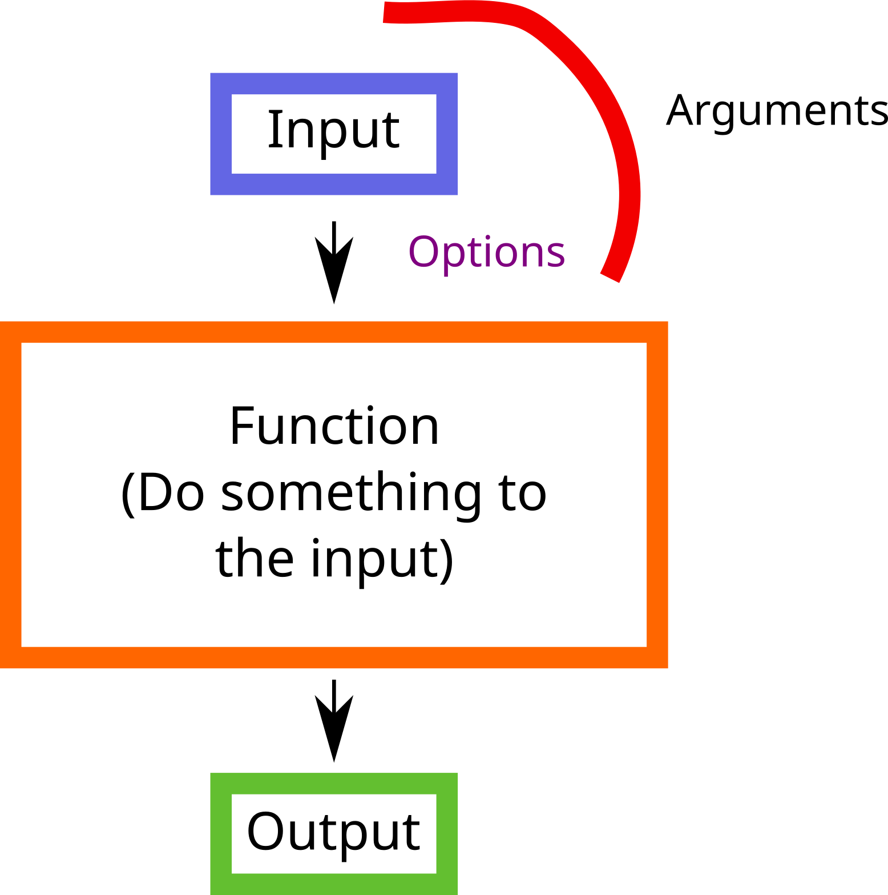
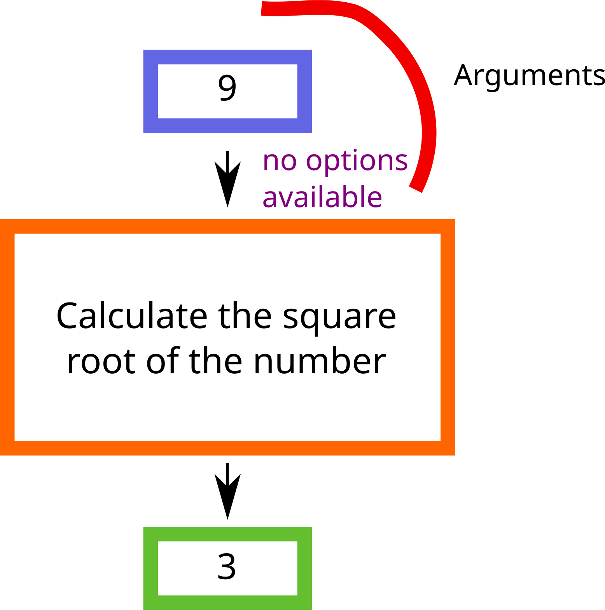
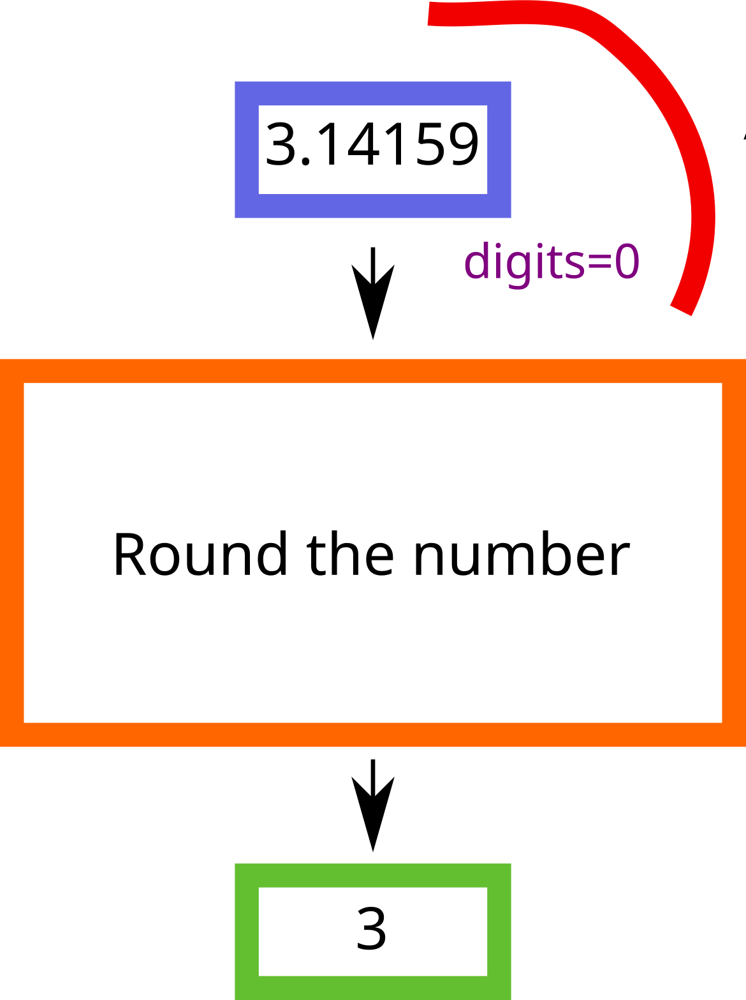
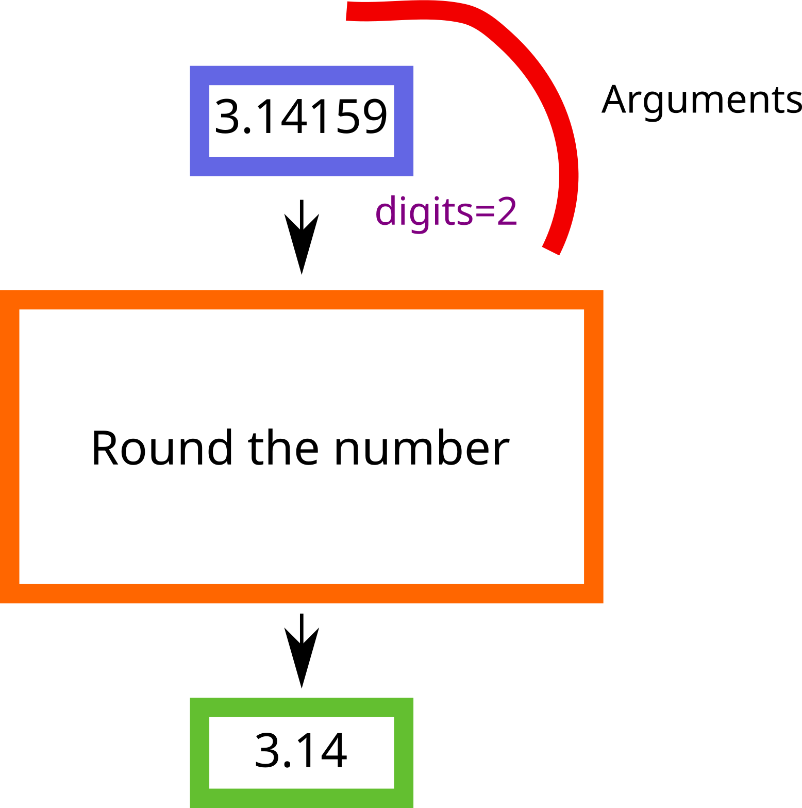

```{r setup0103, include=FALSE}
library(gt)
```

# Part 3: Functions and Variables {#sec-p3_functions_and_variables}

::: {.callout-note .partmenu #parts-0103}
## Sections
- @sec-functions
- @sec-arguments
- @sec-variables
- @sec-variable_types
- @sec-summary_0103

:::

:::{.callout-tip .objectives #objectives-0103}
## Learning objectives
By the end of this part of the practical you should be able to:

- Understand what a function is and use some simple functions.
- Understand how and why we provide arguments to functions.
- Explain the concept of a variable and use variables in your code.
- Know the difference between a character, numeric and logical variable.

:::

For parts 3 and 4 of the practical, we recommend that you keep track of your progress in a new Quarto document, ``/prac1_part3_4.qmd`. You can describe the code if you wish, or just label it with the exercise number. For the data analysis exercises in Part 4: exercises 5 and 6, please create a second Quarto document `/ukhsa_data_analysis.qmd` and briefly describe your analysis.

## Functions {#sec-functions}

[↑ top](#)

**Functions** take an input (called an **argument**), perform an action, and often return an output. They allow us to perform common tasks without writing the same code repeatedly.

{#fig-functions width='50%'}

We have used some functions already:

* The `print()` function outputs text to the screen.
* The `sum()` function adds together a series of numbers.

Functions allow us to do the same thing multiple times without rewriting code. We can also write our own functions, we'll come to this in a later practical.

A function usually takes one or more inputs called **arguments**. They often (but not always) return an output.

A typical example would be the function `sqrt()`. The input (the argument) must be a number, and the output is the square root of that number.

{#fig-func_sqrt width="50%"}
```{r square_root}
sqrt(9)
```

Here, the input `9` is given as an argument to the `sqrt()` function. The function calculates the square root, and returns the value. This function is very simple, because it takes just one argument and has no additional options.

::: {.callout-exercise #ex-first_functions}



The function `round()` rounds a number, by default into the nearest whole number.

Write some code to round the number 3.14159 to the nearest whole number.

::: {.callout-answer collapse="true" #ex-first_functions_ans}
```{r first_functions_ans}
round(3.14159)
```
:::
:::

## Arguments {#sec-arguments}

[↑ top](#)

Arguments allow you to control the behaviour of a function. They can be anything, not only numbers. Exactly what each argument means differs per function and can be looked up in the documentation. 

Some functions take arguments which may either be specified by the user, or, if left out, take on a **default** value: these are called **options**.

Options are typically used to alter the way the function operates.

Let's look at the `round()` function again.

{#fig-func_round1 width="50%"}

```{r, round_int}
round(3.14159)
```

This gives us an integer, 3.


{#fig-func_round2 width="50%"}

However, if we want e.g. two digits after the decimal point, we can type `digits = 2` (or however many we want). For example:

```{r, round_2}
round(3.14159, digits = 2)
```

### Ordering arguments

When a function has several arguments, there are two common ways to provide them. You can either give the arguments in the correct order, or you can name each argument explicitly.

For example, let's take the function `seq()`.

This function generates a sequence of numbers. The arguments are, in order, `from`, `to` and `by`, where `from` is the number you want the sequence to start from, `to` is the number you want it to end at and `by` is the increment. If you search in the `Help` panel for `seq` you'll see this order - `from`, `to`, `by`.

We can call the function with these three arguments:

For example:

```{r seq1}
print(seq(1, 10, 2))
```
```{r seq2}
print(seq(5, 15, 5))
```
However, we can also use their names, and then put them in any order:

```{r seq3}
print(seq(by = 2, from = 1, to = 10))
```
```{r seq4}
print(seq(by = 5, to = 15, from = 5))
```

::: {.callout-exercise #ex-arg_order}




The function `rep()` repeats a value, `x` a specific number of times.
The order of arguments is: `rep(x, times)` - so you first specify `x`, then the number of `times` you want it to be repeated.

For example:
```{r rep1}
print(rep(2, 5))
```
```{r rep2}
print(rep(x=2, times=5))
```
Write some code to repeat the number 5, 7 times, first by specifying arguments in order and then using their names.

::: {.callout-answer collapse="true" #ex-arg_order_ans}
```{r arg_order_ans}
# ordered
print(rep(5, 7))

# keywords
print(rep(times = 7, x = 5))
```
:::
:::

## Variables {#sec-variables}

[↑ top](#)

Another fundamental concept in programming is a **variable**.

Basically, a variable associates a specific name with a specific value. In R, we use the operator `<-` to assign a value to a name, we've done this several times already.

For example, by running the code below, we are saying that the name `my_variable` refers to the value `12`. 
When you run the code, it will seem like nothing has happened, but, interally, R now knows that `my_variable` is equal to `12`.

```{r variable_basic}
my_variable <- 12
```

To check this has worked, we can use the **function**, `print()` to show the value of our variable on the screen.

```{r variable_retrieve}
my_variable <- 12
print(my_variable)
```

We can change the value of our variable by assigning it a new value. Although the first line of the code below is run, the value is then replaced in the second line, so when we reach the third line, the value is `10`.

```{r variable_reassign}
my_variable <- 12
my_variable <- 10
print(my_variable)
```

::: {.callout-exercise #ex-varorder}



What would be the value of `whatsmynumber` after running all of code below?

```{r varorder}
whatsmynumber <- 1
whatsmynumber <- 5
```

::: {.callout-answer collapse="true" #ex-varorder_ans}
5
:::
:::

### Variable Names

You can have as many variables as you like, and use any name, with a few exceptions.

Your variable names should be one word, without spaces and without punctuation except underscores ("_"), so the following won't work:

```{r variable_punc}
#| error: true
my-var <- 12
```


```{r variable_space}
#| error: true
my var <- 12
```

In R, variable names can't start with a number.

```{r variable_num}
#| error: true
1var <- 12
```

Some words are used by the R language itself, so although you can use them as variable names, it can become confusing and stop other functions from working. 

Some will not work at all:

```{r variable_if}
#| error: true
if <- 12
```

Others will work, but cause problems. For example, if you assign a value to the word `sum`, then you won't be able to calculate mean values using the R function `sum`.

To check if a word already exists as a function in R, you can type `?` followed by the word. This will show the help screen for any existing functions. 

e.g.

```{r variable_check_used}
?sum
```

Compare this to a variable name which is not already in use:

```{r variable_check_ok}
?banana
```

## Types of variable {#sec-variable_types}

[↑ top](#)

### Numeric, character and logical variables

Different types of data can be stored as variables. 

There are many types of variable in R.

Some of the most important are:

#### Numeric
(sometimes also called `double`)


All variables which are numbers can be classed as numeric (there are some more specific number types but you don't need these yet)

```{r numeric_variable}
x <- 1
print(x)

x <- 1.74
print(x)

x <- 4e-3
print(x)
```

#### Character
(sometimes called a `string`)

A character variable consists of text - it can be one or multiple words.

```{r character_variable}
x <- "hello"
print(x)

x <- "I am a variable"
print(x)
```

#### Logical
(sometimes called `boolean`)

These can only be TRUE or FALSE.

```{r bool_variable}
x <- TRUE
print(x)

x <- FALSE
print(x)
```

#### Identifying types of variables

We can find out what type of variable we have using the function `class`.
```{r print_class}
x <- "hi there"
print(class(x))

x <- 1513871
print(class(x))

x <- FALSE
print(class(x))
```

::: {.callout-exercise #ex-var_types}



Create character, numerical and logical variables, print them, then check their classes.

::: {.callout-answer collapse="true" #ex-var_types_ans}
```{r var_types_ans}
# for example
my_favourite_number <- 11
my_favourite_word <- "hullabaloo"
is_this_true <- FALSE

print(class(my_favourite_number))
print(class(my_favourite_word))
print(class(is_this_true))
```
:::
:::

::: {.callout-exercise #ex-celldata}



You have conducted an experiment in which you have treated one batch of cells with radiation and kept the other as a control, then counted the number of live cells before and after.

The attributes of your two batches of cells are in this table:

```{r table_cells, echo=FALSE}
df <- data.frame(
  cell_ID = c("CX1", "CX2"),
  treated = c(TRUE, FALSE),
  num_cells_before = c(5415, 8123),
  num_cells_after = c(1432, 7543)
)

gt(df)
```

In your Quarto document, create eight variables of appropriate types which together contain all of the information in the table.

::: {.callout-answer collapse="true" #ex-celldata_ans}
```{r celldata_ans}
# for example
cell_id_1 <- "CX1"
cell_id_2 <- "CX2"

treated_1 <- TRUE
treated_2 <- FALSE

n_before_1 <- 5415
n_before_2 <- 8123

n_after_1 <- 1432
n_after_2 <- 7543
```
:::
:::

## Review {#sec-summary_0103}

[↑ top](#)

::: {.callout-note #note-summary_0103}
## Summary
- A **function** performs a specific task, usually taking one or more inputs (called **arguments**) and often returning an output.
- **Arguments** provide information to a function and control how it behaves. Some arguments are optional and have default values.
- A **variable** stores a value under a name so that it can be used again later in your code.
- Choose **descriptive variable names** and avoid spaces, punctuation (except `_`), names beginning with numbers, and names that already have a meaning in R.
- Common variable types include **numeric** (numbers), **character** (text) and **logical** (`TRUE` or `FALSE`).
- The `class()` function tells you what type of data a variable contains.
:::


