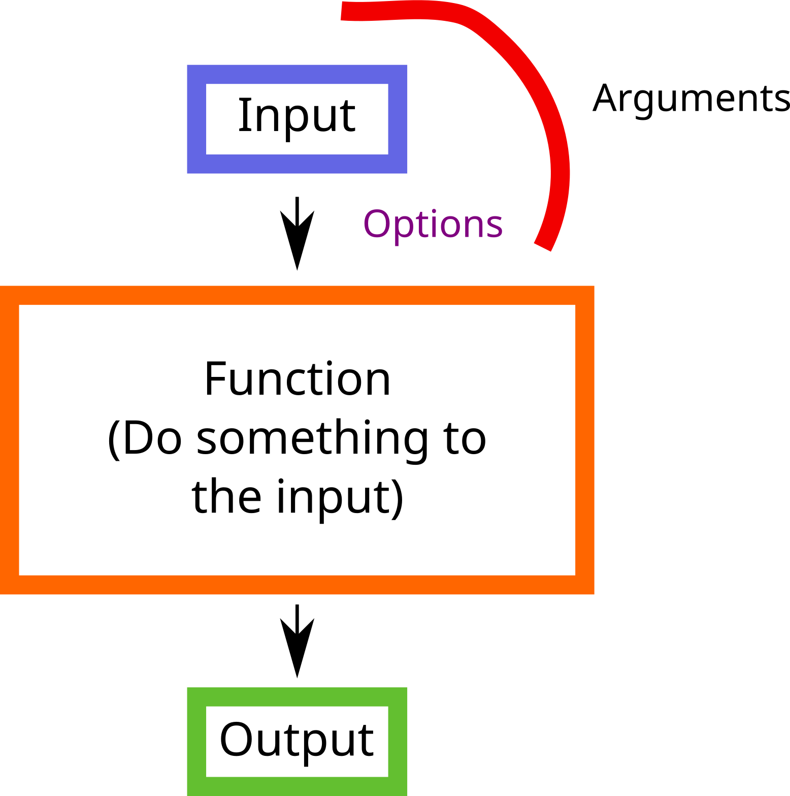
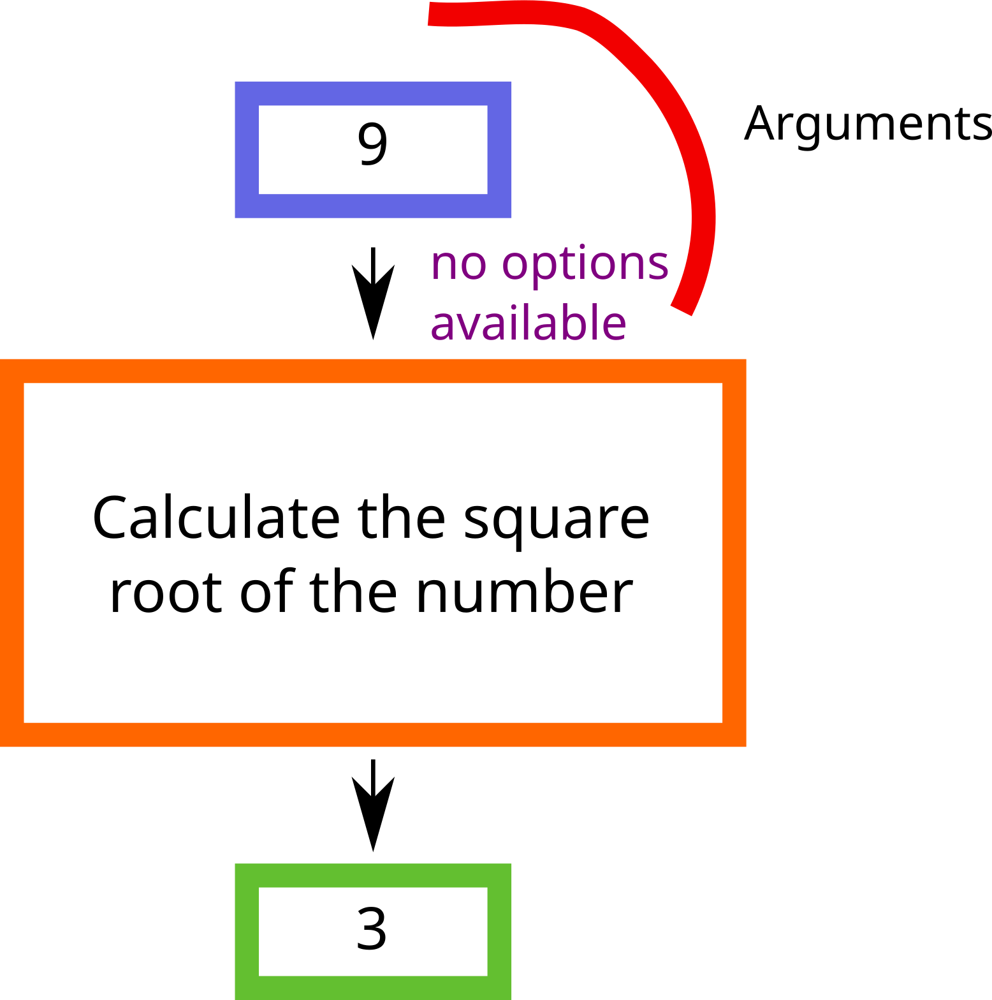
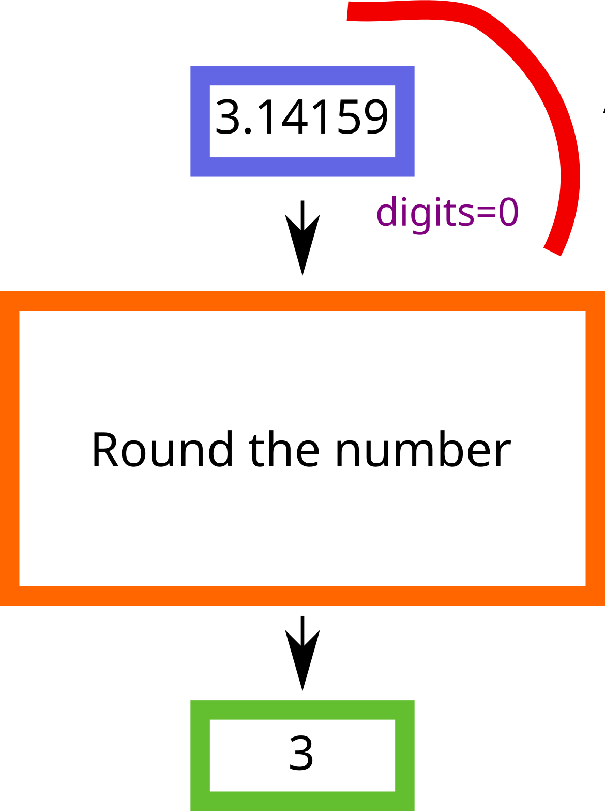
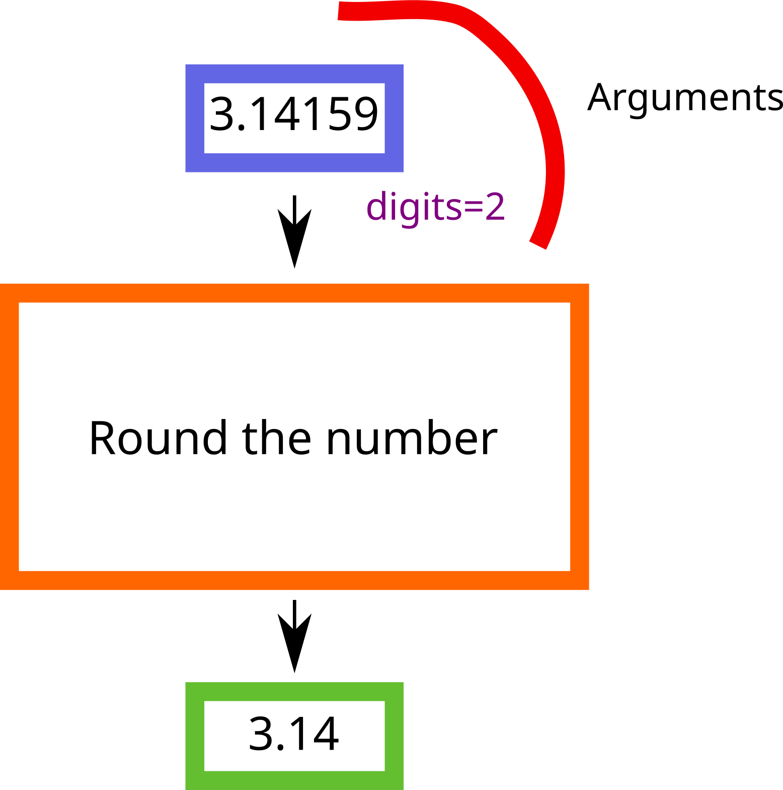

```{r setup0103, include=FALSE}
library(gt)
```

# Part 3: Functions and Variables {#sec-p3_functions_and_variables}

::: {.callout-note .partmenu #parts-0103}
## Sections
- @sec-functions
- @sec-arguments
- @sec-variables
- @sec-variable_types
- @sec-r_quirks [(Bonus)]{.bonus-text}
- @sec-summary_0103

:::

:::{.callout-tip .objectives #objectives-0103}
## Learning objectives
By the end of this part of the practical you should be able to:

- Explain what a function is and use some simple functions.
- Explain how and why we provide arguments to functions.
- Explain the concept of a variable and use variables in your code.
- Recognise and use common types of variable, including numeric, character and logical variables.

:::

For parts 3 and 4 of the practical, we recommend that you keep track of your progress in a new Quarto document, ``/prac1_exercises.qmd`. You can describe the code if you wish, or just label it with the exercise name. For the data analysis exercises in Part 4: exercises 5 and 6, please create a second Quarto document `/ukhsa_data_analysis.qmd` and briefly describe your analysis.

## Functions {#sec-functions .core}

[**Core**]{.core-text}

[↑ top](#)

**Functions** take an input (called an **argument**), perform an action, and often return an output. They allow us to perform common tasks without writing the same code repeatedly.

{#fig-functions width='50%'}

We have used some functions already:

* The `print()` function outputs text to the screen.
* The `sum()` function adds together a series of numbers.

Functions allow us to do the same thing multiple times without rewriting code. We can also write our own functions, we'll come to this in a later practical.

A function usually takes one or more inputs called **arguments**. They often (but not always) return an output.

A typical example would be the function `sqrt()`. The input (the argument) must be a number, and the output is the square root of that number.

{#fig-func_sqrt width="50%"}
```{r square_root}
sqrt(9)
```

Here, the input `9` is given as an argument to the `sqrt()` function. The function calculates the square root, and returns the value. This function is very simple, because it takes just one argument and has no additional options.

::: {.callout-exercise #ex-first_functions .core}

### Using functions

[**Core**]{.core-text}

The function `round()` rounds a number, by default into the nearest whole number.

In your `prac1_exercises.qmd` Quarto file, write some code to round the number 3.14159 to the nearest whole number.

::: {.callout-answer collapse="true" #ex-first_functions_ans}
```{r first_functions_ans}
round(3.14159)
```
:::
:::

## Arguments {#sec-arguments .core}

[**Core**]{.core-text}

[↑ top](#)

Arguments allow you to control the behaviour of a function. They can be anything, not only numbers. Exactly what each argument means differs per function and can be looked up in the documentation. 

Some functions take arguments which may either be specified by the user, or, if left out, take on a **default** value.

Arguments can be used to provide something to the function, such as the input data, or to alter the way the function operates.

Let's look at the `round()` function again.

{#fig-func_round1 width="50%"}

```{r, round_int}
round(3.14159)
```

This gives us an integer, 3.


{#fig-func_round2 width="50%"}

However, if we want e.g. two digits after the decimal point, we can type `digits = 2` (or however many we want). For example:

```{r, round_2}
round(3.14159, digits = 2)
```

### Ordering arguments {#sec-ordering_arguments .core}

When a function has several arguments, there are two common ways to provide them. You can either give the arguments in the correct order, or you can name each argument explicitly.

For example, let's take the function `seq()`.

This function generates a sequence of numbers. The arguments are, in order, `from`, `to` and `by`, where `from` is the number you want the sequence to start from, `to` is the number you want it to end at and `by` is the increment. If you search in the `Help` panel for `seq` you'll see this order - `from`, `to`, `by`.

We can call the function with these three arguments:

For example:

```{r seq1}
print(seq(1, 10, 2))
```
```{r seq2}
print(seq(5, 15, 5))
```
However, we can also use their names, and then put them in any order:

```{r seq3}
print(seq(by = 2, from = 1, to = 10))
```
```{r seq4}
print(seq(by = 5, to = 15, from = 5))
```

::: {.callout-exercise #ex-arg_order .core}

### Argument order

The function `rep()` repeats a value, `x` a specific number of times.
The order of arguments is: `rep(x, times)` - so you first specify `x`, then the number of `times` you want it to be repeated.

For example:
```{r rep1}
print(rep(2, 5))
```
```{r rep2}
print(rep(x = 2, times = 5))
```

In your `prac1_exercises.qmd` Quarto file, write some code to repeat the number 5, 7 times, first by specifying arguments in order and then using their names.

::: {.callout-answer collapse="true" #ex-arg_order_ans}
```{r arg_order_ans}
# ordered
print(rep(5, 7))

# keywords
print(rep(times = 7, x = 5))
```
:::
:::

## Variables {#sec-variables .core}

[**Core**]{.core-text}

[↑ top](#)

Another fundamental concept in programming is a **variable**.

Basically, a variable associates a specific name with a specific value. In R, we use the operator `<-` to assign a value to a name, we've done this several times already.

For example, by running the code below, we are saying that the name `my_variable` refers to the value `12`. 
When you run the code, it will seem like nothing has happened, but, internally, R now knows that `my_variable` is equal to `12`.

```{r variable_basic}
my_variable <- 12
```

To check this has worked, we can use the **function**, `print()` to show the value of our variable on the screen.

```{r variable_retrieve}
my_variable <- 12
print(my_variable)
```

We can change the value of our variable by assigning it a new value. Although the first line of the code below is run, the value is then replaced in the second line, so when we reach the third line, the value is `10`.

```{r variable_reassign}
my_variable <- 12
my_variable <- 10
print(my_variable)
```

::: {.callout-exercise #ex-varorder .core}

### Assigning values to variables

[**Core**]{.core-text}

What would be the value of `whatsmynumber` after running all of the code below?

```{r varorder}
whatsmynumber <- 1
whatsmynumber <- 5
```

::: {.callout-answer collapse="true" #ex-varorder_ans}
5
:::
:::

### Variable Names {#sec-variable_names .core}

You can have as many variables as you like, and use any name, with a few exceptions.

Your variable names should be one word, without spaces and ideally without punctuation except underscores ("_"), so the following won't work:

```{r error1, error=TRUE}
my-var <- 12
```


```{r error2, error=TRUE}
my var <- 12
```

In R, variable names can't start with a number.

```{r error3, error=TRUE}
1var <- 12
```

Some words have a special meaning in R and cannot be used as variable names. For example:

```{r error4, error=TRUE}
if <- 12
```


## Types of variable {#sec-variable_types .core}

[**Core**]{.core-text}

[↑ top](#)

### Numeric, character and logical variables {#sec-var_types_ncl .core}

Different types of data can be stored as variables. 

There are many types of variable in R.

Some of the most important are:

#### Numeric
(You may sometimes see the term `double` used for numeric values in R — you don't need to worry about the distinction yet.)

All variables which are numbers can be classed as numeric (there are some more specific number types but you don't need these yet)

```{r numeric_variable}
x <- 1
print(x)

x <- 1.74
print(x)

x <- 4e-3
print(x)
```

#### Character
(sometimes called a `string`)

A character variable consists of text - it can be one or multiple words.

```{r character_variable}
x <- "hello"
print(x)

x <- "I am a variable"
print(x)
```

#### Logical
(sometimes called `boolean`)

These can only be TRUE or FALSE.

```{r bool_variable}
x <- TRUE
print(x)

x <- FALSE
print(x)
```

#### Identifying types of variables

We can find out what type of variable we have using the function `class()`.
```{r print_class}
x <- "hi there"
print(class(x))

x <- 1513871
print(class(x))

x <- FALSE
print(class(x))
```

::: {.callout-exercise #ex-var_types .core}

### Character, numerical and logical variables

[**Core**]{.core-text}

In your `prac1_exercises.qmd` Quarto file, create character, numerical and logical variables, print them, then check their classes.

::: {.callout-answer collapse="true" #ex-var_types_ans}
```{r var_types_ans}
# for example
my_favourite_number <- 11
my_favourite_word <- "hullabaloo"
is_this_true <- FALSE

print(class(my_favourite_number))
print(class(my_favourite_word))
print(class(is_this_true))
```
:::
:::

::: {.callout-exercise #ex-celldata .core}

### Using variables of different types

[**Core**]{.core-text}

You have conducted an experiment in which you have treated one batch of cells with radiation and kept the other as a control, then counted the number of live cells before and after.

The attributes of your two batches of cells are in this table:

```{r table_cells, echo=FALSE}
df <- data.frame(
  cell_ID = c("CX1", "CX2"),
  treated = c(TRUE, FALSE),
  num_cells_before = c(5415, 8123),
  num_cells_after = c(1432, 7543)
)

gt(df)
```

In your `prac1_exercises.qmd` Quarto document, create eight variables of appropriate types which together contain all of the information in the table.

::: {.callout-answer collapse="true" #ex-celldata_ans}
```{r celldata_ans}
# for example
cell_id_1 <- "CX1"
cell_id_2 <- "CX2"

treated_1 <- TRUE
treated_2 <- FALSE

n_before_1 <- 5415
n_before_2 <- 8123

n_after_1 <- 1432
n_after_2 <- 7543
```
:::
:::

## Exploring the quirks of R {#sec-r_quirks .fold .bonus}

::: {.callout-exercise #ex-explore_r_quirks .bonus}

### Explore the quirks of R 

[**Bonus**]{.bonus-text}

If you have programmed before, some of R's behaviour may be different from languages you have previously used.

Predict the outcome of the following expressions, then test them in R. Are they as you expected?

```{r weird_r1, eval=FALSE}
print(TRUE + TRUE)
print(TRUE + FALSE)
print(5 + TRUE)
```

::: {.callout-answer collapse="true" #bon-explore_r_quirks_ans1}

**Logical values can behave like numbers**

When logical values are used in arithmetic, R converts `TRUE` to `1` and `FALSE` to `0`. Therefore:

- `TRUE + TRUE` gives `2`
- `TRUE + FALSE` gives `1`
- `5 + TRUE` gives `6`
:::

Predict the outcomes of the following chunks of code, then test them in R.

```{r weird_r2, eval=FALSE}
x <- NA
print(x == NA)
print(is.na(x))
```

::: {.callout-answer collapse="true" #bon-explore_r_quirks_ans2}

**Missing values are unknown**

`NA` represents a missing or unknown value. Asking whether an unknown value is equal to another unknown value does not give `TRUE` or `FALSE` — the answer is also unknown (`NA`).

For this reason, use `is.na()` to test whether a value is missing rather than `== NA`.
:::

```{r weird_r3, eval=FALSE}
x <- 0 / 0
print(x)
print(is.na(x))
print(is.nan(x))
```

::: {.callout-answer collapse="true" #bon-explore_r_quirks_ans3}

**`NaN` is a special kind of missing value**

`0 / 0` has no defined numerical value, so R returns `NaN` ("Not a Number"). `NaN` is considered missing, so `is.na(NaN)` is `TRUE`, but `is.nan()` can be used to distinguish `NaN` from other missing values.

:::

```{r weird_r4, eval=FALSE}
print(round(2.5))
print(round(3.5))
```

::: {.callout-answer collapse="true" #bon-explore_r_quirks_ans4}

**R may round halves differently than you expect**

R uses "round to even" for numbers exactly halfway between two possibilities. Therefore `round(2.5)` gives `2`, while `round(3.5)` gives `4`.

This reduces systematic bias that could result from always rounding `.5` upwards.
:::

R has several other special values and objects. Use the R Help system to find out what `Inf`, `-Inf` and `NULL` represent. Can you write an expression that produces `Inf` and `-Inf`? How does `NULL` differ from `NA` and `NaN`?

::: {.callout-answer collapse="true" #bon-explore_r_quirks_ans5}

**Other special values and objects**

`Inf` and `-Inf` represent positive and negative infinity. For example:

```{r weird_r_ans1}
print(1 / 0)
print(-1 / 0)
```

NULL represents the absence of a value or object. This is different from NA, which represents a value that exists but is missing or unknown.

:::
:::

## Review {#sec-summary_0103}

[↑ top](#)

::: {.callout-note #note-summary_0103}
## Summary
- A **function** performs a specific task, usually taking one or more inputs (called **arguments**) and often returning an output.
- **Arguments** provide information to a function and control how it behaves. Some arguments are optional and have default values.
- A **variable** stores a value under a name so that it can be used again later in your code.
- Choose **descriptive variable names** and avoid spaces, punctuation (except `_`), names beginning with numbers, and names that already have a meaning in R.
- Common variable types include **numeric** (numbers), **character** (text) and **logical** (`TRUE` or `FALSE`).
- The `class()` function tells you what type of data a variable contains.
:::

For this part of the practical, the main files you have created are:

- `prac1_exercises.qmd`

These are the files you should select when making your Git commit.


