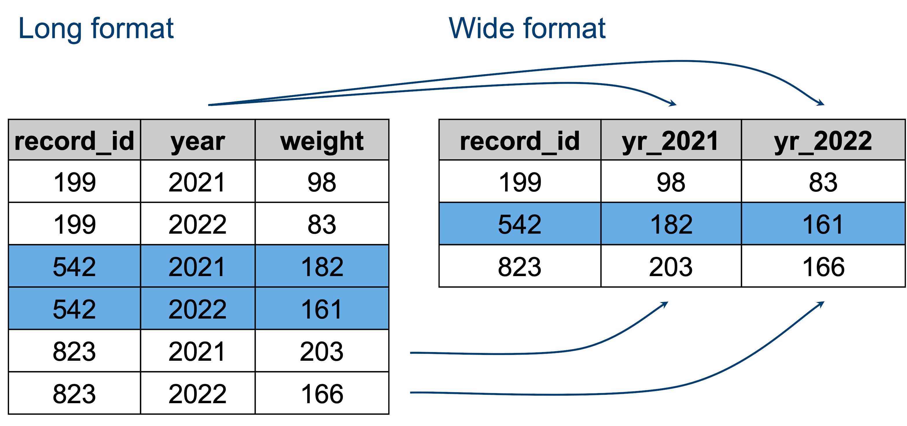

# Part 1: Manipulating Data Frames {#sec-p1_manipulating_dataframes}


::: {.callout-note .partmenu}
## Sections
- @sec-dataset
- @sec-select
- @sec-filter
- @sec-summary_stats
- @sec-merge
- @sec-long_wide
- @sec-summary_0201
:::

:::{.callout-tip .objectives}
#### Learning objectives
By the end of this part of the practical you will be able to:

* Use the pipe operator to create multi-step analyses.
* Select specific columns and rows from a dataframe.
* Calculate summary statistics for groups of observations.
* Merge information from multiple dataframes.
* Convert data from "wide" to "long" format.
:::

## Sync your Git repository


## Dataset {#sec-dataset}

In this practical, we will first work with a published dataset to learn how to perform various analyses in R. 

You'll then be asked to carry out a similar analysis independently with data from a different source.

For the worked example, we will use data from [this Science paper](https://doi.org/10.1126/science.ads0532), published in June 2026.
This study tracked the migration of a songbird species, the pied flycatcher (*Ficedula hypoleuca*).

We will reproduce Figure 1B from this paper, which shows the breeding site, Iberian stopover location and winter location for 8 bird populations.

All of the data we will use comes from the Supplementary Data associated with this publication.

{#fig-pied_flycatcher width="30%"}


The first part of the data we will use for this practical contains the longitude and latitude co-ordinates for breeding sites for eight specific populations of pied flycatcher. This data comes from Supplementary Table 1 in the publication. 

### Starting your analysis

The file is in the data directory for Practical 2 and named `breeding_site_locations.csv`. Open this file in a text editor (for example NotePad, TextEdit) and examine it.

::: {.callout-exercise #ex_breeding_csv}



What is the longitude of the Moscow breeding site?

::: {.callout-answer collapse="true"}
36.7
:::
:::

### Reading the breeding site CSV file

Now we will start to build a new Quarto document to examine this dataset.

You will need to include the following as an R code chunk at the start of the document.

```{r include_libs}
library(gt)
library(tidyverse)
```

There are two data frames needed - saved in your practical 2 data directory as `data/breeding_site_locations.csv` and `data/migratory_connectivity_dataset.csv`.

::: {.callout-exercise #ex_read_csv}



In your document, read `data/breeding_site_locations.csv` into a variable, then view it with `gt`.

::: {.callout-note #ex_read_csv_nb}
Reminder: The R function `read_csv` reads a CSV file into R as a data frame. The function `gt` is used to view a data frame.

:::

::: {.callout-answer collapse="true"}
```{r read_bird_data, eval=FALSE}
bird_breeding_sites <- read_csv("data/breeding_site_locations.csv")
gt(bird_breeding_sites)
```
:::
:::

It should look like this:

```{r view_breeding_location_data}
bird_breeding_sites <- read_csv("data/breeding_site_locations.csv")
gt(bird_breeding_sites)
```

### Examining the breeding site CSV file

You can view just the column names from the data frame using the function `colnames()`.

```{r colnames_birds}
colnames(bird_breeding_sites)
```

The contents of columns in this data frame are described in the publication, we will just focus on three for our main analysis.

* Site - breeding site name used throughout the publication
* Longitude - longitude of the breeding site
* Latitude - latitude of the breeding site

We can use the function `glimpse()` to see a summary of the data frame.

```{r glimpse_birds}
glimpse(bird_breeding_sites)
```

At the top, we can see how many rows and columns the data frame has.

There is then a summary of each column. The second column shows `<chr>` or `<dbl>` - `<chr>` columns contain **character** data and `<dbl>` columns contain **numeric** data (sometimes called **double**)


### Reading the migration site CSV file

We also need to read a second CSV file into a data frame. This one contains the data about the Iberian stopover and winter migration sites for the birds. It is identical to one of the Supplementary Data files associated with the publication.

Unlike the breeding site data, in this table there are multiple records for each site - as the birds were recorded at multiple locations.

::: {.callout-exercise #ex_read_csv2}
The data frame is saved in the `data` directory for this practical as `data/migratory_connectivity_dataset.csv`.

In your Quarto document, please read the file into a variable and visualise the top 10 rows using the `gt()` and `head()` functions.

::: {.callout-note #ex_read_csv_nb}
Reminder: You can nicely visualise the top 10 rows of a data frame using `gt()` and `head()` together as follows, replacing `df_variable` with your variable name.

```{r gthead, eval=FALSE}
gt(head(df_variable))
```

:::

::: {.callout-answer collapse="true"}
```{r read_bird_data2}
bird_migration_sites <- read_csv("data/migratory_connectivity_dataset.csv")
gt(head(bird_migration_sites))
```

:::
:::

::: {.callout-exercise #ex_examine_csv}
Examine this dataframe using the `glimpse` function.

How many columns and rows are there?

::: {.callout-answer collapse="true"}
100 rows, 34 columns
:::

What is the data type for the column `Tag`?

::: {.callout-answer collapse="true"}
character (`<chr>`)
:::

What is the data type for the column `Birth`?

::: {.callout-answer collapse="true}
numeric / double (`<dbl>`)
:::
:::

This data frame again has many columns.
```{r colnames_migration}
colnames(bird_migration_sites)
```

The full details of all of the columns are provided in the supplementary data for the publication. 

We will just use five columns in our analysis:

* Site - breeding site name used throughout the publication
* winterLongitude - longitude of the winter migration site
* winterLatitude - latitude of the winter migration site
* iblon - longitude of the Iberian stopover site
* iblat - latitude of the Iberian stopover site


## The Pipe Symbol {#sec-pipe}

To do this, we first need to learn about the **pipe** symbol `|>`. This is an **operator** in R which is used to link multiple steps in an analysis.

For example:

```{r pipe_sym}
my_numbers <- c(2, 4, 6, 8)

my_numbers |> sum()
```
Here, we first make a **vector** of numbers, then we use this vector as the input to the function `sum()`.

This produces the same result as:

```{r mean_no_pipe}
my_numbers <- c(2, 4, 6, 8)

sum(my_numbers)
```

Pipes make it easier to perform a series of steps on the same variable:

```{r pipe_longer}
my_numbers <- c(2, 4, 6, 8)

my_numbers |>
  sum() |>
  sqrt()
```

This produces the same result as:

```{r nopipe_longer}
my_numbers <- c(2, 4, 6, 8)

sqrt(sum(my_numbers))
```

You can keep adding additional steps to your pipe:

```{r pipe_longerer}
my_numbers <- c(2, 4, 6, 8)

my_numbers |>
  sum() |>
  sqrt() |>
  round()
```

This produces the same result as:

```{r nopipe_longerer}
my_numbers <- c(2, 4, 6, 8)

round(sqrt(sum(my_numbers)))
```

We can assign the result to a variable using the `<-` operator as usual.

```{r pipe_longerer_assign}
my_numbers <- c(2, 4, 6, 8)

my_result <- my_numbers |>
  sum() |>
  sqrt() |>
  round()

print(my_result)
```

::: {.callout-exercise #ex_pipe}
Using the pipe operator, calculate the absolute value (function `abs()`) of the mean (function `mean()` of this vector, then round it to the nearest whole number (`round()`). Assign the result to a variable.

```{r pipe_vec}
input_vec <- c(5, 10, 4, 3)
```

::: {.callout-answer collapse="true}
```{r pipe_vec_ans}
input_vec <- c(5, 10, 4, 3)

result <- input_vec |>
  mean() |>
  abs() |>
  round()
```

:::
:::


## Selecting columns {#sec-select}

For simplicity, we can filter our data frames to just have the relevant columns. We will do this by **piping** our data to the function `select()`.

Select takes the names of the columns you want to keep as arguments.

Let's select just the `Site`, `Longitude` and `Latitude` columns from our `bird_breeding_sites` table.


```{r select_breeding}
bird_breeding_selected <- bird_breeding_sites |>
  select(Site, Longitude, Latitude)

gt(bird_breeding_selected)
```

I can see that some of these rows are duplicates, so I will also select only unique rows,
with the function `distinct()`.

```{r select_breeding_uni}
bird_breeding_selected <- bird_breeding_sites |>
  select(Site, Longitude, Latitude) |>
  distinct()

gt(bird_breeding_selected)
```

I will also rename the columns in this new table to be a bit clearer, using the `rename()` function.

```{r select_breeding_uni_rename}
bird_breeding_selected <- bird_breeding_sites |>
  select(Site, Longitude, Latitude) |>
  distinct() |>
  rename(Breeding_Longitude = Longitude, Breeding_Latitude = Latitude)

gt(bird_breeding_selected)
```
::: {.callout-exercise #ex_select_breeding}

Repeat this for the `bird_migration_sites` dataframe:

* Select the columns Site, winterLongitude, winterLatitude, iblon, iblat
* Take the distinct rows only
* Rename winterLongitude as Winter_Longitude, winterLatitude as Winter_Latitude, iblon as Stopover_Longitude and iblat as Stopover_Latitude.

Store the result in a variable named `bird_migration_selected`.

::: {.callout-answer collapse="true"}
```{r select_breeding_ex_ans}
bird_migration_selected <- bird_migration_sites |>
  select(Site, winterLongitude, winterLatitude, iblon, iblat) |>
  unique() |>
  rename(
    Winter_Longitude = winterLongitude,
    Winter_Latitude = winterLatitude,
    Stopover_Longitude = iblon,
    Stopover_Latitude = iblat
  )

gt(head(bird_migration_selected))
```

:::
:::

## Filtering rows {#sec-filter}

### Comparison operators
We can also filter our data frame to just see certain rows.

To do this, one option is to use **comparison operators**. 

For example:

| Operator | Meaning |
|-------|------------------------------------|
| `==` | is equal to |
| `!=` | is not equal to |
| `>` | is greater than |
| `>=` | is greater than or equal to |
| `<` | is less than |
| `<=` | is less than or equal to |

We can use these with single values as well as with data frame columns:

```{r operators1}
x <- 3

print(x == 2)
```
This shows `FALSE` because `x` is not equal to `2`.

```{r operators2}
x <- 3

print(x == 3)
```
This shows `TRUE` because `x` is equal to `3`.

::: {.callout-exercise #ex_select_breeding}
Assign `y` a value of 12 and then use comparison operators to show if:

`y` is equal to 7
`y` is less than 15
`y` is greater than 20
`y` is less than or equal to 12

:::{.callout-answer collapse="true"}
```{r operator_ex_ans1}
y <- 12
```

```{r operator_ex_ans2}
print(y == 7)
```

```{r operator_ex_ans3}
print(y < 15)
```

```{r operator_ex_ans4}
print(y > 20)
```

```{r operator_ex_ans5}
print(y <= 12)
```
:::
:::

### Filtering data frames
On our data frame columns, we can use the function `filter` to get the rows which match our criteria.

For example, to get only rows for the site "Dartmoor".

```{r filter1}
bird_breeding_dartmoor <- bird_breeding_selected |> filter(Site == "Dartmoor")

gt(bird_breeding_dartmoor)
```

To get rows for everywhere except Dartmoor:

```{r filter2}
bird_breeding_not_dartmoor <- bird_breeding_selected |> filter(Site != "Dartmoor")

gt(bird_breeding_not_dartmoor)
```
To get rows where `Breeding_Longitude` is greater than `10`:

```{r filter3}
bird_breeding_long_10 <- bird_breeding_selected |> filter(Breeding_Longitude > 10)

gt(bird_breeding_long_10)
```

For our analysis we will exclude the measurements from the `Spain` site, as their Iberian stopover locations are very close to their breeding locations. 

::: {.callout-exercise #ex_select_breeding}

Filter both the breeding site and the migration site data frames to exclude `Spain` from the `Site` column. Store these in the variables `bird_breeding_exc` and `bird_migration_exc`, respectively.

::: {.callout-answer collapse="true"}
```{r filter_spain}
bird_breeding_exc <- bird_breeding_selected |>
  filter(Site != "Spain")

bird_migration_exc <- bird_migration_selected |>
  filter(Site != "Spain")

gt(bird_breeding_exc)
```

```{r filter_spain2}
gt(head(bird_migration_exc))
```

:::
:::

## Grouping and summarising data {#sec-summary_stats}

At the moment, the data frame `bird_breeding_exc` has seven rows, one for each breeding site - as the breeding sites are small, fixed locations. However, the data frame `bird_migration_exc` has multiple measurements for Iberian stopover location and winter location for each breeding site - as the numerous birds were tracked as they migrated.

For our visualisation, it's sufficient to just take the median value for Iberian stopover location and winter location for each breeding site.

To do this, we can *group* our data by the values in a specific column, then calculate summary statistics for each group.

We group data using the `group_by()` function, then summarise for each group using the `summarize()` function.

First, let's group our migration frame by the `Site` column.

```{r groupby}
bird_migration_grouped <- bird_migration_exc |> group_by(Site)
```

We can't really visualise the grouped data frame, but we can check it has worked using the `glimpse` function:

```{r glimpse_groupby}
glimpse(bird_migration_grouped)
```
We can see `Groups: Site [7]` at the top, which tells us our data frame is grouped into seven different sites.

`group_by()` does not change the data itself. It tells R how later calculations should be applied.

We can then use the function `summarize()` to calculate specific statistics per group and generate a new data frame containing these values.

For example, here we create a new data frame, `lat_df`, with one column `Highest_Lat_Stopover`, which contains the maximum (calculated with the function `max()`) value in the `Stopover_Latitude` column for each Site.

::: {.callout-note #nb_narm}
Notice the `na.rm = TRUE` argument here - this is telling R to ignore any rows which have a value of "NA".
:::

```{r grouped_summarise}
lat_df <- bird_migration_grouped |>
  summarise(Highest_Lat_Stopover = max(Stopover_Latitude, na.rm = TRUE))

gt(lat_df)
```

We can calculate multiple summary statistics at the same time:

```{r grouped_summarise2}
lat_df <- bird_migration_grouped |>
  summarise(
    Highest_Lat_Stopover = max(Stopover_Latitude, na.rm = TRUE),
    Lowest_Lat_Stopover = min(Stopover_Latitude, na.rm = TRUE),
    Mean_Lat_Stopover = mean(Stopover_Latitude, na.rm = TRUE),
    Higher_Lat_Winter = max(Winter_Latitude, na.rm = TRUE),
    Lowest_Lat_Winter = min(Winter_Latitude, na.rm = TRUE),
    Mean_Lat_Winter = mean(Winter_Latitude, na.rm = TRUE)
  )

gt(lat_df)
```

::: {.callout-exercise #ex_medians_migration}

For the migration site data frame, group by site and then make a new summary data frame which contains median values for the columns `Stopover_Latitude`, `Stopover_Longitude`, `Winter_Latitude` and `Winter_Longitude` for each Site. Name the new columns to match the original columns -  `Stopover_Latitude`, `Stopover_Longitude`, `Winter_Latitude`, `Winter_Longitude`.

Store this new data frame in a variable `bird_migration_summary`.

::: {.callout-answer collapse="true"}
```{r migration_summary}
bird_migration_grouped <- bird_migration_exc |> group_by(Site)

bird_migration_summary <- bird_migration_grouped |>
  summarise(
    Stopover_Longitude = median(Stopover_Longitude, na.rm = TRUE),
    Stopover_Latitude = median(Stopover_Latitude, na.rm = TRUE),
    Winter_Longitude = median(Winter_Longitude, na.rm = TRUE),
    Winter_Latitude = median(Winter_Latitude, na.rm = TRUE)
  )
gt(bird_migration_summary)
```
:::
:::

## Joining data frames {#sec-merge}

Datasets often contain information spread across several tables, as we see here.

A **join** allows us to combine two data frames into one, assuming they have a column in common.

To demonstrate, here are two small example data frames, showing the Department name and Assessment Score for several individuals in an university. Some people are in both tables, some are only in one or the other. The shared column `Name` allows them to be joined easily.

```{r read_dfs}
df_dept <- read_csv("data/depts.csv")
df_score <- read_csv("data/scores.csv")
```

```{r show_dept}
gt(df_dept)
```

```{r show_score}
gt(df_score)
```

If we want to combine these into a single data frame, we have various options.

A **full join** retains all of the rows from both data frames, adding **NA** where no data is available.

```{r full_join}
full_join_example <- full_join(df_dept, df_score)

gt(full_join_example)
```

An **inner join** only retains rows for individuals which are in both data frames.

```{r inner_join}
inner_join_example <- inner_join(df_dept, df_score)

gt(inner_join_example)
```
A **left join** retains all the rows in the first data frame and adds data from the second data frame where available, adding **NA** where it is not.

```{r left_join}
left_join_example <- left_join(df_dept, df_score)

gt(left_join_example)
```

A **right join** retains all the rows in the second data frame and adds data from the first data frame where available, adding **NA** where it is not.

```{r right_join}
right_join_example <- right_join(df_dept, df_score)

gt(right_join_example)
```

For our bird data, the `Site` column is shared between the two data frames - `bird_breeding_selected` and `bird_migration_exc`.

We can actually use any type of join, because all of the sites are in both data frames, let's use a **full join**.

::: {.callout-exercise #ex_join}
Perform a full outer join on the `bird_breeding_exc` data frame and the `bird_migration_summary` data frame. Store the resulting data frame in a new variable, named `combined_bird_data`.

::: {.callout-answer #ex_join_ans}
```{r join_birds}
combined_bird_data <- full_join(bird_breeding_exc, bird_migration_summary)

gt(combined_bird_data)
```

:::
:::

## Long and wide formats {#sec-long_wide}

We need to perform one more transformation before we can plot our data.

Our data is currently in what is known as **wide** format - with a single row per site and multiple columns for each measurement for that site. So, all our measurements for each site are on a single row in the data frame.

The plots we want to create will be simpler if we convert the data to **long** format, where, instead, each measurement has a row and there are multiple rows per site.

{#fig-env_tab width="50%"}

We can convert our data frame to long format using the `pivot_longer()` function.

This is a little more complicated than some of the other functions we have used.

Basically we are instructing R to:

- **Select the columns to reshape**: take any columns ending in `_Longitude` or `_Latitude` using `cols = ends_with(c("_Longitude", "_Latitude"))`.
- **Split the column names**: separate the original column names wherever there is an underscore using `names_sep = "_"`.
- **Create new column names**: use the first part of the original column name to create a new column called `Location_Type`, and use the second part (`Longitude` or `Latitude`) to create new columns containing the values. This is specified with `names_to = c("Location_Type", ".value")`.

Single row example:

Before:

| Bird | Breeding_Longitude | Breeding_Latitude | Winter_Longitude | Winter_Latitude |
|-|-|-|-|-|
| A | 10 | 50 | 20 | 40 |

After:

| Bird | Location_Type | Longitude | Latitude |
|-|-|-|-|
| A | Breeding | 10 | 50 |
| A | Winter | 20 | 40 |

We won't ask you to do this in the visualisation exercise, but it's needed in this case.

```{r pivotpivotpivot}
combined_bird_piv <- combined_bird_data |>
  pivot_longer(
    cols = ends_with(c("_Longitude", "_Latitude")),
    names_sep = "_",
    names_to = c("Location_Type", ".value")
  )

gt(combined_bird_piv)
```

We now have our input table for Part 2!


## Review {#sec-summary_0201}

::: {.callout-note}

## Summary

* The **pipe operator** (`|>`) allows us to pass data through a series of analysis steps.
* `select()` allows us to choose specific columns from a data frame.
* `filter()` allows us to select rows which match specific conditions.
* `group_by()` and `summarise()` allow us to calculate statistics for groups of observations.
* **Joins** allow us to combine information from multiple data frames using shared columns.
* `pivot_longer()` converts data from **wide format** into **long format**, making it easier to analyse and visualise.

:::

Remember to save your work before moving on to Part 2.




