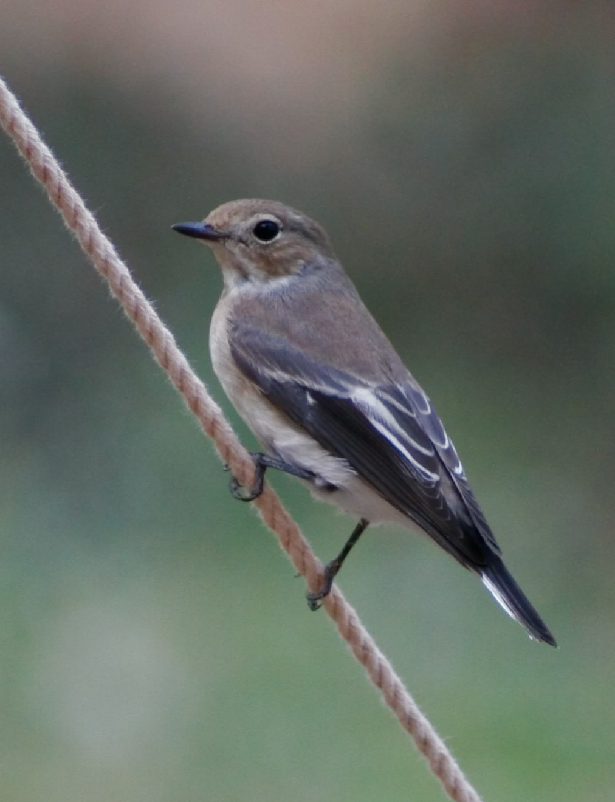

# Part 1: Basic Data Frame Operations {#sec-p1_basic_data_frame_operations}

::: {.callout-note .partmenu #parts-0201}
## Sections

- @sec-dataset
- @sec-pipe
- @sec-select
- @sec-filter
- @sec-summary_0201

:::

:::{.callout-tip .objectives}
#### Learning objectives
By the end of this part of the practical you will be able to:

* Use the pipe operator to create multi-step analyses.
* Select specific columns from a data frame.
* Select rows from a data frame which meet specific criteria

:::

## Sync your Git repository


## Dataset {#sec-dataset}

[↑ top](#)

In this practical, we will first work with a published dataset to learn how to perform various analyses in R. 

You'll then be asked to carry out a similar analysis independently with data from a different source.

For the worked example, we will use data from [this Science paper](https://doi.org/10.1126/science.ads0532), published in June 2026.
This study tracked the migration of a songbird species, the pied flycatcher (*Ficedula hypoleuca*).

We will reproduce Figure 1B from this paper, which shows the breeding site, post-Saharan stopover location and winter location for 8 bird populations.

::: {.callout-exercise #ex-view_plot}



Have a look at this plot and its legend.

What are the `x` and `y` axis labels?

::: {.callout-answer collapse="true" #ex-view_plot_ans1}

x - Longitude

y - Latitude

:::

What do the colours represent?

::: {.callout-answer collapse="true" #ex-view_plot_ans2}
The locations of the breeding populations.

* Orange - Spain
* Purple - Norway
* Blue - Sweden
* Pink - Britain
* Red - Netherlands
* Turquoise - western Russia
* Green - Ural
* Dark green - Siberia
:::

What do the shapes represent?

::: {.callout-answer collapse="true" #ex-view_plot_ans3}
The type of site:

* Circles - breeding site
* Triangles - post-Saharan stopover location
* Squares - non-breeding area (this is the winter location)

:::

:::

All of the data we will use comes from the Supplementary Data associated with this publication.

{#fig-pied_flycatcher width="30%"}

To produce this plot, we need a single data frame which contains all of the information in the plot:

* Breeding site
* Longitude and latitude of breeding site
* Longitude and latitude of post-Saharan stopover
* Longitude and latitude of winter non-breeding site

However, as is very common with biological datasets, the data provided with the publication is not in the ideal format for our needs. Therefore, there are various **data frame operations** we need to perform before we start plotting.

### Starting your analysis

The first part of the data we will use for this practical contains the longitude and latitude co-ordinates for breeding sites for eight specific populations of pied flycatcher. This data comes from Supplementary Table 1 in the publication. 


The file is in the data directory for Practical 2 and named `breeding_site_locations.csv`. Open this file in a text editor (for example NotePad, TextEdit) and examine it.

::: {.callout-exercise #ex-breeding_csv}



What is the longitude of the Moscow breeding site?

::: {.callout-answer collapse="true" #ex-breeding_csv_ans}
36.7
:::
:::

### Reading the breeding site CSV file

Now we will start to build a new Quarto document to examine this dataset.

You will need to include the following as an R code chunk at the start of the document.

```{r setup0201}
library(gt)
library(tidyverse)
```

There are two data frames needed - saved in your practical 2 data directory as `data/breeding_site_locations.csv` and `data/migratory_connectivity_dataset.csv`.

::: {.callout-exercise #ex-read_csv}



In your document, read `data/breeding_site_locations.csv` into a variable, then view it with `gt`.

::: {.callout-note #note-read_csv}
Reminder: The R function `read_csv` reads a CSV file into R as a data frame. The function `gt` is used to view a data frame.

:::

::: {.callout-answer collapse="true" #ex-read_csv_ans}
```{r read_bird_data, eval=FALSE}
bird_breeding_sites <- read_csv("data/breeding_site_locations.csv")
gt(bird_breeding_sites)
```
:::
:::

It should look like this:

```{r view_breeding_location_data}
bird_breeding_sites <- read_csv("data/breeding_site_locations.csv")
gt(bird_breeding_sites)
```

### Examining the breeding site CSV file

You can view just the column names from the data frame using the function `colnames()`.

```{r colnames_birds}
colnames(bird_breeding_sites)
```

The contents of columns in this data frame are described in the publication, we will just focus on three for our main analysis.

* Site - breeding site name used throughout the publication
* Longitude - longitude of the breeding site
* Latitude - latitude of the breeding site

We can use the function `glimpse()` to see a summary of the data frame.

```{r glimpse_birds}
glimpse(bird_breeding_sites)
```

At the top, we can see how many rows and columns the data frame has.

There is then a summary of each column. The second column shows `<chr>` or `<dbl>` - `<chr>` columns contain **character** data and `<dbl>` columns contain **numeric** data (sometimes called **double**)


### Reading the migration site CSV file

We also need to read a second CSV file into a data frame. This one contains the data about the post-Saharan stopover and winter migration sites for the birds. It is identical to one of the Supplementary Data files associated with the publication.

Unlike the breeding site data, in this table there are multiple records for each site - as the birds were recorded at multiple locations.

::: {.callout-exercise #ex-read_csv2}



The data frame is saved in the `data` directory for this practical as `data/migratory_connectivity_dataset.csv`.

In your Quarto document, please read the file into a variable and visualise the top 10 rows using the `gt()` and `head()` functions.

::: {.callout-note #note-gt_head}
Reminder: You can nicely visualise the top 10 rows of a data frame using `gt()` and `head()` together as follows, replacing `df_variable` with your variable name.

```{r gthead, eval=FALSE}
gt(head(df_variable))
```

:::

::: {.callout-answer collapse="true" #ex-read_csv2_ans}
```{r read_csv2_ans}
bird_migration_sites <- read_csv("data/migratory_connectivity_dataset.csv")
gt(head(bird_migration_sites))
```

:::
:::

::: {.callout-exercise #ex-examine_csv}



Examine this data frame using the `glimpse` function.

How many columns and rows are there?

::: {.callout-answer collapse="true" #ex-examine_csv_ans1}
100 rows, 34 columns
:::

What is the data type for the column `Tag`?

::: {.callout-answer collapse="true" #ex-examine_csv_ans2}
character (`<chr>`)
:::

What is the data type for the column `Birth`?

::: {.callout-answer collapse="true" #ex-examine_csv_ans3}
numeric / double (`<dbl>`)
:::
:::

This data frame again has many columns.
```{r colnames_migration}
colnames(bird_migration_sites)
```

The full details of all of the columns are provided in the supplementary data for the publication. 

We will just use five columns in our analysis:

* Site - breeding site name used throughout the publication
* winterLongitude - longitude of the winter migration site
* winterLatitude - latitude of the winter migration site
* pslon - longitude of the post-Saharan stopover site
* pslat - latitude of the post-Saharan stopover site


## The Pipe Symbol {#sec-pipe}

[↑ top](#)

To do this, we first need to learn about the **pipe** symbol `|>`. This is an **operator** in R which is used to link multiple steps in an analysis.

For example:

```{r pipe_sym}
my_numbers <- c(2, 4, 6, 8)

my_numbers |> sum()
```
Here, we first make a **vector** of numbers, then we use this vector as the input to the function `sum()`.

This produces the same result as:

```{r mean_no_pipe}
my_numbers <- c(2, 4, 6, 8)

sum(my_numbers)
```

Pipes make it easier to perform a series of steps on the same variable:

```{r pipe_longer}
my_numbers <- c(2, 4, 6, 8)

my_numbers |>
  sum() |>
  sqrt()
```

This produces the same result as:

```{r nopipe_longer}
my_numbers <- c(2, 4, 6, 8)

sqrt(sum(my_numbers))
```

You can keep adding additional steps to your pipe:

```{r pipe_longerer}
my_numbers <- c(2, 4, 6, 8)

my_numbers |>
  sum() |>
  sqrt() |>
  round()
```

This produces the same result as:

```{r nopipe_longerer}
my_numbers <- c(2, 4, 6, 8)

round(sqrt(sum(my_numbers)))
```

We can assign the result to a variable using the `<-` operator as usual.

```{r pipe_longerer_assign}
my_numbers <- c(2, 4, 6, 8)

my_result <- my_numbers |>
  sum() |>
  sqrt() |>
  round()

print(my_result)
```

::: {.callout-exercise #ex-pipe}



Using the pipe operator, calculate the absolute value (function `abs()`) of the mean (function `mean()` of this vector, then round it to the nearest whole number (`round()`). Assign the result to a variable.

```{r pipe_vec}
input_vec <- c(5, 10, 4, 3)
```

::: {.callout-answer collapse="true #ex-pipe_ans}
```{r pipe_ans}
input_vec <- c(5, 10, 4, 3)

result <- input_vec |>
  mean() |>
  abs() |>
  round()
```

:::
:::


## Selecting columns {#sec-select}

[↑ top](#)

For simplicity, we can filter our data frames to just have the relevant columns. We will do this by **piping** our data to the function `select()`.

Select takes the names of the columns you want to keep as arguments.

Let's select just the `Site`, `Longitude` and `Latitude` columns from our `bird_breeding_sites` table.


```{r select_breeding}
bird_breeding_selected <- bird_breeding_sites |>
  select(Site, Longitude, Latitude)

gt(bird_breeding_selected)
```

I can see that some of these rows are duplicates, so I will also select only unique rows,
with the function `distinct()`.

```{r select_breeding_uni}
bird_breeding_selected <- bird_breeding_sites |>
  select(Site, Longitude, Latitude) |>
  distinct()

gt(bird_breeding_selected)
```

I will also rename the columns in this new table to be a bit clearer, using the `rename()` function.

```{r select_breeding_uni_rename}
bird_breeding_selected <- bird_breeding_sites |>
  select(Site, Longitude, Latitude) |>
  distinct() |>
  rename(Breeding_Longitude = Longitude, Breeding_Latitude = Latitude)

gt(bird_breeding_selected)
```
::: {.callout-exercise #ex-select_migration}



Repeat this for the `bird_migration_sites` data frame:

* Select the columns Site, winterLongitude, winterLatitude, pslon, pslat
* Take the distinct rows only
* Rename winterLongitude as Winter_Longitude, winterLatitude as Winter_Latitude, pslon as Stopover_Longitude and pslat as Stopover_Latitude.

Store the result in a variable named `bird_migration_selected`.

::: {.callout-answer collapse="true" #ex-select_migration_ans}
```{r select_migration_ans}
bird_migration_selected <- bird_migration_sites |>
  select(Site, winterLongitude, winterLatitude, pslon, pslat) |>
  unique() |>
  rename(
    Winter_Longitude = winterLongitude,
    Winter_Latitude = winterLatitude,
    Stopover_Longitude = pslon,
    Stopover_Latitude = pslat
  )

gt(head(bird_migration_selected))
```

:::
:::

## Filtering rows {#sec-filter}

[↑ top](#)

### Comparison operators
We can also filter our data frame to just see certain rows.

To do this, one option is to use **comparison operators**. 

For example:

| Operator | Meaning |
|-------|------------------------------------|
| `==` | is equal to |
| `!=` | is not equal to |
| `>` | is greater than |
| `>=` | is greater than or equal to |
| `<` | is less than |
| `<=` | is less than or equal to |

We can use these with single values as well as with data frame columns:

```{r operators1}
x <- 3

print(x == 2)
```
This shows `FALSE` because `x` is not equal to `2`.

```{r operators2}
x <- 3

print(x == 3)
```
This shows `TRUE` because `x` is equal to `3`.

::: {.callout-exercise #ex-comparisons}



Assign `y` a value of 12 and then use comparison operators to show if:

`y` is equal to 7
`y` is less than 15
`y` is greater than 20
`y` is less than or equal to 12

:::{.callout-answer collapse="true" #ex-comparisons_ans}
```{r comparisons_ans1}
y <- 12
```

```{r comparisons_ans2}
print(y == 7)
```

```{r comparisons_ans3}
print(y < 15)
```

```{r comparisons_ans4}
print(y > 20)
```

```{r comparisons_ans5}
print(y <= 12)
```
:::
:::

### Filtering data frames
On our data frame columns, we can use the function `filter` to get the rows which match our criteria.

For example, to get only rows for the site "Dartmoor".

```{r filter1}
bird_breeding_dartmoor <- bird_breeding_selected |> filter(Site == "Dartmoor")

gt(bird_breeding_dartmoor)
```

To get rows for everywhere except Dartmoor:

```{r filter2}
bird_breeding_not_dartmoor <- bird_breeding_selected |> filter(Site != "Dartmoor")

gt(bird_breeding_not_dartmoor)
```
To get rows where `Breeding_Longitude` is greater than `10`:

```{r filter3}
bird_breeding_long_10 <- bird_breeding_selected |> filter(Breeding_Longitude > 10)

gt(bird_breeding_long_10)
```

For our analysis we will exclude the measurements from the `Spain` site, as their post-Saharan stopover locations are very close to their breeding locations. 

::: {.callout-exercise #ex-filter_breeding}



Filter both the breeding site and the migration site data frames to exclude `Spain` from the `Site` column. Store these in the variables `bird_breeding_exc` and `bird_migration_exc`, respectively.

::: {.callout-answer collapse="true" #ex-filter_breeding_ans}
```{r filter_breeding_ans1}
bird_breeding_exc <- bird_breeding_selected |>
  filter(Site != "Spain")

bird_migration_exc <- bird_migration_selected |>
  filter(Site != "Spain")

gt(bird_breeding_exc)
```

```{r filter_breeding_ans2}
gt(head(bird_migration_exc))
```

:::
:::

## Review {#sec-summary_0201}

[↑ top](#)

::: {.callout-note #note-summary_0201}

### Summary

* The **pipe operator** (`|>`) allows us to pass data through a series of analysis steps.
* `select()` allows us to choose specific columns from a data frame.
* `filter()` allows us to select rows which match specific conditions.

:::

Remember to save your work before moving on to Part 2.



```{r export_df, include=FALSE}
write_csv(bird_breeding_exc, "output/bird_breeding_exc.csv")
write_csv(bird_migration_exc, "output/bird_migration_exc.csv")
```
