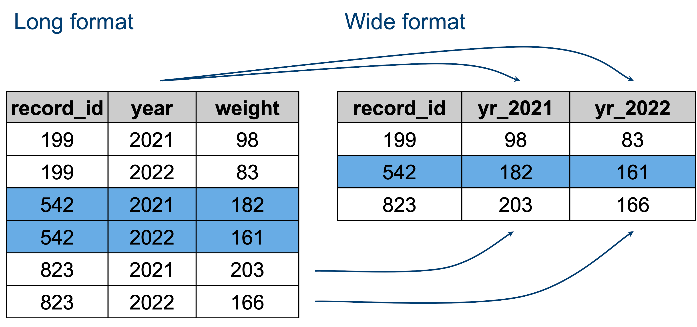

```{r setup0202, include=FALSE}
library(gt)
library(tidyverse)
bird_breeding_exc <- read_csv("output/bird_breeding_exc.csv")
bird_migration_exc <- read_csv("output/bird_migration_exc.csv")
```

# Part 2: Complex Data Frame Operations {#sec-p2_complex_data_frame_operations}

::: {.callout-note .partmenu #parts-0202}

## Sections
- @sec-summary_stats
- @sec-merge
- @sec-long_wide
- @sec-divide
- @sec-summary_0202

:::

:::{.callout-tip .objectives #objectives-0202}
#### Learning objectives
By the end of this part of the practical you will be able to:

#### Learning objectives

By the end of this part of the practical you will be able to:

- Calculate summary statistics for groups of observations.
- Merge information from multiple data frames using joins.
- Recognise wide and long data formats.

:::

## Grouping and summarising data {#sec-summary_stats .core}

[**Core**]{.core-text}

[↑ top](#)

At the moment, the data frame `bird_breeding_exc` has seven rows, one for each breeding site - as the breeding sites are small, fixed locations. However, the data frame `bird_migration_exc` has **multiple** measurements for each location for each bird population - as the numerous birds were tracked as they migrated.

For our visualisation, it's sufficient to just take the median values for the migration locations in `bird_migration_exc`.

To do this, we can *group* our data by the values in a specific column, then calculate summary statistics for each group.

We group data using the `group_by()` function, then summarise for each group using the `summarise()` function.

::: {.callout-note #note-UK_US}

The packages we use for data frame manipulation (`tidyverse` and `ggplot`) accept UK and US spellings - so `summarise()` and `summarize()` will both work, as will `color` and `colour`. However, this is unusual! Usually when programming we need to stick to whichever convention was used by whoever wrote the package.

:::

First, let's group our migration frame by the `Site` column.

```{r groupby}
bird_migration_grouped <- bird_migration_exc |> group_by(Site)
```

We can't really visualise the grouped data frame, but we can check it has worked using the `glimpse` function:

```{r glimpse_groupby}
glimpse(bird_migration_grouped)
```
We can see `Groups: Site [7]` at the top, which tells us our data frame is grouped into seven different sites.

`group_by()` does not change the data itself. It tells R how later calculations should be applied.

We can then use the function `summarise()` to calculate specific statistics per group and generate a new data frame containing these values.

For example, the following code creates a new data frame, `lat_df`, with one column `Highest_Lat_Stopover`, which contains the maximum (calculated with the function `max()`) value in the `Stopover_Latitude` column for each Site.

::: {.callout-note #note-narm}
Notice the `na.rm = TRUE` argument here - this is telling R to ignore any rows which have a value of "NA".
:::

```{r grouped_summarise}
lat_df <- bird_migration_grouped |>
  summarise(Highest_Lat_Stopover = max(Stopover_Latitude, na.rm = TRUE))

gt(lat_df)
```

We can calculate multiple summary statistics at the same time:

```{r grouped_summarise2}
lat_df <- bird_migration_grouped |>
  summarise(
    Highest_Lat_Stopover = max(Stopover_Latitude, na.rm = TRUE),
    Lowest_Lat_Stopover = min(Stopover_Latitude, na.rm = TRUE),
    Mean_Lat_Stopover = mean(Stopover_Latitude, na.rm = TRUE),
    Highest_Lat_Winter = max(Winter_Latitude, na.rm = TRUE),
    Lowest_Lat_Winter = min(Winter_Latitude, na.rm = TRUE),
    Mean_Lat_Winter = mean(Winter_Latitude, na.rm = TRUE)
  )

gt(lat_df)
```

::: {.callout-exercise #ex-medians_migration .core}

### Summarise a data frame

[**Core**]{.core-text}

In your `worked_example.qmd` Quarto document, for the migration site data frame, group by site and then make a new summary data frame which contains **median** values for all of the latitude and longitude columns:

* `Stopover_Latitude`
* `Stopover_Longitude`
* `Iberian_Latitude`
* `Iberian_Longitude`
* `Westmost_Latitude`
* `Westmost_Longitude`
* `Winter_Latitude`
* `Winter_Longitude`

To simplify plotting later, please stick to this order - Stopover, Iberian, Westmost, Winter.

Name the new columns to match the original columns -  e.g. `Stopover_Latitude`, `Winter_Longitude`.

Store this new data frame in a variable `bird_migration_summary`.

::: {.callout-answer collapse="true" #ex-medians_migration_ans}
```{r medians_migration_ans}
bird_migration_grouped <- bird_migration_exc |> group_by(Site)

bird_migration_summary <- bird_migration_grouped |>
  summarise(
    Stopover_Longitude = median(Stopover_Longitude, na.rm = TRUE),
    Stopover_Latitude = median(Stopover_Latitude, na.rm = TRUE),
    Iberian_Longitude = median(Iberian_Longitude, na.rm = TRUE),
    Iberian_Latitude = median(Iberian_Latitude, na.rm = TRUE),
    Westmost_Longitude = median(Westmost_Longitude, na.rm = TRUE),
    Westmost_Latitude = median(Westmost_Latitude, na.rm = TRUE),
    Winter_Longitude = median(Winter_Longitude, na.rm = TRUE),
    Winter_Latitude = median(Winter_Latitude, na.rm = TRUE)
  )
gt(bird_migration_summary)
```
:::
:::

### Summarising multiple columns {#sec-summ_multiple_columns .fold .extension}

::: {.callout-exercise #ex-across .extension}

### Summarising multiple columns

[**Extension**]{.extension-text}

In the exercise above, we calculated the median of each latitude and longitude column separately. This involved writing very similar code eight times.

The `across()` function can be used with `summarise()` to apply the same function to several columns at once.

Explore the documentation for [`across()`](https://dplyr.tidyverse.org/reference/across.html) and see if you can use it to recreate `bird_migration_summary` with less code.

::: {.callout-answer collapse="true" #ex-across_ans}

```{r across_ans}
bird_migration_summary <- bird_migration_exc |>
  group_by(Site) |>
  summarise(
    across(
      c(Stopover_Longitude, Stopover_Latitude,
        Iberian_Longitude, Iberian_Latitude,
        Westmost_Longitude, Westmost_Latitude,
        Winter_Longitude, Winter_Latitude),
      ~ median(.x, na.rm = TRUE)
    )
  )

gt(bird_migration_summary)
```
:::
:::

## Joining data frames {#sec-merge .core}

[**Core**]{.core-text}

[↑ top](#)

Datasets often contain information spread across several tables, as we see here.

A **join** allows us to combine two data frames into one, assuming they have a column in common.

To demonstrate, here are two small example data frames, showing the Department name and Assessment Score for several individuals in a university. Some people are in both tables, some are only in one or the other. The shared column `Name` allows them to be joined easily.

```{r read_dfs, message=FALSE}
df_dept <- read_csv("data/depts.csv")
df_score <- read_csv("data/scores.csv")
```

```{r show_dept}
gt(df_dept)
```

```{r show_score}
gt(df_score)
```

If we want to combine these into a single data frame, we have various options.

A **full join** retains all of the rows from both data frames, adding **NA** where no data is available.

```{r full_join}
full_join_example <- full_join(df_dept, df_score)

gt(full_join_example)
```

An **inner join** only retains rows for individuals which are in both data frames.

```{r inner_join}
inner_join_example <- inner_join(df_dept, df_score)

gt(inner_join_example)
```
A **left join** retains all the rows in the first data frame and adds data from the second data frame where available, adding **NA** where it is not.

```{r left_join}
left_join_example <- left_join(df_dept, df_score)

gt(left_join_example)
```

A **right join** retains all the rows in the second data frame and adds data from the first data frame where available, adding **NA** where it is not.

```{r right_join}
right_join_example <- right_join(df_dept, df_score)

gt(right_join_example)
```

For our bird data, the `Site` column is shared between the two data frames - `bird_breeding_exc` and `bird_migration_exc`.

In this case, all of the sites are present in both data frames, so any of these joins would produce the same result. We'll use a **full join**.

::: {.callout-exercise #ex-join .core}

### Joining data frames

[**Core**]{.core-text}


In your `worked_example.qmd` Quarto document, perform a full outer join on the `bird_breeding_exc` data frame and the `bird_migration_summary` data frame. Store the resulting data frame in a new variable, named `combined_bird_data`.

::: {.callout-answer #ex-join_ans}
```{r join_birds}
combined_bird_data <- full_join(bird_breeding_exc, bird_migration_summary)

gt(combined_bird_data)
```

:::
:::

### Joining with non-unique values {#sec-joining_non_unique .fold .extension}

::: {.callout-exercise #ex-join_duplicates .extension}

### Joining with non-unique values

[**Extension**]{.extension-text}

Joins do not always produce the number of rows you might expect.

Create these two data frames:

```{r join_duplicates1}
birds <- tibble(
  Bird = c("Robin", "Robin", "Blackbird"),
  Mass = c(18, 19, 100)
)

observations <- tibble(
  Bird = c("Robin", "Robin", "Robin", "Blackbird"),
  Count = c(4, 7, 2, 5)
)
```

Before running any more code, predict how many rows you think the following join will produce:

```{r join_duplicates2, eval=FALSE}
inner_join(birds, observations, by = "Bird")
```


Now run the join and examine the result.

Why does the resulting data frame contain so many rows?

::: {.callout-answer collapse="true" #ex-join_duplicates_ans}

When joining data frames, each matching row in one data frame is matched with every matching row in the other. Here, two Robin rows in one data frame and three in the other produce 2 × 3 = 6 rows.

:::

:::

## Long and wide formats {#sec-long_wide .rec}

[**Recommended**]{.rec-text}

[↑ top](#)

Now you should have a single data frame with all the data you need for your plot.

We need to perform one more transformation before we can plot our data.

Our data is currently in what is known as **wide** format - with a single row per site and multiple columns for each measurement for that site. So, all our measurements for each site are on a single row in the data frame.

The plots we want to create will be simpler if we convert the data to **long** format, where, instead, each measurement has a row and there are multiple rows per site.

{#fig-env_tab width="50%"}

We can convert our data frame to long format using the `pivot_longer()` function.

This is a little more complicated than some of the other functions we have used.

Basically we are instructing R to:

- **Select the columns to reshape**: take any columns ending in `_Longitude` or `_Latitude` using `cols = ends_with(c("_Longitude", "_Latitude"))`.
- **Split the column names**: separate the original column names wherever there is an underscore using `names_sep = "_"`.
- **Create new column names**: use the first part of the original column name to create a new column called `Location_Type`, and use the second part (`Longitude` or `Latitude`) to create new columns containing the values. This is specified with `names_to = c("Location_Type", ".value")`.

Single row example:

Before:

| Bird | Breeding_Longitude | Breeding_Latitude | Winter_Longitude | Winter_Latitude |
|-|-|-|-|-|
| A | 10 | 50 | 20 | 40 |

After:

| Bird | Location_Type | Longitude | Latitude |
|-|-|-|-|
| A | Breeding | 10 | 50 |
| A | Winter | 20 | 40 |

::: {.callout-note .copycode #copy-pivot}

### Include this code

Include this code chunk in your `worked_example.qmd` Quarto document to convert your data frame from wide to long format.

```{r pivotpivotpivot}
combined_bird_piv <- combined_bird_data |>
  pivot_longer(
    cols = ends_with(c("_Longitude", "_Latitude")),
    names_sep = "_",
    names_to = c("Location_Type", ".value")
  )

gt(combined_bird_piv)
```

:::

### Pivoting to wide format {#sec-pivot_wide .fold .extension}
::: {.callout-exercise #ex-pivot_wider .extension}

### Going the other way

[**Extension**]{.extension-text}

We used `pivot_longer()` to convert our bird data from wide to long format.

There is also a function called `pivot_wider()`.

Without changing `combined_bird_data`, see if you can use `pivot_wider()` on `combined_bird_piv` to reconstruct the original wide-format data.

You may need to explore the documentation to work out which arguments you need.

:::{.callout-hint #hint-glue}
The argument `names_glue` might be useful.
:::

::: {.callout-answer collapse="true" #ex-pivor_wider_ans}
```{r pivot_wider}
combined_bird_wide <- combined_bird_piv |>
  pivot_wider(
    names_from = Location_Type,
    values_from = c(Longitude, Latitude),
    names_glue = "{Location_Type}_{.value}"
  )

gt(combined_bird_wide)
```
:::
:::

## Subsetting your data frame {#sec-divide .core}

[**Core**]{.core-text}

[↑ top](#)

In order to create the two plots shown in Figure 1A and Figure 1B in the publication, we need to make two subsets of our data frame, one with only the **spring migration** data and one with only the **autumn migration** data.

The spring migration data has the following values in the `Location_Type` column:

* Breeding
* Stopover
* Winter

The autumn migration data has the following values in the `Location_Type` column:

* Breeding
* Iberian
* Westmost
* Winter

We can pass a **vector** of values to the `filter()` function and use the operator `%in%` to filter rows on multiple values.

For example, let's go back to our Department data frame.

```{r read_show_department}
gt(df_dept)
```

If I wanted just individuals who are in the Maths or English department, I could do this as follows:

```{r filter_department}
keep_depts <- c("Maths", "English")

df_eng_maths <- df_dept |>
  filter(Department %in% keep_depts)

gt(df_eng_maths)
```

::: {.callout-exercise #ex-divide .core}

### Subset data

[**Core**]{.core-text}

In your `worked_example.qmd` Quarto document, generate two subsets of your `combined_bird_piv` data frame, one with the **spring** data and one with the **autumn** data. Store these in two variables `spring_data` and `autumn_data`.

::: {.callout-answer #ex-divide_ans}
```{r divide_ans}

spring_vals <- c("Breeding", "Stopover", "Winter")
autumn_vals <- c("Breeding", "Iberian", "Westmost", "Winter")

spring_data <- combined_bird_piv |>
  filter(Location_Type %in% spring_vals)

autumn_data <- combined_bird_piv |>
  filter(Location_Type %in% autumn_vals)

```

:::
:::


We now have our two input tables for the plots!

We can save copies using the function `write_csv()`. The first argument is the variable we want to save and the second is the path to the file we want to save it into.

::: {.callout-note .copycode #copy-pivot}
### Include this code

Include this code chunk in your `worked_example.qmd` Quarto document to save your data frame into the `output` folder for the practical.

```{r write_birds}
write_csv(spring_data, "output/birds_spring.csv")
write_csv(autumn_data, "output/birds_autumn.csv")
```

:::

## Review {#sec-summary_0202}

[↑ top](#)

::: {.callout-note #note-summary_0202}

### Summary

* `group_by()` and `summarise()` allow us to calculate statistics for groups of observations.
* **Joins** combine information from multiple data frames using shared columns.
* `pivot_longer()` converts data from **wide** to **long** format.
* `%in%` allows us to test whether values occur within a set of values, which is useful when filtering on several categories.

:::

For this part of the practical, the main files you have edited are:

- `worked_example.qmd`
- `output/birds_spring.csv`
- `output/birds_autumn.csv`

These are the files you should select when making your Git commit.


Remember to save and commit your work before moving on to Part 3.


