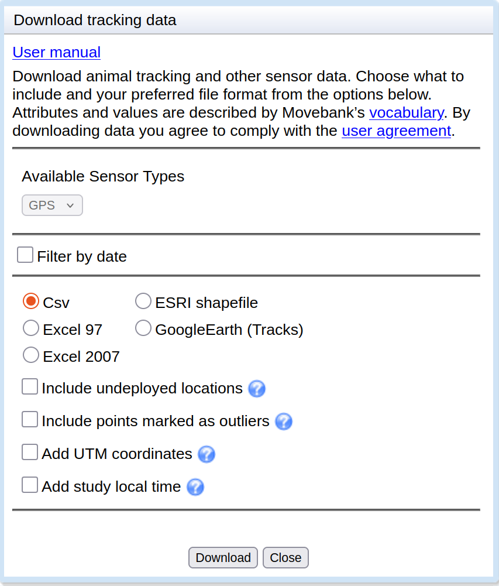

```{r setup0204, include=FALSE}
library(tidyverse)
library(gt)
library(janitor)
library(lubridate)
```

# Part 4: Visualisation Exercise {#sec-p4_visualisation_exercise}

::: {#parts-0204 .callout-note .partmenu}
## Sections

- @sec-movebank [(Extension)]{.extension-text}
- @sec-load_packages_ve [(Extension)]{.extension-text}
- @sec-download_data_ve [(Extension)]{.extension-text}
- @sec-read_data_ve [(Extension)]{.extension-text}
- @sec-process_df_ve [(Extension)]{.extension-text}
- @sec-plot_data_ve [(Extension)]{.extension-text}
- @sec-summary_0204
:::

::: {#objectives-0204 .callout-tip .objectives}
#### Learning objectives

By the end of this part of the practical you will have:

- Applied the data manipulation and plotting techniques introduced throughout Practical 2 to a different real animal tracking dataset. [(Extension)]{.extension-text}
:::

## The Movebank database {#sec-movebank .fold .extension}

[**Extension**]{.extension-text}

[↑ top](#)

In this exercise, you will apply the skills from Parts 1 to 3 to analyse a new dataset independently. You will download animal tracking data from the **Movebank** database, process it into a suitable format, and create a map showing the median location of each tracked individual on each day.

Movebank is a free, online database of animal tracking data hosted by the Max Planck Institute of Animal Behavior. It is a database of data from lots of different animal tracking studies, all stored in a standardised format.

For this part of the practical, you will choose an animal tracking dataset and plot the tracked locations of different individuals within that dataset on a map.

## Load packages {#sec-load_packages_ve .fold .extension}

[**Extension**]{.extension-text}

[↑ top](#)

Please start a new Quarto document for this exercise, `visualisation_exercise.qmd`.

We need to load the `tidyverse` and `gt` packages again, together with two additional packages:

- `janitor`, which helps clean column names.
- `lubridate`, which provides functions for working with dates.

::: {#copy-libraries .callout-note .copycode}
### Include this code

You will need to include the following as an R code chunk at the start of the document.

```{r libraries_visex, eval=FALSE}
library(tidyverse)
library(gt)
library(janitor)
library(lubridate)
```
:::

## Download data {#sec-download_data_ve .fold .extension}

[**Extension**]{.extension-text}

[↑ top](#)

First, you need to download some animal location data from the [Movebank database](https://www.movebank.org/).

To find your dataset:

- On the MoveBank Site, click on `Data` and then `View and Manage Studies`.
- Select `Studies where I can download any data`.
- Choose a study from the list. Search for an animal which interests you. Initially, choose a study containing approximately **5–15** tracked individuals (shown in the "Number of Animals" field on the website). This will give enough data to produce an interesting plot without making it difficult to interpret.
- Select `Download` \> `Download Data`.
- Agree with the terms and conditions
- Download the data in CSV format

{#fig-download_movebank .screenshot width="50%"}

In this exercise, based on this data frame, you will plot the median location of each individual animal by date as a scatter plot overlaid onto a map.

First, find your downloaded CSV file and rename it as `movebank_data.csv`, then put it into the data directory for Practical 2.

## Read data {#sec-read_data_ve .fold .extension}

[**Extension**]{.extension-text}

[↑ top](#)

Read the data frame into a variable.

This data has a couple of features you've not come across yet, so we'll provide some code to help you:

- The column names are not in a format that R can easily use, as they contain hyphens (`-`). We can use an additional function, `clean_names()` to rename the columns. `clean_names()` converts column names into a consistent format by replacing spaces and punctuation with underscores and converting everything to lower case.

- One of the columns contains date information which needs to be reformatted - we do this using the `mutate()` function and the `as_date()` function. We'll learn more about the `mutate()` function in a later practical.

::: {.callout-note .copycode}
### Include this code

Include the following code to read the data into an R data frame

```{r read_location_data, eval=FALSE}
locations <- read_csv("data/movebank_data.csv") |>
  clean_names() |>
  mutate(Date = as_date(timestamp))
```
:::

```{r read_location_data_hidden, include=FALSE}
locations <- read_csv("data/movebank_data.csv") |>
  clean_names() |>
  mutate(Date = as_date(timestamp))
```

## Process data frame {#sec-process_df_ve .fold .extension}

[**Extension**]{.extension-text}

[↑ top](#)

- Look at the data frame and check that the data looks as expected.
- Identify the columns containing the longitude and latitude data. There is a unique identifier for each animal in the column `individual_local_identifier`.
- Select only the relevant columns - these are `Date`, `individual_local_identifier` and the longitude and latitude columns.
- Group the data by `Date` and `individual_local_identifier`. You can group by multiple factors by adding additional arguments to the `group_by()` function.
- Using the `summarise` function, calculate the median latitude and median longitude for each individual on each date.

### Example solution

::: {#ex-process_df_ans .callout-answer collapse="true"}
[Look at the data frame and check that the data looks as expected.]{.blue-text}

```{r process_df_ans1}
gt(head(locations))
```

[Identify the columns containing the latitude and longitude data. There is a unique identifier for each animal in the column `individual_local_identifier`.]{.blue-text}

  - latitude - location_lat
  - longitude - location_long

[Select only the relevant columns - these are `Date`, `individual_local_identifier` and the longitude and latitude columns.]{.blue-text}

```{r process_df_ans2}
loc_selected <- locations |> select(
  Date,
  individual_local_identifier,
  location_long, location_lat
)

gt(head(loc_selected))
```

[Group the data by `Date` and `individual_local_identifier` You can group by multiple factors by adding additional arguments to the `group_by()` function.]{.blue-text}

```{r process_df_ans3}
loc_grouped <- loc_selected |>
  group_by(Date, individual_local_identifier)
```

[Using the `summarise` function, calculate the median latitude and median longitude for each individual on each date.]{.blue-text}

```{r process_df_ans4}
loc_sum <- loc_grouped |>
  summarise(
    Longitude = median(location_long),
    Latitude = median(location_lat)
  )

gt(head(loc_sum))
```
:::

## Plot data {#sec-plot_data_ve .fold .extension}

[**Extension**]{.extension-text}

[↑ top](#)

- Plot a scatter plot using `ggplot()` and `geom_point()` with longitude on the x axis and latitude on the y axis.
- Add a map to the plot using `annotation_borders()` and `coord_quickmap()`.
- Set axis limits by subtracting `2` from the minimum longitude and latitude and adding `2` to the maximum longitude and latitude. If your study covers a small geographic area, you may find that adding 2 degrees leaves too much empty space. Adjust these values if necessary.

:::  {.callout-note}

Some of the geographic areas are very small so you might not actually see many borders on your plot - don't worry about this.

:::

- Colour the points by individual by adding `color = individual_local_identifier` as an argument to the `aes()` function.
- If you wish, change the appearance of your plot to your taste.

### Example solution

::: {#ex-plot_data_ans .callout-answer collapse="true"}
[Plot a scatter plot using `ggplot()` and `geom_point()` with longitude on the x axis and latitude on the y axis.]{.blue-text}

```{r plot_data_ans1}
ggplot(
  loc_sum,
  aes(
    x = Longitude,
    y = Latitude,
  )
) +
  geom_point()
```

[Add a map to the plot using `annotation_borders()` and `coord_quickmap()`.]{.blue-text}

```{r plot_data_ans2}
ggplot(
  loc_sum,
  aes(
    x = Longitude,
    y = Latitude,
  )
) +
  geom_point() +
  annotation_borders(linewidth = 0.2) +
  coord_quickmap()
```

[Set axis limits by subtracting `2` from the minimum longitude and latitude and adding `2` to the maximum longitude and latitude`. If `2` seems like too little or too much for your data, feel free to adjust.]{.blue-text}

```{r plot_data_ans3}
min_lat <- loc_sum |>
  pull(Latitude) |>
  min()

max_lat <- loc_sum |>
  pull(Latitude) |>
  max()

min_lon <- loc_sum |>
  pull(Longitude) |>
  min()

max_lon <- loc_sum |>
  pull(Longitude) |>
  max()


ggplot(
  loc_sum,
  aes(
    x = Longitude,
    y = Latitude,
  )
) +
  geom_point() +
  annotation_borders(
    linewidth = 0.2
  ) +
  coord_quickmap(
    # as my data has a narrow y range I have used 0.2 instead of 2
    xlim = c(min_lon - 2, max_lon + 2),
    ylim = c(min_lat - 0.2, max_lat + 0.2)
  )
```

[Colour the points by individual by adding `color = individual_local_identifier` as an argument to the `aes()` function.]{.blue-text}

```{r plot_data_ans4}
ggplot(
  loc_sum,
  aes(
    x = Longitude,
    y = Latitude,
    color = individual_local_identifier
  )
) +
  geom_point() +
  annotation_borders(
    linewidth = 0.2
  ) +
  coord_quickmap(
    xlim = c(min_lon - 2, max_lon + 2),
    ylim = c(min_lat - 0.2, max_lat + 0.2)
  )
```

[If you wish, change the appearance of your plot to your taste.]{.blue-text}

```{r plot_data_ans5}
ggplot(
  loc_sum,
  aes(
    x = Longitude,
    y = Latitude,
    color = individual_local_identifier
  )
) +
  geom_point() +
  annotation_borders(
    linewidth = 0.2
  ) +
  coord_quickmap(
    xlim = c(min_lon - 2, max_lon + 2),
    ylim = c(min_lat - 0.2, max_lat + 0.2)
  ) +
  scale_color_brewer(palette = "Set1") +
  theme_bw()
```
:::

## Bonus-bonus {#sec-take_further_ve .fold .bonus}

[**Bonus**]{.bonus-text}

[↑ top](#)

::: {.callout-exercise #bon-take_further_ve .bonus}

### Do something interesting

[**Bonus**]{.bonus-text}

Still looking for a challenge? You now have a real animal tracking dataset and access to hundreds of others, and the tools to explore them.

Extend your analysis in any way that interests you. You could, for example:

- Incorporate multiple species
- Investigate how the locations of the animals change over time.
- Compare the movements of different individuals.
- Find out what other information is available in your Movebank dataset and incorporate it into your analysis.
- Compare different summary statistics.
- Create a different type of visualisation.
- Make your map more sophisticated or visually appealing.

There is no single correct answer and no example solution. 

:::

## Review {#sec-summary_0204}

[↑ top](#)

::: {#note-summary_0204 .callout-note}
### Summary

In this exercise you have:

- Downloaded a real animal tracking dataset from Movebank.
- Cleaned and processed the data.
- Selected relevant columns.
- Grouped observations and calculated summary statistics.
- Created a scatter plot of animal locations.
- Added map borders and appropriate axis limits.
- Used colour to distinguish individual animals.
- Applied the data manipulation and plotting techniques introduced throughout Practical 2.
:::

For this part of the practical, the main files you have edited are:

- `visualisation_exercise.qmd`
- `data/movebank_data.csv`

These are the files you should select when making your Git commit.




