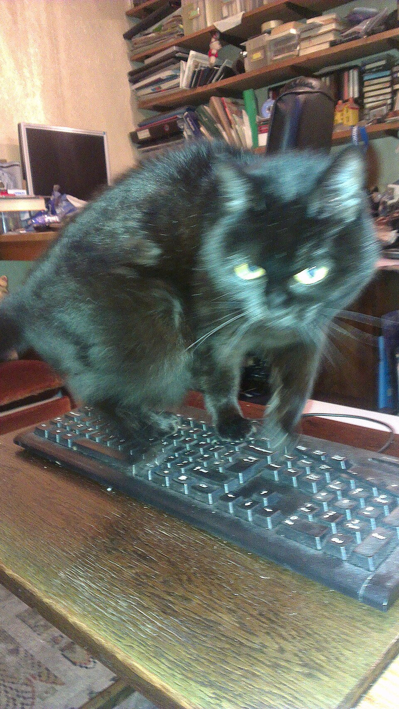
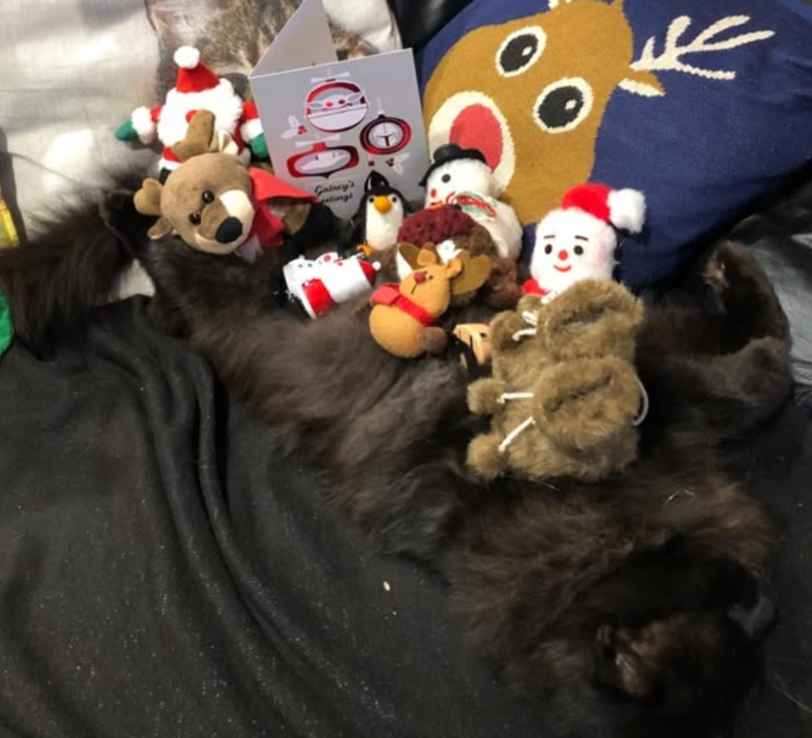

```{r setup_0304, include=FALSE}
library(tidyverse)
set.seed(42)
```

# Part 5 - Bonus: Sampling from a user-defined probability distribution

**This whole page is bonus content**

::: {.callout-note .partmenu #parts-0303}

## Sections
- @sec-user_defined

:::

:::{.callout-tip .objectives #objectives-0303}

## Learning Objectives

By the end of this section, you will be able to:

* Plot a user-defined PDF.
* Check a probability function is valid using `integrate()`
* Simulate data based on a user defined PDF.

:::

## Sampling from a user defined probability distribution {#sec-user_defined}

Earlier, we used functions such as `rbinom()`, `rpois()` and `rnorm()` to simulate data from named probability distributions. However, sometimes we may want to simulate from a probability distribution for which R does not provide a built-in random-sampling function, or from a PDF that we have defined ourselves.

In R, it is possible to simulate data from a user-defined probability distribution using the package `Runuran`.

```{r libraries_0305, message=FALSE}
library(Runuran)
```

For example, cats like to sit on keyboards, particularly if they are currently being used. Let's say a researcher has developed a probability density function describing the position at which a cat's centre of mass occurs along a 40-cm keyboard, measured as distance in cm from the left edge.

$$
f(x) =
\begin{cases}
\frac{3x(40-x)}{32000}, & 0 \leq x \leq 40 \\
0, & \text{otherwise}
\end{cases}
$$

{#fig-keyboard_cat width="50%"}

Let's plot just the function.

Here, instead of giving the argument `fun` our function name, we directly give it our cat PDF.

```{r plot_cat_pdf}
ggplot() +
  stat_function(
    fun = function(x) {
      3 * x * (40 - x) / 32000
    },
    xlim = c(0, 40)
  ) +
  xlab("Distance from Left Edge") +
  ylab("Density")
```

As expected, cats like to sit in the middle where they can obscure the most keys and, ideally, block the view of the screen.

For a function to be a valid PDF, its total area must equal 1. We can check this in R using `integrate()`. `integrate()` takes 3 arguments - the PDF, `lower` - the lower bound - and `upper` - the upper bound.

```{r integrate_cats}
cat_int <- integrate(function(x) {
  3 * x * (40 - x) / 32000
}, lower = 0, upper = 40)
print(cat_int)
```

The total area under this curve is `r cat_int$value` - so the function is valid.

Using our probability density function, let's simulate the positions of 10,000 cats, then estimate the probability that the centre of the cat is within the central 10 cm of the keyboard.

First, we use the function `pinv.new()` to create a **random number generator** which can sample values from a continuous distribution described by a user-defined PDF.

The arguments are:
* `pdf` - the PDF
* `lb` - the lower bound, in our case 0
* `ub` - the upper bound, in our case 40

```{r cat_generator}
cat_gen <- pinv.new(
  pdf = function(x) {
    3 * x * (40 - x) / 32000
  },
  lb = 0,
  ub = 40
)
```

Now, to simulate data from this distribution, we use the function `ur()`.

```{r cat_simulation}
cat_positions <- ur(cat_gen,
  n = 10000
)
```

Let's plot our cats. First, we need to put the data in a data frame.

```{r plot_more_cats}
cat_df <- tibble(Position = cat_positions)
ggplot(cat_df, aes(x = Position)) +
  geom_histogram(aes(y = after_stat(density)), bins = 50) +
  stat_function(
    fun = function(x) {
      3 * x * (40 - x) / 32000
    }
  )
```

Finally, let's estimate the probability that a cat will sit within the central 10 cm of the keyboard. The middle 10 cm lies between 15 cm and 25 cm from the left edge.

```{r cat_middle}
middle_only <- cat_df |> filter(
  Position >= 15,
  Position <= 25
)
prop_middle <- nrow(middle_only) / nrow(cat_df)
print(prop_middle)
```

Based on our simulation, cats will sit in the middle 10 cm of the keyboard approximately `r round(prop_middle * 100, 2)`% of the time.

::: {.callout-exercise #ex-cats}

Some cat parents like to, for their own amusement, pile objects onto their sleeping cat, a game known as [cat buckaroo](https://knowyourmeme.com/memes/cat-buckaroo).

{#fig-cataroo width="50%"}

Cats will tolerate this to a certain extent but, at some point, will get up and shake the objects off. The weight of objects the cat will tolerate varies considerably between cats.

Cats appear to fall into two broad groups: those that almost immediately object to this game, and those that will tolerate a substantial pile before taking action. A researcher proposes the following probability density function for the total weight of objects a sleeping cat will tolerate before shaking them off.


$$
f(x) =
\begin{cases}
\frac{1-\cos\left(\frac{4\pi x}{1000}\right)}{1000},
& 0 \leq x \leq 1000 \\
0, & \text{otherwise}
\end{cases}
$$

::: {.callout-note #note-cos_pi}

To use pi in R, you can just type pi.

```{r pi}
print(pi)
```
To calculate a cosine you can use the function `cos()` with one argument, the number for which you want to calculate the cosine.

:::

In your `distributions.qmd` Quarto file:

* Plot this function.
* Check it is a valid PDF.
* Create a **random number generator** which can sample values from the distribution described by this PDF.
* Simulate 10,000 values.
* A cat has already tolerated 500 g of objects. Estimate the probability that it will tolerate the addition of a 75 g Yoda figurine without shaking everything off.

::: {.callout-answer collapse="true" #ex-cats_ans}

[Plot this function.]{.blue-text}

```{r cats_ans1}
ggplot() +
  stat_function(
    fun = function(x) {
      (1 - cos(4 * pi * x / 1000)) / 1000
    },
    xlim = c(0, 1000)
  ) +
  xlab("Weight of objects") +
  ylab("Density")
```

[Check it is a valid PDF.]{.blue-text}

```{r cats_ans2}
cataroo_int <- integrate(
  function(x) {
    (1 - cos(4 * pi * x / 1000)) / 1000
  },
  lower = 0,
  upper = 1000
)
print(cataroo_int)
```
The area under the curve is `r cataroo_int$value` so this is a valid PDF.

[Create a **random number generator** which can sample values from the distribution described by this PDF.]{.blue-text}

```{r cats_ans3}
cataroo_gen <- pinv.new(
  pdf = function(x) {
    (1 - cos(4 * pi * x / 1000)) / 1000
  },
  lb = 0,
  ub = 1000
)
```

[Simulate 10,000 values.]{.blue-text}
```{r cat_ans4}
cat_tolerance <- ur(cataroo_gen,
  n = 10000
)
```

[A cat has already tolerated 500 g of objects. Estimate the probability that it will tolerate the addition of a 75 g Yoda figurine without shaking everything off.]{.blue-text}

```{r cat_ans5}
cat_tolerance_df <- tibble(Tolerance = cat_tolerance)

# Find all the cats who tolerated at least 500g
over_500 <- cat_tolerance_df |> filter(Tolerance >= 500)

# Find all the cats who tolerated at least 575g
over_575 <- cat_tolerance_df |> filter(Tolerance >= 575)

# Calculate the proportion of cats who tolerated at least 500g who will tolerate at least 575g.
prop <- nrow(over_575) / nrow(over_500)

print(prop)
```

If a cat has tolerated the addition of 500g of objects, there is an estimated `r round(prop*100, 2)`% probability they will tolerate an additional 75g Yoda figurine.

:::
:::
