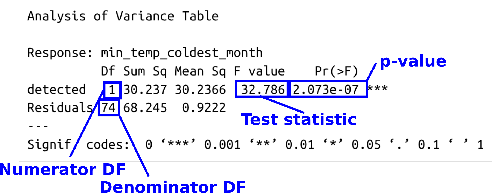

```{r setup_0402, include=FALSE}
library(tidyverse)
library(gt)
library(maps)
library(patchwork)
insect_counts <- read_csv("data/insect_counts.csv")
site_metadata <- read_csv("data/site_metadata.csv")
```

# Part 2: Hypothesis Testing {#sec-p2_hypothesis_testing_1}

::: {.callout-note .partmenu #parts-0402}
## Sections

- @sec-examining_data
- @sec-choose_test
- @sec-run_test
- @sec-t_dist [(Extension)]{.extension-text}
- @sec-confidence_intervals
- @sec-linear_models_cat
- @sec-anova_cat
- @sec-summary_0402
:::

:::{.callout-tip .objectives}
#### Learning objectives
By the end of this part of the practical you will be able to:

* Interpret and report the test statistic, degrees of freedom, p-value and confidence interval from a t-test.
* Fit and interpret a linear model with a categorical explanatory variable.
* Explain the relationship between a two-sample t-test, a linear model and a one-way ANOVA with two groups.
* Perform and interpret a one-way ANOVA in R.
* Report statistical results in the context of a biological question.

:::

## Examining data {#sec-examining_data .core}

[**Core**]{.core-text}

Now we can start to test some hypotheses based on this dataset.

For now, let's concentrate on a single species, the "bronze furrow bee" *Halictus tumulorum*. This is a relatively common bee species in the UK. It is a species of sweat bee, named because they are often attracted to sweat (although the UK ones usually aren't). 

{#fig-bee width="50%" fig-alt="A photo of H. tumulorum"}

::: {.callout-exercise #ex-filter_ht .core}

### Build *H. tumulorum* data frame.

[**Core**]{.core-text}

In your `pollinators.qmd` Quarto document:

* Filter the `insect_counts` data frame to include only the counts for *H. tumulorum*.
* Create a logical (see @sec-variable_types) column showing if *H. tumulorum* is detected or undetected at each site using `mutate()` based on the `n_observed` column - if `n_observed` is > 0, this species was detected.
* Join the resulting data frame with the `site_metadata` data frame using `inner_join()`, to add additional site data.
* Store the resulting data frame as a variable named `ht_df`.
* Write the data frame to the file `output/ht_df.tsv`.

::: {.callout-answer collapse="true" #ex_filter_ht_ans}
[Filter the `insect_counts` data frame to include only the counts for *H. tumulorum*.]{.blue-text}

```{r subset_ht}
ht_counts <- insect_counts |>
  filter(species == "Halictus tumulorum")
gt(head(ht_counts))
```

[Create a logical (see @sec-variable_types) column showing if *H. tumulorum* is detected or undetected at each site using `mutate()` based on the `n_observed` column - if `n_observed` is > 0, this species was detected.]{.blue-text}

```{r logical_ht}
ht_df <- ht_counts |>
  mutate(detected = n_observed > 0)
```

[Join the resulting data frame with the `site_metadata` data frame using `inner_join()`, to add additional site data.]{.blue-text}

[Store the resulting data frame in as a variable named `ht_df`.]{.blue-text}

```{r presence_absence_ht, message=FALSE}
ht_df <- ht_df |>
  inner_join(site_metadata)

gt(head(ht_df))
```

[Write the data frame to the file `output/ht_df.csv`.]{.blue-text}

```{r save_ht}
write_csv(ht_df, "output/ht_df.csv")
```

:::
:::

*H. tumulorum* tend to be found [towards the south](https://bwars.com/bee/halictidae/halictus-tumulorum) of the UK. Let's use our data to explore the possibility that this is because they don't like very cold temperatures.

We have a column in our site metadata data frame which can help us establish if this is true - the `min_temp_coldest_month` column. This is a BIOCLIM climate variable describing the lowest temperature in the coldest month in the map square and is the mean from 1970-2000. Technically, the lowest tempeature in the coldest month might not be the overall lowest temperature, however, for brevity from here forward we will refer to this just as **minimum temperature**.

We can compare this minimum temperature for the sites where the bees are present and absent using a box plot.

For clarity, let's select only the relevant columns in our data frame, using the `select()` function.

::: {.callout-note .copycode #copy-select}

### Include this code

In `pollinators.qmd`:

```{r select_ht}
ht_temp_df <- ht_df |>
  select(x1km_square, detected, min_temp_coldest_month)
```

:::

```{r show_ht}
gt(head(ht_temp_df))
```


:::{.callout-exercise #ex-boxplot_bees .rec}

### Box plot

[**Recommended**]{.rec-text}

In your `pollinators.qmd` Quarto document, plot a box plot showing the value of `min_temp_coldest_month` in your `ht_df` data frame for the regions with and without these bees (i.e. based on the `detected` column).

* The R function `geom_boxplot()` draws a box plot.
* The `aes` function for this type of plot requires a categorical x variable and a continuous y variable as arguments - so you would use the arguments `x = detected` and `y = min_temp_coldest_month`. 

:::{.callout-answer collapse="true" #ex-boxplot_bees_ans}

```{r boxplot_ht}
#| fig-alt: "Box plot comparing minimum temperature at sites where H. tumulorum was detected and not detected. The detected group is shifted towards higher temperatures, although the two distributions overlap. The undetected box has a longer interquartile range and longer whiskers"
ggplot(
  ht_df,
  aes(x = detected, y = min_temp_coldest_month, fill = detected)
) +
  geom_boxplot() +
  theme_bw()
```
:::
:::

Based on this box plot, perhaps these bees don't like the cold.

## Choosing a test {#sec-choose_test .core}

[**Core**]{.core-text}

Now we have some hypotheses to investigate:

* **Null hypothesis**: Mean minimum temperature is the same at sites where *H. tumulorum* is present and absent.

* **Alternative hypothesis**: Mean minimum temperature is different at sites where *H. tumulorum* is present than at sites where it is absent.

::: {.callout-important #note-harking}
We developed our hypothesis that *H. tumulorum* prefers sites with a higher minimum temperature after looking at these data, and we're about to use the same data to test that hypothesis. This is sometimes called **HARKing** — Hypothesizing After the Results are Known.

Ideally, we would now test our hypothesis using a new dataset. However, given the limitations of this practical, we will instead look for evidence of an association in this dataset.
:::

We have a **continuous response variable** and a **categorical explanatory variable** - maybe we can use a t-test.

There are various **assumptions** which underlie a t-test - we'll come back to these later in the practical. For the moment, assume these assumptions are met.

## Running statistical tests in R {#sec-run_test .core}

[**Core**]{.core-text}

In R statistical functions, `~` is used to specify a formula describing the relationship between variables.

The basic structure is `response ~ explanatory`, which you can read as "response as a function of explanatory variable".

In our example above, the response variable is minimum temperature and the explanatory variable is presence or absence of *H. tumulorum* bees. 

:::{.callout-note #note-explanatory}

"Explanatory" here means the variable we're using to explain/describe variation in the response statistically, not necessarily a biological cause - we're not claiming that the bees are affecting the temperature.

:::

To run a t-test in R, the function is `t.test()`. 

The first argument is our formula - `response ~ explanatory`, or in this case, `min_temp_coldest_month ~ detected`.
We need two additional arguments:

* `data = ht_temp_df` - this is the data frame containing the data.
* `var.equal = TRUE` - run an equal variance t-test, the default in R is to assume unequal variance and run a Welch's t-test.

::: {.callout-exercise #ex-first_t .core}

### T-test

[**Core**]{.core-text}

In your `pollinators.qmd` Quarto file, run a t-test in R to test the hypotheses above. View the output using `print()`. 

::: {.callout-answer collapse="true" #ex-first_t_ans}

```{r ttest_ht}
ttest_ht_temp <- t.test(min_temp_coldest_month ~ detected,
  data = ht_temp_df,
  var.equal = TRUE
)
print(ttest_ht_temp)
```

:::
:::

To fully describe our t-test output we need to include at least the following:

* **Test statistic:** `t`
* **Degrees of freedom:** `df`
* **p-value:** `p-value`

In addition to the test statistic, degrees of freedom and p-value, we should describe the size and direction of the observed difference. R reports the two group means, from which we can calculate the difference between the means.

```{r vals_ht, include=FALSE}
# Test statistic
ht_t <- round(ttest_ht_temp$statistic, 2)

# Degrees of freedom
ht_t_df <- round(ttest_ht_temp$parameter)

# p-value
ht_t_p <- ttest_ht_temp$p.value

# Confidence interval
ht_ci_lower <- round(ttest_ht_temp$conf.int[1], 2)
ht_ci_upper <- round(ttest_ht_temp$conf.int[2], 2)

# Group means
ht_mean_absent <- round(ttest_ht_temp$estimate[1], 2)
ht_mean_present <- round(ttest_ht_temp$estimate[2], 2)

# Difference between means (FALSE - TRUE, matching the t-test)
ht_mean_diff <- round(
  ttest_ht_temp$estimate[1] - ttest_ht_temp$estimate[2],
  2
)
```

We could therefore report our results here as:

::: {.highlight-box}

There is evidence that mean minimum temperature is higher at sites where *H. tumulorum* is present than at sites where it is absent ($t$(`r ht_t_df`) = `r ht_t`, $p$ = `r formatC(ttest_ht_temp$p.value, format = "e", digits = 2)`, mean difference [absent − present] = `r ht_mean_diff`°C). This means we can reject our null hypothesis.

:::

This doesn't mean that our alternative hypothesis is definitely true for the population, but based on this sample the evidence supports it.


## The t-distribution {#sec-t_dist .fold .extension}

[**Extension**]{.extension-text}

The p-value for a t-test is the probability of a test statistic at least as far from zero as the value calculated from our data, if we drew values from a t-distribution with the specified number of degrees of freedom.

The t-distribution is just a probability distribution, so we can simulate and visualise it in R using the same methods we learned for other probability distributions (@sec-using_other_distributions).

::: {.callout-exercise #ex-t_dist .extension}

### Visualising the t-distribution

[**Extension**]{.extension-text}

In your `pollinators.qmd` Quarto file:

* Simulate a sample of 1000 observations from t-distribution with 74 degrees of freedom. You can draw a random sample from a t-distribution with the function `rt` with the arguments `n` - number of observations and `df` degrees of freedom. 
* Create a data frame where this set of observations forms a column.
* Plot the results using the ggplot layer `geom_density()`.
* Calculate an approximated p-value using your simulated data - the proportion of observations which are at least `r round(abs(ttest_ht_temp$statistic), 3)` from zero **in either direction**. You can extract the test statistic from the t-test as `ttest_ht_temp$statistic`.
* Calculate the exact p-value using the t-distribution cumulative probability function `pt()`. 

::: {.callout-answer collapse="true" #ex-t_dist_ans}

[Simulate a sample of 1000 observations from t-distribution with 74 degrees of freedom. You can draw a random sample from a t-distribution with the function `rt` with the arguments `n` - number of observations and `df` degrees of freedom.]{.blue-text}

```{r t_dist_ans1}
df74 <- rt(1000, df = 74)
```

[Create a data frame where this set of observations forms a column.]{.blue-text}

```{r t_dist_ans2}
t_dist <- tibble(simulated = df74)
```

[Plot the results using the ggplot layer `geom_density()`.]{.blue-text}

```{r t_dist_ans3}
#| fig-alt: "Density plot of 1,000 values simulated from a t-distribution with 74 degrees of freedom. The distribution is symmetric around zero, with most values concentrated near zero and progressively fewer values towards either tail. Vertical lines mark the observed positive and negative t-statistics. Both lines lie far into the tails of the distribution."
ggplot(
  t_dist,
  aes(x = simulated)
) +
  geom_density() +
  geom_vline(xintercept = c(ttest_ht_temp$statistic, -ttest_ht_temp$statistic), color = "red")
```

[Calculate an approximated p-value using your simulated data - the proportion of observations which are at least `r round(abs(ttest_ht_temp$statistic), 3)` from zero **in either direction**. You can extract the test statistic from the t-test as `ttest_ht_temp$statistic`.]{.blue-text}

```{r t_dist_ans4}
p_lower_sim <- sum(t_dist$simulated <= ttest_ht_temp$statistic)
p_upper_sim <- sum(t_dist$simulated >= -ttest_ht_temp$statistic)

p_sim <- (p_lower_sim + p_upper_sim) / nrow(t_dist)

print(p_sim)
```

With 1000 simulations your value will almost certainly be zero. 

:::{.callout-exercise #ex-pvalue_ttest .bonus}

### Bonus question: Probability

[**Bonus**]{.bonus-text}

What is the probability of getting a value which is not zero here given the p-value calculated by R above of `r formatC(ttest_ht_temp$p.value, format = "e", digits = 2)`.

:::{.callout-answer collapse="true" #pvalue_ttest_ans}
```{r pvalue_ttest_ans}
prob_no_extreme <- (1 - ttest_ht_temp$p.value)^1000
prob_at_least_one <- 1 - prob_no_extreme

print(prob_at_least_one)
```
There is a `r round(prob_at_least_one * 100, 4)`% probability of observing at least one simulated value this extreme when drawing 1,000 points from a t-distribution with 74 degrees of freedom.
:::
:::

[Calculate the exact p-value using the t-distribution cumulative probability function `pt()`.]{.blue-text}

```{r t_dist_ans5}
p_lower <- pt(ttest_ht_temp$statistic, 74)
p_upper <- 1 - pt(-ttest_ht_temp$statistic, 74)

pval <- p_lower + p_upper

print(pval)
```
This should be the exact p-value calculated in our t-test.

:::
:::

## Confidence intervals {#sec-confidence_intervals .core}

[**Core**]{.core-text}

In our description of the t-test output above, something is missing - it is also worth looking at our **confidence interval** here. This data is provided in our t-test summary above.

Lower: `r round(ttest_ht_temp$conf.int[1], 4)`

Upper: `r round(ttest_ht_temp$conf.int[2], 4)`

A 95% confidence interval means that if we repeatedly sampled from the population and calculated a 95% confidence interval in the same way each time, 95% of those intervals would contain the true population value. In this case, the true population value is the true difference between the mean minimum annual temperature at sites where *H. tumulorum* is present and at sites where it is absent.

For a two-sided test at the 5% significance level, if the 95% confidence interval for the difference between the means does not contain zero, we can reject the null hypothesis that the mean difference is zero. Here, our confidence interval does not contain zero, which agrees with our conclusion based on the p-value.

We should add this to our conclusion above:

::: {.highlight-box}

There is evidence that mean minimum temperature is higher at sites where *H. tumulorum* is present than at sites where it is absent ($t$(`r ht_t_df`) = `r ht_t`, $p$ = `r formatC(ttest_ht_temp$p.value, format = "e", digits = 2)`, mean difference [absent − present] = `r ht_mean_diff`°C, 95% CI [`r ht_ci_lower`, `r ht_ci_upper`]°C). This means we can reject our null hypothesis.

:::

### The t-distribution and confidence intervals {#sec-t_confidence_intervals .fold .extension}

[**Extension**]{.extension-text}

*"A 95% confidence interval means that if we repeatedly sampled from the population and calculated a 95% confidence interval in the same way each time, 95% of those intervals would contain the true population value. In this case, the true population value is the true difference between the mean minimum annual temperature at sites where H. tumulorum is present and at sites where it is absent."*

Let's check using simulation. If we simulate samples from populations with known means, we know the "true" difference between means of the source populations.

To simplify this process, let's first calculate the mean, standard deviation and sample size for sites with and without *H. tumulorum*. This is straightforward using the `group_by()` and `summarise()` functions.

::: {.callout-note .copycode #copy-select}

### Include this code

```{r summary_ht}
ht_temp_summ <- ht_temp_df |>
  group_by(detected) |>
  summarise(
    mean = mean(min_temp_coldest_month),
    sd = sd(min_temp_coldest_month),
    count = n()
  )

# Separate present and absent sites
present <- ht_temp_summ |>
  filter(detected == TRUE)

absent <- ht_temp_summ |>
  filter(detected == FALSE)
```
:::


```{r summary_ht_show}
gt(ht_temp_summ)
```

::: {.callout-exercise #ex-cis .extension}

### Simulate confidence intervals

[**Extension**]{.extension-text}

Next, in your `pollinators.qmd` Quarto file:

* 1,000 times:
  * Simulate two samples drawn from a normal distribution:
      * one with the same mean, standard deviation and sample size as the sites with *H. tumulorum*
      * one with the same mean, standard deviation and sample size as the sites without *H. tumulorum*. 
  * Put the data for the two samples into a data frame in long format as follows:

  ```{r norm_samples_ht, include=FALSE}
s1 <- rnorm(pull(present, count),
  mean = pull(present, mean),
  sd = pull(present, sd)
)
s2 <- rnorm(pull(absent, count),
  mean = pull(absent, mean),
  sd = pull(absent, sd)
)
  ```

  ```{r norm_samples_df_ht}
# Let's assume your vectors are in variables named s1 and s2
# rep is used to add the sample names to the data frame

df <- tibble(
  sample = c(
    rep("sample_1", length(s1)),
    rep("sample_2", length(s2))
  ),
  min_temp_coldest_month = c(s1, s2)
)
  ```
  * For each pair of simulated samples, use a t-test to calculate the difference between the sample means, and its 95% confidence interval.
  * Extract the confidence interval

  ```{r ttest_norm_ht, include=FALSE}
ttest_res <- t.test(min_temp_coldest_month ~ sample,
  data = df
)
  ```

  ```{r conf_norm_ht}
# If the result of your t-test is stored as ttest_res
ci_lower <- ttest_res$conf.int[1]
ci_upper <- ttest_res$conf.int[2]
  ```

  * Record whether the confidence interval contains the **true difference** between the two population means. Because we specified the means of our simulated populations ourselves, we know what this value is: `r round(pull(present, mean) - pull(absent, mean), 4)`
  
  :::{.callout-note}
  The function <code>between([value]{.red-text}, [lower]{.orange-text}, [upper]{.blue-text})</code> will tell you if <code>[value]{.red-text}</code> is between <code>[lower]{.orange-text}</code> and <code>[upper]{.blue-text}</code>.
  :::
  
  * Store TRUE or FALSE in a vector depending on the result.
* Calculate the percentage of the 1,000 confidence intervals that contain the true difference.

:::{.callout-answer collapse="true" #ex-cis_ans}

[1,000 times:]{.blue-text}

* [Simulate two samples drawn from a normal distribution:]{.blue-text}
    * [one with the same mean, standard deviation and sample size as the sites with *H. tumulorum*]{.blue-text}
    * [one with the same mean, standard deviation and sample size as the sites without *H. tumulorum*.]{.blue-text}
* [Put the data for the two samples into a data frame in long format.]{.blue-text}
* [For each pair of simulated samples, use a t-test to calculate the difference between the sample means and its 95% confidence interval.]{.blue-text}
* [Extract the confidence interval.]{.blue-text}
* [Determine whether the confidence interval contains the **true difference** between the two population means.]{.blue-text}
* [Store TRUE or FALSE in a vector depending on the result.]{.blue-text}

```{r cis_ans1}
# Find the real difference for comparison
true_diff <- pull(present, mean) - pull(absent, mean)

# Vector to store the results
res_vec <- c()

for (i in seq_len(1000)) {
  # Simulate the two samples
  sample_present <- rnorm(pull(present, count), mean = pull(present, mean), sd = pull(present, sd))
  sample_absent <- rnorm(pull(absent, count), mean = pull(absent, mean), sd = pull(absent, sd))

  # Put the results into a data frame
  df <- tibble(
    sample = c(
      rep("sample_1", length(sample_present)),
      rep("sample_2", length(sample_absent))
    ),
    min_temp_coldest_month = c(sample_present, sample_absent)
  )

  # Run the t-test
  ttest_res <- t.test(min_temp_coldest_month ~ sample,
    data = df,
    var.equal = TRUE
  )

  # Extract the confidence interval
  ci_lower <- ttest_res$conf.int[1]
  ci_upper <- ttest_res$conf.int[2]

  # Check if the result is in the confidence interval or not
  res_in_ci <- between(true_diff, ci_lower, ci_upper)

  # Store the result
  res_vec <- c(res_vec, res_in_ci)
}
```

[Calculate the percentage of the 1,000 confidence intervals that contain the true difference.]{.blue-text}

```{r cis_ans2}
perc <- (sum(res_vec) / length(res_vec)) * 100
print(perc)
```

In this simulation, the confidence interval included the true difference `r round(perc, 3)`% of the time - very similar to our expectation.

:::
:::


###  Calculating confidence intervals {#sec-calc_confidence-intervals .fold .extension}

[**Extension**]{.extension-text}

We can revisit our simulated t-distribution above to understand how confidence intervals are calculated. 

For a 95% confidence interval, we want the central 95% of the t-distribution. This leaves 2.5% of the distribution in each tail.

In our `t_dist` data frame there are 1,000 observations sampled from a t-distribution with 74 degrees of freedom.

```{r t_dist_replot}
#| fig-alt: "Density plot of simulated values from the same t-distribution as above."
ggplot(
  t_dist,
  aes(x = simulated)
) +
  geom_density()
```

To calculate our confidence interval, we want the middle 95% of values from this distribution. 

With our simulated data, we can extract these using `summarize()` and then the `quantile()` function with the data column as the first argument and the quantile we want to extract as the second. The $x$ quantile is the value below which $x$ proportion of the observations fall. 

```{r t_dist_quantiles}
quantile_df <- t_dist |>
  summarise(
    lower = quantile(simulated, 0.025),
    upper = quantile(simulated, 0.975)
  )
gt(quantile_df)
```

Let's add these to our density plot.

```{r t_dist_quantiles_plot}
#| fig-alt: "Density plot of simulated values from the same t-distribution as above, with blue vertical lines marking the estimated 2.5% and 97.5% quantiles. Approximately 95% of the simulated values lie between the lines."
ggplot(
  t_dist,
  aes(x = simulated)
) +
  geom_density() +
  geom_vline(xintercept = c(pull(quantile_df, lower), pull(quantile_df, upper)), color = "blue")
```

We can also calculate the exact values using the function `qt()`.

```{r t_dist_qt}
lower_exact <- qt(0.025, 74)
upper_exact <- qt(0.975, 74)

print(lower_exact)
print(upper_exact)
```

The absolute values of these exact values should be identical to each other.

```{r t_dist_quantiles_exact}
#| fig-alt: "Density plot of simulated values from the same t-distribution as above, with orange vertical lines marking the exact 2.5% and 97.5% quantiles. The lines are symmetric around zero, with 95% of the distribution between them."
ggplot(
  t_dist,
  aes(x = simulated)
) +
  geom_density() +
  geom_vline(xintercept = c(lower_exact, upper_exact), color = "orange")
```

Because the t-distribution is symmetric, the two exact quantiles have the same absolute value. This value is called the critical t-value, often written $t*$. These values are measured on the t-distribution. To calculate a confidence interval for our estimated difference between means, we need to convert $t*$ into the units of our response variable.

We do this by multiplying $t*$ by the standard error of our t-test. We can access from our t-test above using `ttest_ht_temp$stderr`.

```{r t_dist_stderr}
tstar <- upper_exact
SE <- ttest_ht_temp$stderr

confint_rv_units <- tstar * SE

print(confint_rv_units)
```

This tells us how far we need to go above and below our estimated difference between means to obtain the 95% confidence interval.

```{r t_dist_confint_man}
diff_means <- pull(absent, mean) - pull(present, mean)

lower_cint <- diff_means - confint_rv_units
upper_cint <- diff_means + confint_rv_units

print(c(lower_cint, upper_cint))
```

This gives us our lower value of `r round(lower_cint, 4)` and upper value of `r round(upper_cint, 4)` as above.


## Linear models {#sec-linear_models_cat .core}

[**Core**]{.core-text}

The comparison we have just made can also be represented using a linear model.

As you know, a simple linear model can be written as:

$$
y = \beta_0 + \beta_1 x + \epsilon
$$
where:

- $y$ is the response variable - minimum temperature
- $x$ is the explanatory variable - *H. tumulorum* present or absent.
- $\beta_0$ is the intercept
- $\beta_1$ is the coefficient (or slope)
- $\epsilon$ represents the variation not explained by the model

In our case, the value of $x$ (`detected`, the explanatory variable) - can only be TRUE or FALSE. It is usual in this case to assign FALSE a value of 0 and TRUE a value of 1.

* If *H. tumulorum* is absent, $x$ equals 0.
* When $x$ is zero, the line intercepts the y axis - so the intercept $\beta_0$ is the mean minimum temperature when *H. tumulorum* is absent.
* If *H. tumulorum* is present, $x$ equals 1.
* The slope is the change in $y$ over one unit of $x$. So, the change in mean minimum temperature between $x$ = 0 and $x$ = 1, or the difference in mean temperature when *H. tumulorum* is present, compared to when it is absent.

We know these numbers already:
```{r}
gt(ht_temp_summ |> select(detected, mean))
```

The difference between the two means is:

```{r diff_means}
diff <- pull(present, mean) - pull(absent, mean)
print(diff)
```

When the bee is absent, $x = 0$:

$$
y = `r round(pull(absent, mean), 2)` + (`r round(diff, 2)` \times 0) + \epsilon
$$

so:

$$
y = `r round(pull(absent, mean), 2)` + \epsilon
$$

When the bee is present, $x = 1$:

$$
y = `r round(pull(absent, mean), 2)` + (`r round(diff, 2)` \times 1) + \epsilon
$$

so:

$$
y = `r round(pull(present, mean), 2)` + \epsilon
$$

Our **t-test** tests whether there is evidence that the difference between the mean values of the two groups is different from zero.

Our **linear model** tests whether there is evidence that the slope of the line is different from zero.

They are therefore testing exactly the same thing.

### Fitting linear models in R {#sec-fitting_linear_models_cat .core}

[**Core**]{.core-text}

Let's see if this is correct by fitting a linear model to our data in R. We do this with the function `lm()` and the same formula we used previously - `response ~ explanatory`.

::: {.callout-exercise #ex-first_lm .core}

### Fit a linear model

[**Core**]{.core-text}

In your `pollinators.qmd` Quarto file, fit a linear model using the function `lm()` and the same formula as for the t-test above. As for the t-test, you'll need to add the argument `data = ht_temp_df` so R can see the data frame. Store the output in the variable `lm_ht`.

::: {.callout-answer collapse="true" #ex-first_lm_ans}
```{r lm_ht_spp}
lm_ht <- lm(min_temp_coldest_month ~ detected,
  data = ht_temp_df
)
```
:::
:::

We can summarise the linear model using the function `summary()` on the fitted model.

```{r lm_ht_spp_summ}
summ_lm_ht <- summary(lm_ht)
print(summ_lm_ht)
```

This function gives us a lot of information, including the numbers we calculated above.

* The estimated **intercept** is our mean minimum temperature without *H. tumulorum*
* The estimated **slope** (listed as `detectedTRUE`) is the difference in minimum temperature with and without *H. tumulorum*. 
* The **p-value** for the slope is identical to the p-value we calculated earlier with our t-test.

We can extract the 95% confidence intervals from our linear model with the function `confint()` with one argument - the fitted model, `lm_ht`. 

::: {.callout-exercise #ex-first_ci .rec}

### Confidence intervals

[**Recommended**]{.rec-text}

In your `pollinators.qmd` Quarto file, use the function `confint()` to find the confidence intervals for your `lm_ht` fitted model.

::: {.callout-answer collapse="true" #ex-first_ci_ans}

```{r confint_lm}
ci <- confint(lm_ht)
print(ci)
```

:::
:::

The second confidence interval here is the confidence interval of the slope of the line - and again it's identical to our t-test values above.

As discussed above, for a linear regression, we are interested in whether the coefficient (slope) for our explanatory variable differs from zero. We still use the t-statistic, which is calculated by dividing the estimated coefficient by its standard error.

The p-value is obtained from a t-distribution specified by the residual degrees of freedom. For a simple linear regression, we estimate two parameters: the intercept and the slope. Here we have 76 observations, so the residual degrees of freedom are 76 - 2 = 74.

We therefore need to look for the following values in the linear model output:

* **Coefficient (slope):** `Estimate`
* **Test statistic:** `t value`
* **Degrees of freedom:** residual degrees of freedom
* **p-value:** `Pr(>|t|)`
* **Proportion of variation explained:** `Multiple R-squared`

```{r get_vals_lm_ht, include=FALSE}
# Coefficient
ht_beta <- round(summ_lm_ht$coefficients["detectedTRUE", "Estimate"], 2)

# Test statistic
ht_lm_t <- round(summ_lm_ht$coefficients["detectedTRUE", "t value"], 2)

# Degrees of freedom
ht_lm_df <- lm_ht$df.residual

# p-value
ht_lm_p <- summ_lm_ht$coefficients["detectedTRUE", "Pr(>|t|)"]

# 95% confidence interval for the coefficient
ht_lm_ci <- confint(lm_ht, "detectedTRUE")

ht_lm_ci_lower <- round(ht_lm_ci[1], 2)
ht_lm_ci_upper <- round(ht_lm_ci[2], 2)

# R-squared
ht_lm_rsq <- round(summ_lm_ht$r.squared, 3)

# Percentage of variation explained
ht_lm_var_explained <- round(summ_lm_ht$r.squared * 100, 1)
```

For a linear model with a categorical explanatory variable like this, we can also report the difference in means between the two conditions.

For the linear model above, we could report:

:::{.highlight-box}

There is evidence that minimum temperature differs according to the presence or absence of *H. tumulorum* ($\beta$ = `r ht_beta`°C, 95% CI [`r ht_lm_ci_lower`, `r ht_lm_ci_upper`]°C, $t$(`r ht_lm_df`) = `r ht_lm_t`, $p$ = `r formatC(ht_lm_p, format = "e", digits = 2)`, $R^2$ = `r ht_lm_rsq`). Sites where *H. tumulorum* is present have a mean minimum temperature approximately `r ht_beta`°C higher than sites where it is absent. The model explains approximately `r ht_lm_var_explained`% of the variation in minimum temperature.

:::


### Visualising linear models with a logical categorical variable {#sec-visualising_linear_models_cats .fold .extension}

[**Extension**]{.extension-text}

We can easily visualise our linear model in ggplot.

First, we plot a scatter plot with our `detected` variable on the x-axis and minimum temperature on the y-axis.

We need to convert our `detected` column to show 0 for FALSE and 1 for TRUE. To convert a column to numeric, we use the function `as.numeric()`. For a logical column, it will automatically do what we want - convert FALSE to 0 and TRUE to 1.

We can then use the function `geom_smooth()` to apply and plot a linear model to the data. This corresponds to plotting a line between `r round(pull(absent, mean), 2)` when x is 0 and `r round(pull(present, mean), 2)` when x is 1.

Let's also add a horizontal line using `geom_hline()` showing a slope of 0 and the same mean for both groups.

```{r lm_lowest_temp}
#| fig-alt: "Scatter plot of minimum temperature against H. tumulorum detection status, coded as 0 for absent and 1 for present. Points form two vertical groups, with present somewhat warmer than absent. The fitted linear model slopes upward from the absent group to the present group, indicating higher mean minimum temperature where H. tumulorum is present. A horizontal reference line shows the overall mean temperature."
ht_temp_df <- ht_temp_df |>
  mutate(detected_num = as.numeric(detected))

overall_mean <- ht_temp_df |>
  pull(min_temp_coldest_month) |>
  mean()

ggplot(ht_temp_df, aes(
  x = detected_num,
  y = min_temp_coldest_month
)) +
  geom_point() +
  geom_smooth(method = "lm", se = FALSE) +
  theme_bw() +
  geom_hline(aes(yintercept = overall_mean), color = "red")
```

## ANOVA {#sec-anova_cat .core}

[**Core**]{.core-text}

With exactly two groups, a **classical one-way ANOVA** is also mathematically equivalent to either of these tests. 

A one-way ANOVA with two groups is testing:

*Does allowing the two groups to have different means explain significantly more variation than assuming they have the same mean*

This can be simplified to - is there evidence that these two means are not equal?

This is asking the same question we've already asked twice, in a different way.

Let's try an ANOVA. We run ANOVA in R on an existing linear model - which we already created above, in the variable `lm_ht`, using the function `anova()`.

::: {.callout-exercise #ex-first_anova .core}

### ANOVA

[**Core**]{.core-text}

In your `pollinators.qmd` Quarto file, run an ANOVA on your existing linear model, `lm_ht`, using the function `anova()`.

::: {.callout-answer collapse="true" #ex-first_anova_ans}

```{r anova_temp}
anova_lm <- anova(lm_ht)
anova_lm
```

:::
:::

As you can see, we've again found an identical p-value. As it's the same linear model, our confidence intervals are, by definition, also the same.

For an ANOVA, we report our results a little differently. The p-value here is obtained from an **F distribution** specified by **two** degrees-of-freedom values: the numerator and denominator degrees of freedom.

* The numerator degrees of freedom are associated with the explanatory variable. Here there are two groups (present and absent), so this is 2 − 1 = 1.
* The denominator degrees of freedom are the residual degrees of freedom. We have 76 observations and estimate two parameters (the intercept and slope), so this is 76 − 2 = 74.

As with the t-test, the p-value is calculated from a probability distribution. For ANOVA, this is the F-distribution rather than the t-distribution. The F-statistic compares the variation explained by the model with the unexplained variation; unusually large F-values provide evidence against the null hypothesis.

So, we need to look for the following values in our ANOVA output.

* **Test statistic:** `F value`
* **Numerator degrees of freedom:** `Df` for the explanatory variable
* **Denominator degrees of freedom:** `Df` for the residuals
* **p-value:** `Pr(>F)`

{#fig-a1wstats width="100%" fig-alt="Screenshot showing where to find the ANOVA numerator DF, denominator DF, p-value and test statistic. The output is a table with columns Df, Sum Sq, Mean Sq, F value and Pr(>F) and rows detected and residuals. Numerator DF is in Df, detected, denominator Df in Df, residuals, test statistic in F value, detected and p-value in Pr(>F), detected"}

Additionally, we can report the proportion of variation explained by the model relative to the total variation in the response variable. We can calculate this from the sum of square values in the ANOVA output.

```{r calc_prop_var_temp}
SS_model <- anova_lm["detected", "Sum Sq"]
SS_res <- anova_lm["Residuals", "Sum Sq"]

prop_var <- SS_model / (SS_res + SS_model)
print(prop_var)
```

Conveniently, this is the same as our $R^2$ value in the linear model we used above.

```{r lm_again}
print(summary(lm_ht))
```
```{r get_anova_vals, include=FALSE}
ann <- anova(lm_ht)

# Degrees of freedom
ht_df <- ann["detected", "Df"]
ht_resid_df <- ann["Residuals", "Df"]

# F-statistic
ht_f <- round(ann["detected", "F value"], 2)

# p-value
ht_p <- ann["detected", "Pr(>F)"]

ht_rsq <- round(summary(lm_ht)$r.squared, 3)
ht_perc_explained <- round(ht_rsq * 100, 1)
```

So, we would report:

:::{.highlight-box}

There is evidence that minimum temperature in the coldest month differs between sites where *H. tumulorum* is present and sites where it is absent ($F$(`r ht_df`, `r ht_resid_df`) = `r ht_f`, $p$ = `r formatC(ht_p, format = "e", digits = 2)`, $R^2$ = `r ht_rsq`). The model explains approximately `r ht_perc_explained`% of the variation in minimum temperature in the coldest month.

:::

The advantage of ANOVA is that, unlike a t-test, we can use it when our categorical explanatory variable has more than two groups - we'll come to this in the next section.

## Review {#sec-summary_0402}

[↑ top](#)


In this part of the practical, you used hypothesis tests to investigate associations between variables in the pollinator data and learned how to interpret test statistics and p-values. The key idea is that t-tests, linear models and ANOVA are not completely separate statistical techniques. In this simple two-group example, they provide different ways of describing and testing the same model of the data.

::: {.callout-note #note-summary_0402}

### Programming summary

In this part of the practical, you have used the following R functions:

| Function         | What it does                                                                                                      |
| ---------------- | ----------------------------------------------------------------------------------------------------------------- |
| `t.test()`       | Performs a t-test to compare the means of two groups.                                                             |
| `lm()`           | Fits a linear model describing the relationship between a response and one or more explanatory variables.         |
| `summary()`      | Displays a summary of a fitted statistical model, including coefficient estimates, test statistics and p-values.  |
| `confint()`      | Calculates confidence intervals for the coefficients of a fitted model.                                           |
| `anova()`        | Produces an ANOVA table for a fitted model, partitioning variation into explained and residual components.        |
| `as.numeric()`   | Converts values to numbers; for logical values, `FALSE` becomes 0 and `TRUE` becomes 1.                           |

**Extension material also introduced:**

| Function     | What it does                                                                |
| ------------ | --------------------------------------------------------------------------- |
| `rt()`       | Generates random values from a t-distribution.                              |
| `pt()`       | Calculates cumulative probabilities from a t-distribution.                  |
| `qt()`       | Finds a specified quantile of a t-distribution.                             |
| `quantile()` | Finds values corresponding to specified quantiles of a set of observations. |
| `between()`  | Tests whether a value lies between a lower and upper value.                 |


:::

For this part of the practical, the main files you have edited are:

- `pollinators.qmd`

These are the files you should select when making your Git commit.


Remember to save and commit your work before moving on to Part 3.


