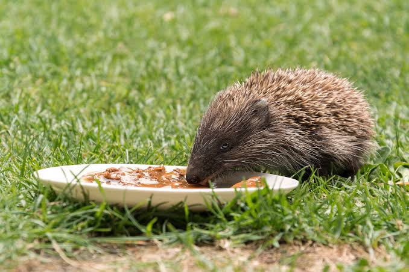

```{r setup_0403, include=FALSE}
library(tidyverse)
library(gt)
library(maps)
library(patchwork)
library(GGally)
insect_counts <- read_csv("data/insect_counts.csv")
site_metadata <- read_csv("data/site_metadata.csv")
set.seed(42)
```

# Part 3: Hypothesis Testing 2

In this part of the practical, I will briefly introduce how to perform a number of other statistical tests in R, then, in the next part, you will choose hypotheses to address using these tests. With the exception of chi-squared, these tests are based on linear models.

## ANOVA

### One-way ANOVA with more than two groups

In the previous section, we used one-way ANOVA to look at the difference between two groups.

ANOVA expands easily to take into account an explanatory variable with more than two levels (i.e. a categorical variable with three or more options).

We already know about using `response ~ explanatory` as a formula in R to investigate response as a function of explanatory variable. If you are using a data frame as the input to this function and the explanatory variable is categorical, R will automatically treat the different values in the column as different levels of that variable.

One of the measurements in our pollinator data frame is `mean_insect_mass` - the mean mass in grams of all pollinators collected at that site. 

It seems feasible that this would be affected by the types of pollinators present - some pollinators are much bigger than others. 

Using our pollinator data, let's investigate the following hypothesis:

* Null hypothesis: Sites dominated by different insect families have the same mean mass.
* Alternative hypothesis: At least one dominant insect family is associated with sites with a different mean mass.

Let's first list all the families which dominate at any site.

```{r families_domfam}
unique_fams <- site_metadata |> distinct(dominant_family)
print(unique_fams)
```

All sites are dominated by one of these four families.

We can test the association between mean insect mass and dominant family with a one-way ANOVA, and we define it exactly as before.

Here, we would define the linear model as `lm(mean_insect_mass ~ dominant_family, data=site_metadata)`.

We could then just look at our linear model directly. It would take one category - in this case Andrenidae, as it is first alphabetically, to be the reference level and compare each of the other levels - Syrphidae, Halictidae and Apidae to Andrenidae. It would not compare e.g. Halictidae to Apidae as neither is the reference.

Let's try it:

```{r lm_mass_domfam}
lm_mass_domfam <- lm(mean_insect_mass ~ dominant_family, data = site_metadata)
summary(lm_mass_domfam)
```

This tells us:

* There is evidence that sites with Apidae as the dominant family differ from those with Andrenidae as their dominant family in mean insect mass.
* There is no evidence that sites with Halictidae as the dominant family differ from those with Andrenidae as their dominant family in mean insect mass.
* There is no evidence that sites with Syrphidae as the dominant family differ from those with Andrenidae as their dominant family in mean insect mass.

But, this probably isn't what we want to know - we still don't know if all four means are equal.

If we perform an ANOVA on this data, it will compare a model in which sites with all four dominant pollinator families have the same mean insect mass with a model in which the sites with different dominant pollinator families are allowed to have different means. 


:::{.callout-exercise #ex-anova_domfam}

In your `pollinators.qmd` markdown file, perform an ANOVA on the linear model defined above, to investigate the hypothesis that at least one dominant insect family is associated with sites with a different mean mass. Draw a conclusion based on the output, including the appropriate statistical evidence to support your conclusion.

:::{.callout-answer collapse="true" #ex-anova_domfam_ans}

```{r anova_mass_domfam}
anova_mass_domfam <- anova(lm_mass_domfam)
print(anova_mass_domfam)
```

```{r vals_mass_domfam, include=FALSE}
mass_domfam_df <- anova_mass_domfam["dominant_family", "Df"]
mass_domfam_resid_df <- anova_mass_domfam["Residuals", "Df"]

mass_domfam_f <- round(
  anova_mass_domfam["dominant_family", "F value"],
  2
)

mass_domfam_p <- formatC(
  anova_mass_domfam["dominant_family", "Pr(>F)"],
  format = "f",
  digits = 8
)

mass_domfam_rsq <- round(summary(lm_mass_domfam)$r.squared, 3)
mass_domfam_perc_explained <- round(mass_domfam_rsq * 100, 1)
```

:::{.highlight-box}

There is evidence that mean insect mass differs among dominant insect families ($F$(`r mass_domfam_df`, `r mass_domfam_resid_df`) = `r mass_domfam_f`, $p$ = `r formatC(mass_domfam_p, format = "e", digits = 2)`), $R^2$ = `r mass_domfam_rsq`). Dominant insect family explains approximately `r mass_domfam_perc_explained`% of the variation in mean insect mass among sites.

:::
:::
:::

::: {.callout-note .extension #ext-f_distribution}
### Extension exercise - the F-distribution

I stated above that *"The p-value here is obtained from an F distribution specified by two degrees-of-freedom values: the numerator and denominator degrees of freedom. The numerator degrees of freedom are associated with the explanatory variable. The denominator degrees of freedom are the residual degrees of freedom."*. In this case, our numerator has three degrees of freedom and our denominator has 72. 

In your `pollinators.qmd` Quarto file:

* Simulate a sample of 1000 observations from F-distribution with 3 numerator degrees of freedom and 72 denominator degrees of freedom. You can draw a random sample from an F-distribution with the function `rf` with the arguments `n` - number of observations, `df1` numerator degrees of freedom and `df2` denominator degrees of freedom.
* Create a dataframe where this set of observations forms a column.
* Plot the results using the ggplot layer `geom_density()`.
* Calculate an approximate p-value using your simulated data — the proportion of simulated F-values which are greater than or equal to the F-statistic calculated from our data (`r round(anova_mass_domfam["dominant_family", "F value"], 2)`). You can extract the F-statistic from the ANOVA table using `anova_mass_domfam["dominant_family", "F value"]`, changing `anova_mass_domfam` to whichever variable name you used.
* Calculate the exact p-value using the F-distribution cumulative probability function `pf()`. 

:::{.callout-answer collapse="true" #ex_f_distribution_ans}

[Simulate a sample of 1000 observations from F-distribution with 3 numerator degrees of freedom and 72 denominator degrees of freedom. You can draw a random sample from an F-distribution with the function `rf` with the arguments `n` - number of observations, `df1` numerator degrees of freedom and `df2` denominator degrees of freedom.]{.blue-text}

```{r f_dist_ans1}
df_3_72 <- rf(1000, df1 = 3, df2 = 72)
```

[Create a dataframe where this set of observations forms a column.]{.blue-text}

```{r f_dist_ans2}
f_dist <- tibble(simulated = df_3_72)
```

[Plot the results using the ggplot layer `geom_density()`.]{.blue-text}

```{r f_dist_ans3}
fstat <- anova_mass_domfam["dominant_family", "F value"]

ggplot(
  f_dist,
  aes(x = simulated)
) +
  geom_density() +
  geom_vline(xintercept = fstat, color = "red")
```

[Calculate an approximate p-value using your simulated data — the proportion of simulated F-values which are greater than or equal to the F-statistic calculated from our data (`r round(anova_mass_domfam["dominant_family", "F value"], 2)`).]{.blue-text}

```{r f_dist_ans4}
p_above_sim <- sum(f_dist$simulated >= fstat)

p_sim <- p_above_sim / nrow(f_dist)

print(p_sim)
```

As for the t-test previously, with 1000 simulations and such a low p-value, your value will almost certainly be zero. 

[Calculate the exact p-value using the F-distribution cumulative probability function `pf()`.]{.blue-text}

```{r f_dist_ans5}
p_below <- pf(fstat, 3, 72)
p_exact <- 1 - p_below
print(p_exact)
```
This should be the exact p-value calculated in our ANOVA.
:::
:::


### Multi-way ANOVA

ANOVA can also be extended to include multiple categorical explanatory variables. This is called multi-way ANOVA (or factorial ANOVA). A model with two categorical explanatory variables is a two-way ANOVA, one with three is a three-way ANOVA, and so on.

We can add additional explanatory variables using `+` - `response ~ explanatory1 + explanatory2 + explanatory3` etc.

The ANOVA tests whether each explanatory variable is associated with the response in turn. So, in the case above, explanatory1 would be tested first, followed by whether explanatory2 explains additional variation after explanatory1 has been included, and so forth.

::: {.callout-exercise #ex-anova_twoway}

In your `pollinators.qmd` Quarto file:

* Expand the linear model above to incorporate a second explanatory variable - broad habitat type (from the column `broad_habitat`) as well as `dominant_family`.
* Run an ANOVA on the model and view the results.
* Draw a conclusion based on your findings, including the appropriate statistical evidence to support your conclusion.

::: {.callout-answer collapse="true" #ex_anova_twoway_ans}

We define our linear model as follows:

```{r domfam_habitat_mass_lm}
lm_domfam_habitat_mass <- lm(mean_insect_mass ~ dominant_family + broad_habitat, data = site_metadata)
```

And then run the ANOVA.

```{r domfam_habitat_mass_anova}
anova_domfam_habitat_mass <- anova(lm_domfam_habitat_mass)
print(anova_domfam_habitat_mass)
```

```{r get_family_habitat_vals, include=FALSE}
# Dominant family
family_df <- anova_domfam_habitat_mass["dominant_family", "Df"]
family_f <- round(
  anova_domfam_habitat_mass["dominant_family", "F value"],
  2
)
family_p <- anova_domfam_habitat_mass["dominant_family", "Pr(>F)"]

# Broad habitat
habitat_df <- anova_domfam_habitat_mass["broad_habitat", "Df"]
habitat_f <- round(
  anova_domfam_habitat_mass["broad_habitat", "F value"],
  2
)
habitat_p <- round(
  anova_domfam_habitat_mass["broad_habitat", "Pr(>F)"],
  3
)

# Residual degrees of freedom
resid_df <- anova_domfam_habitat_mass["Residuals", "Df"]
```

::: {.highlight-box}
There is evidence that mean insect mass differs among dominant insect families ($F$(`r family_df`, `r resid_df`) = `r family_f`, $p$ = `r formatC(family_p, format = "e", digits = 2)`). After accounting for dominant insect family, there is no evidence that broad habitat type explains additional variation in mean insect mass ($F$(`r habitat_df`, `r resid_df`) = `r habitat_f`, $p$ = `r round(habitat_p, 2)`).
:::
:::
:::


#### Interactions

When we use `+` to include multiple explanatory variables, we are assuming that their relationships with the response are additive. This means that the relationship between one explanatory variable and the response is the same at every level of the other explanatory variable. So for example, the dominant insect family can be associated with a difference in mean insect mass, and habitat can be associated with a difference, and these differences can be added together.

However, sometimes the relationship between one explanatory variable and the response depends on the value of another explanatory variable. This is called an interaction.

We can add interactions between variables using `*` - `response ~ explanatory1 * explanatory2`. The ANOVA will then test the association between each explanatory variable and the response, as well as whether there is an interaction between them.

For example, if we set up the model as `mean_insect_mass ~ dominant_family * dominant_flower_order`, we are asking:

* Does mean insect mass vary between sites with different dominant insect families?
* Does mean insect mass vary between sites with different dominant flower orders, once dominant insect family has been taken into account?
* Does any difference in mean insect mass among dominant insect families depend on the dominant flower order?

This final question is the interaction: does the association between one explanatory variable and the response depend on the value of another explanatory variable?

::: {.callout-exercise #ex-simulate_interaction}

Let's simulate a dataset with an interaction, to help illustrate this concept.

In this study, there are four populations of students and the response variable is the time they took to finish their lunch, in minutes. Response time is drawn from a normal distribution with a standard deviation of 3.

There are two categorical explanatory variables:

* Did they use a spoon or a fork?
* Did they eat soup or pasta?

Their mean finishing times are as follows:

* Spoon + Pasta = 8 minutes
* Fork + Pasta = 10 minutes
* Spoon + Soup = 11 minutes
* Fork + Soup = 25 minutes

In your `prac4_exercises.qmd` Quarto file:

* Generate four simulated populations, each of 10 students, with response times normally distributed around these means and a standard deviation of 3.
* Convert each of these into a data frame with the columns `utensil`, `food` and `time`.
* Convert these to a single data frame using the function `bind_rows()`. You can pass any number of data frames as arguments to this function and it will return a single data frame combining all of the rows (assuming the data frames all have the same columns).
* Fit a linear model with `time` as the response variable and `utensil`, `food` and their interaction as explanatory variables.
* Run an ANOVA on the linear model.

:::{.callout-answer #ex_simulate_interaction_ans}

[Generate four simulated populations, each of 10 students, with response times normally distributed around these means and a standard deviation of 3.]{.blue-text}

```{r simulate_populations_forky_spoony}
spoon_pasta <- rnorm(10, 8, 3)
fork_pasta <- rnorm(10, 10, 3)
spoon_soup <- rnorm(10, 11, 3)
fork_soup <- rnorm(10, 25, 3)
```

[Convert each of these into a data frame with the columns `utensil`, `food` and `time`.]{.blue-text}

```{r data_frames_forky_spoony}
df_sp <- tibble(utensil = "Spoon",
                food = "Pasta",
                time = spoon_pasta)

df_fp <- tibble(utensil = "Fork",
                food = "Pasta",
                time = fork_pasta)

df_ss <- tibble(utensil = "Spoon",
                food = "Soup",
                time = spoon_soup)

df_fs <- tibble(utensil = "Fork",
                food = "Soup",
                time = fork_soup)
```

[Convert these to a single data frame using the function `bind_rows()`. You can pass any number of data frames as arguments to this function and it will return a single data frame combining all of the rows (assuming the data frames all have the same columns).]{.blue-text}

```{r data_frame_rbind_forky_spoony}
df_food <- bind_rows(df_sp, df_fp, df_ss, df_fs)
```

[Fit a linear model with `time` as the response variable and `utensil`, `food` and their interaction as explanatory variables.]{.blue-text}

```{r lm_forky_spoony}
lm_lunch <- lm(time ~ utensil * food, data = df_food) 
```

[Run an ANOVA on the linear model.]{.blue-text}

```{r anova_forky_spoony}
anova_lunch <- anova(lm_lunch)
print (anova_lunch)
```

```{r get_vals_forky_spoony, include=FALSE}

# Utensil
utensil_df <- anova_lunch["utensil", "Df"]
utensil_f <- round(anova_lunch["utensil", "F value"], 2)
utensil_p <- anova_lunch["utensil", "Pr(>F)"]

# Food
food_df <- anova_lunch["food", "Df"]
food_f <- round(anova_lunch["food", "F value"], 2)
food_p <- anova_lunch["food", "Pr(>F)"]

# Interaction
interaction_df <- anova_lunch["utensil:food", "Df"]
interaction_f <- round(
  anova_lunch["utensil:food", "F value"],
  2
)
interaction_p <- anova_lunch["utensil:food", "Pr(>F)"]

# Residual degrees of freedom
resid_df <- anova_lunch["Residuals", "Df"]
```

:::

Here, we need to report the F-statistic, degrees of freedom and p-value for both explanatory variables and for the interaction.


::: {.highlight-box}
There is evidence that eating time differs according to the utensil used ($F$(`r utensil_df`, `r resid_df`) = `r utensil_f`, $p$ = `r formatC(utensil_p, format = "e", digits = 2)`) and according to the type of food being eaten ($F$(`r food_df`, `r resid_df`) = `r food_f`, $p$ = `r formatC(food_p, format = "e", digits = 2)`).

There is also evidence of an interaction between utensil and food ($F$(`r interaction_df`, `r resid_df`) = `r interaction_f`, $p$ = `r formatC(interaction_p, format = "e", digits = 2)`). This means that the difference in eating time between using a fork and a spoon depends on the type of food being eaten.
:::

::: {.callout-note .bonus #bon-simulate_interaction}

### Bonus Exercise: Removing the interaction

Change the population means so that there is no interaction between food and utensil, but both food and utensil are still associated with eating time, then re-run the ANOVA and re-interpret the results.

::: {.callout-answer collapse="true" #bon-simulate_interaction_ans}

For example

```{r simulate_no_interation_forky_spoony}

# Simulate the populations
spoon_pasta <- rnorm(10, 8, 3)
fork_pasta <- rnorm(10, 12, 3)
spoon_soup <- rnorm(10, 14, 3)
fork_soup <- rnorm(10, 18, 3)

# Make the data frames
df_sp <- tibble(utensil = "Spoon",
                food = "Pasta",
                time = spoon_pasta)

df_fp <- tibble(utensil = "Fork",
                food = "Pasta",
                time = fork_pasta)

df_ss <- tibble(utensil = "Spoon",
                food = "Soup",
                time = spoon_soup)

df_fs <- tibble(utensil = "Fork",
                food = "Soup",
                time = fork_soup)

# Combine the data frames
df_food <- bind_rows(df_sp, df_fp, df_ss, df_fs)

# Fit the linear model
lm_lunch <- lm(time ~ utensil * food, data = df_food) 

# Run the ANOVA
anova_lunch <- anova(lm_lunch)
print (anova_lunch)

```

```{r get_vals_forky_spoony_bonus, include=FALSE}

# Utensil
utensil_df <- anova_lunch["utensil", "Df"]
utensil_f <- round(
  anova_lunch["utensil", "F value"],
  2
)
utensil_p <- anova_lunch["utensil", "Pr(>F)"]

# Food
food_df <- anova_lunch["food", "Df"]
food_f <- round(
  anova_lunch["food", "F value"],
  2
)
food_p <- anova_lunch["food", "Pr(>F)"]

# Interaction
interaction_df <- anova_lunch["utensil:food", "Df"]
interaction_f <- round(
  anova_lunch["utensil:food", "F value"],
  2
)
interaction_p <- anova_lunch["utensil:food", "Pr(>F)"]

# Residual degrees of freedom
resid_df <- anova_lunch["Residuals", "Df"]
```

::: {.highlight-box}
There is evidence that eating time differs according to the utensil used ($F$(`r utensil_df`, `r resid_df`) = `r utensil_f`,
$p$ = `r formatC(utensil_p, format = "e", digits = 2)`) and according to the type of food being eaten ($F$(`r food_df`, `r resid_df`) = `r food_f`, $p$ = `r formatC(food_p, format = "e", digits = 2)`).

However, there is no evidence of an interaction between utensil and food ($F$(`r interaction_df`, `r resid_df`) = `r interaction_f`, $p$ = `r round(interaction_p, 4)`). This means there is no evidence that the difference in eating time between using a fork and a spoon depends on the type of food being eaten.
:::

:::
:::
:::

Now, let's try this with our real data

::: {.callout-exercise #ex-anova_interaction}

In your `pollinators.qmd` Quarto file:

* Fit a linear model to test the association between dominant family, dominant flower order and mean insect mass, including the interaction between dominant family and dominant flower order.
* Run an ANOVA on this model and view the results.
* Draw a conclusion based on the results, including the appropriate statistical evidence to support your conclusion.

::: {.callout-answer collapse="true" #ex_anova_twoway_ans}

```{r mass_fam_flower_lm}
# Fit the model
mass_fam_flower_lm <- lm(mean_insect_mass ~ dominant_family * dominant_flower_order,
                         data = site_metadata)
# Run the ANOVA
mass_fam_flower_anova <- anova(mass_fam_flower_lm)

print(mass_fam_flower_anova)
```


```{r get_vars_mass_fam_flower, include=FALSE}
# Dominant insect family
family_df <- mass_fam_flower_anova["dominant_family", "Df"]
family_f <- round(
  mass_fam_flower_anova["dominant_family", "F value"],
  2
)
family_p <- mass_fam_flower_anova[
  "dominant_family", "Pr(>F)"
]

# Dominant flower order
flower_df <- mass_fam_flower_anova["dominant_flower_order", "Df"]
flower_f <- round(
  mass_fam_flower_anova["dominant_flower_order", "F value"],
  2
)
flower_p <- mass_fam_flower_anova[
  "dominant_flower_order", "Pr(>F)"
]

# Interaction
interaction_df <- mass_fam_flower_anova[
  "dominant_family:dominant_flower_order", "Df"
]
interaction_f <- round(
  mass_fam_flower_anova[
    "dominant_family:dominant_flower_order", "F value"
  ],
  2
)
interaction_p <- mass_fam_flower_anova[
  "dominant_family:dominant_flower_order", "Pr(>F)"
]

# Residual degrees of freedom
resid_df <- mass_fam_flower_anova["Residuals", "Df"]
```

:::{.highlight-box}

There is evidence that mean insect mass differs among dominant insect families ($F$(`r family_df`, `r resid_df`) = `r family_f`,
$p$ = `r formatC(family_p, format = "e", digits = 2)`).

After accounting for dominant insect family, there is no evidence that mean insect mass differs among dominant flower orders
($F$(`r flower_df`, `r resid_df`) = `r flower_f`, $p$ = `r round(flower_p, 4)`).

There is also no evidence of an interaction between dominant insect family and dominant flower order ($F$(`r interaction_df`, `r resid_df`) = `r interaction_f`, $p$ = `r round(interaction_p, 4)`). Therefore, there is no evidence that the difference in mean insect mass among dominant insect families depends on the dominant flower order.

:::
:::
:::


## Linear Regression

We've now used all sorts of linear models, but how about a standard linear regression between two continuous variables? You already have the skills needed to do this - you can fit the model using `lm()` and then view the results using `summary()`, and you basically know how to interpret the results. 

As we discussed in the previous section, for a linear model we should report the following:

* **Coefficient (slope):** `Estimate`
* **Test statistic:** `t value`
* **Degrees of freedom:** residual degrees of freedom
* **p-value:** `Pr(>|t|)`
* **Proportion of variation explained:** `Multiple R-squared`

For a linear regression with two continuous variables, we can also report the amount the mean of the response variable changes when the explanatory variable changes by one unit.

Let's use the pollinator data again and look at a straightforward regression question - how is total annual precipitation (column `annual_total_prec`) associated with mean annual temperature (column `annual_mean_temp`)?

:::{.callout-exercise #ex_temp_prec}

In your `pollinators.qmd` Quarto file:
* Fit a linear model to the `site_metadata` data frame with `annual_total_prec` as the response variable and `annual_mean_temp` as the explanatory variable.
* Use the function `summary()` to view the results.
* Draw a conclusion based on the results, including the appropriate statistical evidence to support your conclusion.

::: {.callout-answer collapse="true" #ex_temp_prec_ans}
[Fit a linear model to the `site_metadata` data frame with `annual_total_prec` as the response variable and `annual_mean_temp` as the explanatory variable.]{.blue-text}

[Use the function `summary()` to view the results.]{.blue-text}

```{r lm_temp_prec}
lm_temp_prec <- lm(annual_total_prec ~ annual_mean_temp, data = site_metadata)
summ_lm_temp_prec <- summary(lm_temp_prec)
print(summ_lm_temp_prec)
```
```{r get_vals_temp_prec, include=FALSE}

slope <- summ_lm_temp_prec$coefficients["annual_mean_temp", "Estimate"]
slope_t <- summ_lm_temp_prec$coefficients["annual_mean_temp", "t value"]
slope_p <- summ_lm_temp_prec$coefficients["annual_mean_temp", "Pr(>|t|)"]
slope_df <- summ_lm_temp_prec$df[2]
r_squared <- summ_lm_temp_prec$r.squared
```

[Draw a conclusion based on the results, including the appropriate statistical evidence to support your conclusion.]{.blue-text}

::: {.highlight-box}

There is evidence of a negative association between mean annual temperature and total annual precipitation ($t$(`r slope_df`) = `r round(slope_t, 2)`, $p$ = `r formatC(slope_p, format = "e", digits = 2)`). For each 1°C increase in mean annual temperature, the model predicts a decrease in total annual precipitation of approximately `r abs(round(slope, 2))` mm. The model explains `r round(r_squared * 100, 2)`% of the variation in total annual precipitation ($R^2$ = `r round(r_squared, 4)`).

:::
:::
:::

### Multiple linear regression

Just as we included multiple explanatory variables in our ANOVA, we can include multiple continuous explanatory variables in a linear regression. This is called multiple linear regression. We can also add interaction terms.

For example, we could ask if precipitation is associated with temperature, elevation or the interaction between the two, using `annual_total_prec ~ annual_mean_temp * elevation`.

There is one complication here - by default, a multiple regression containing an interaction will determine the association with each explanatory variable **when the value of the other explanatory variables is zero**. This is not the case for an additive model, where the association with each explanatory variable is estimated while holding the other explanatory variables constant.

So, in our case, our model `annual_total_prec ~ annual_mean_temp * elevation` will tell us:

* Is precipitation associated with annual mean temperature when elevation is 0?
* Is precipitation associated with elevation when annual mean temperature is 0?
* Does the association between annual mean temperature and precipitation depend on elevation?

The first two questions are not usually quite what we want to ask. Better questions might be:

* Is precipitation associated with annual mean temperature **at the mean elevation**.
* Is precipitation associated with elevation **at the mean annual temperature**.

We can ask this by **centring** our data for elevation and temperature - subtracting our mean value from all observations to create a new set of centred observations with mean zero. The shape and spread of the variables remains the same, but the model is now answering more useful questions.

Let's add these new columns to our data frame.

```{r centre_elev_temp}
site_metadata_cent <- site_metadata |>
  mutate(annual_mean_temp_cent = annual_mean_temp - mean(annual_mean_temp),
         elevation_cent = elevation - mean(elevation))
```

Now we can fit our linear model using these new columns.

```{r lm_elev_temp}
lm_elev_temp <- lm(annual_total_prec ~ annual_mean_temp_cent * elevation_cent, data = site_metadata_cent)
summ_lm_elev_temp <- summary(lm_elev_temp)
print (summ_lm_elev_temp)
```
```{r get_vals_elev_temp, include=FALSE}
# Temperature
temp_coef <- summ_lm_elev_temp$coefficients["annual_mean_temp_cent", "Estimate"]
temp_t <- summ_lm_elev_temp$coefficients["annual_mean_temp_cent", "t value"]
temp_p <- summ_lm_elev_temp$coefficients["annual_mean_temp_cent", "Pr(>|t|)"]

# Elevation
elev_coef <- summ_lm_elev_temp$coefficients["elevation_cent", "Estimate"]
elev_t <- summ_lm_elev_temp$coefficients["elevation_cent", "t value"]
elev_p <- summ_lm_elev_temp$coefficients["elevation_cent", "Pr(>|t|)"]

# Interaction
interaction_coef <- summ_lm_elev_temp$coefficients["annual_mean_temp_cent:elevation_cent", "Estimate"]
interaction_t <- summ_lm_elev_temp$coefficients["annual_mean_temp_cent:elevation_cent", "t value"]
interaction_p <- summ_lm_elev_temp$coefficients["annual_mean_temp_cent:elevation_cent", "Pr(>|t|)"]

# Degrees of freedom and R-squared
lm_df <- summ_lm_elev_temp$df[2]
lm_r_squared <- summ_lm_elev_temp$r.squared
```

::: {.highlight-box}
There is no evidence of an association between mean annual temperature and total annual precipitation at the mean elevation ($b$ = `r round(temp_coef, 2)`, $t$(`r lm_df`) = `r round(temp_t, 2)`, $p$ = `r round(temp_p, 3)`). There is evidence of a positive association between elevation and total annual precipitation at the mean annual temperature ($b$ = `r round(elev_coef, 2)`, $t$(`r lm_df`) = `r round(elev_t, 2)`, $p$ = `r formatC(elev_p, format = "e", digits = 2)`). There is no evidence of an interaction between mean annual temperature and elevation ($b$ = `r round(interaction_coef, 3)`, $t$(`r lm_df`) = `r round(interaction_t, 2)`, $p$ = `r round(interaction_p, 3)`), so there is no evidence that the association between temperature and precipitation changes with elevation. Overall, the model explains `r round(lm_r_squared * 100, 1)`% of the variation in total annual precipitation ($R^2$ = `r round(lm_r_squared, 3)`).
:::

### Multicollinearity

This result seems strange at first - precipitation was strongly associated with annual mean temperature when we had just one explanatory variable, but now there is no strong association?

Multicollinearity occurs when two or more explanatory variables in a multiple regression are strongly associated with each other.

For example, we are trying to explain variation in precipitation using both temperature and elevation. But if elevation and temperature are closely related - for example, if higher sites tend to be colder - the model is trying to separate the associations with two variables which tend to change together.

* If only temperature is in the model, we are asking - does temperature explain variation in precipitation?
* If both temperature and elevation are in the model, we are asking - does temperature explain variation in precipitation over and above the variation associated with elevation?

If temperature and elevation are highly correlated, there may not be much independent information with which to separate their associations with precipitation. Consequently, the estimated individual coefficients can become less precise, their standard errors can become larger, and their p-values can increase.

This does not necessarily mean that the multiple regression model is worse at explaining precipitation. Rather, multicollinearity makes it more difficult to determine the individual association between each explanatory variable and the response.

::: {.callout-note .extension #ex-multicollinearity}

We can test how well multiple regression performs by explicitly correlating our explanatory variables.

Since at this point in the practical I think we need a picture of a hedgehog, let's say we want to predict if the weight of a hedgehog in grams is associated with:

1) How much water it drinks per day in millilitres.
2) How much food it eats per day in grams. 

{#fig-bee width="50%"}

Let's say that:
* For each 100ml of water the hedgehog drinks per day, its weight is 30g heavier on average.
* For each 100g of food the hedgehog eats per day, its weight is 50g heavier on average.
* The effects are additive with no interaction.


$$
\text{weight}_i = 500 + 0.3\,\text{water}_i + 0.5\,\text{food}_i + \epsilon_i
$$
First, let's generate some non-correlated data. Let's say hedgehog water intake is a normal distribution with mean 70g and standard deviation 30g and hedgehog food intake is a normal distribution with mean 100g and standard deviation 50g.

```{r weight_hedgehog}


water <- rnorm(
  n_hedgehogs,
  mean = water_mean,
  sd = water_sd
)

food <- rnorm(
  n_hedgehogs,
  mean = food_mean,
  sd = food_sd
)

noise <- rnorm(
  n_hedgehogs,
  mean = noise_mean,
  sd = noise_sd
)

hogs <- 500 + (water * 0.3) + (food * 0.5) + noise

hog_df <- tibble(
  water = water,
  food = food,
  weight = hogs
)

hog_df_long <- hog_df |>
  pivot_longer(
    everything(),
    names_to = 'variable',
    values_to = 'value')

ggpairs(hog_df)
```
```{r lm_hogs_water}
lm_hogs_water <- lm(weight ~ water, data = hog_df)
print(summary(lm_hogs_water))
```
```{r lm_hogs_food}
lm_hogs_food <- lm(weight ~ water, data = hog_df)
print(summary(lm_hogs_food))
```
```{r lm_hogs_both}
lm_hogs_both <- lm(weight ~ water + food, data = hog_df)
print(summary(lm_hogs_both))
```

```{r change_r2_hogs}

n_hedgehogs <- 100
water_mean <- 70
water_sd <- 30
food_mean <- 100
food_sd <- 50
noise_mean <- 0
noise_sd <- 50

res_water <- list()
res_food <- list()
res_both <- list()

counter <- 1

water <- rnorm(
  n_hedgehogs,
  mean = water_mean,
  sd = water_sd
)

water_z <- (water - mean(water)) / sd(water)

noise <- rnorm(
  n_hedgehogs,
  mean = noise_mean,
  sd = noise_sd)

results <- tibble()

for (rsq in seq(0, 0.9, 0.1)){

  
  food_z <- sqrt(rsq) * water_z +
    sqrt(1 - rsq) * rnorm(n_hedgehogs)
  
  food <- food_mean + food_sd * food_z

  hogs <- 500 + (water * 0.3) + (food * 0.5) + noise

  hog_df <- tibble(
  water = water,
  food = food,
  weight = hogs)

  lm_hogs_both <- summary(lm(weight ~ water + food, data = hog_df))

  results <- bind_rows(
    results,
    tibble(
      rsq = rsq,
      observed_rsq = cor(water, food)^2,
      water_estimate = lm_hogs_both$coefficients["water", "Estimate"],
      water_se = lm_hogs_both$coefficients["water", "Std. Error"],
      water_p = lm_hogs_both$coefficients["water", "Pr(>|t|)"],
      food_estimate = lm_hogs_both$coefficients["food", "Estimate"],
      food_se = lm_hogs_both$coefficients["food", "Std. Error"],
      food_p = lm_hogs_both$coefficients["food", "Pr(>|t|)"],
      model_rsq = lm_hogs_both$r.squared
    ))
}

```
```

## Chi-squared

For completeness, let's do a quick chi-squared. Unlike all of our other friends, this is not a linear model!

Chi-squared looks for an association between two categorical variables.

In this imaginary study, researchers looked for the association between seat choice and travel sickness in 160 airline passengers. Here our null hypothesis is that seat choice and travel sickness are independent - knowing someone's seat choice gives us no information about whether they experience travel sickness. Our alternative hypothesis is that there is an association between seat choice and travel sickness.

```{r seats_df}
seat_df <- tibble(
  seat_choice = c(rep("window", 80), rep("aisle", 80)),
  travel_sick = c(
    rep("yes", 24), rep("no", 56),
    rep("yes", 10), rep("no", 70)
  )
) |> slice_sample(prop = 1)
```

```{r show_seat_df}
gt(head(seat_df))
```

The input for the `chisq.test()` function is a contingency table, showing the number of participants who fell into each combination of categories.

|travel_sickness|aisle|window|
|---|---|---|
|yes|count|count|
|no|count|count|

We already know how to generate these counts from the data using `summarize()` but the `chisq.test()` function is a little picky about the input, so instead we will use another function, `xtabs()`, which is specifically made to use to create contingency tables.

`xtabs()` uses the same formula syntax as many R stats functions, as follows:

```{r cont_table_seats}
seat_table <- xtabs(
  ~ seat_choice + travel_sick,
  data = seat_df
)
print(seat_table)
```
Now we can run the chi-squared test.

```{r chisq_seats}
chisq_seats <- chisq.test(seat_table)
print(chisq_seats)
```

There is evidence of an association between seat choice and travel sickness.

With the chi-squared test, we can also see the expected counts for each category - the counts we would expect if the null hypothesis were true.

```{r chisq_expected}
print(chisq_seats$expected)
```

The chi-squared test compares these expected counts with our observed counts. The greater the differences between the observed and expected counts, the greater the evidence against the null hypothesis.
