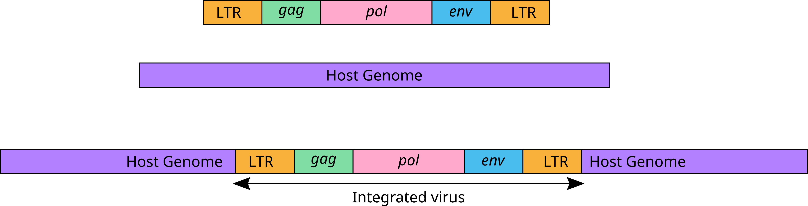
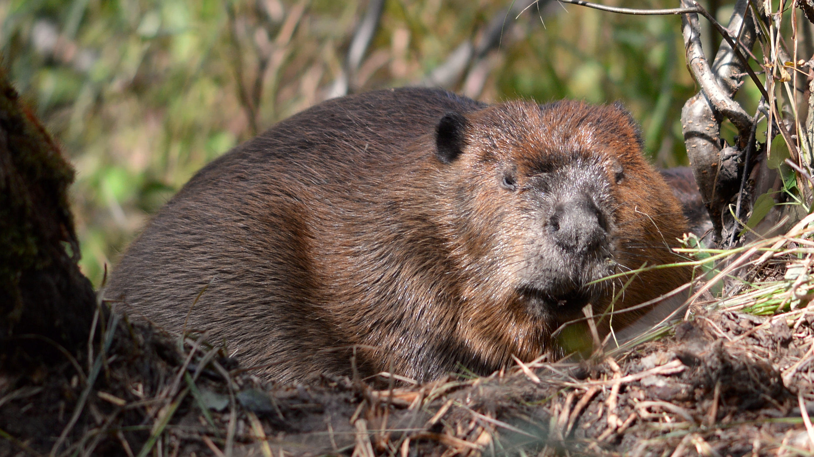

# Part 1: Introduction to Bioconductor and Sequence Analysis in R {#sec-p1_intro_bioconductor}

::: {.callout-note .partmenu #parts-0501}
## Sections
- @sec-ervs
- @sec-aims
- @sec-bioconductor
- @sec-get_sequence
- @sec-summary_0501
:::

:::{.callout-tip .objectives #objectives-0501}
#### Learning objectives
By the end of this part of the practical you will be able to:

* Use some of the tools from the R Bioconductor repository.
* Identify and understand a FASTA file
* Load a set of DNA sequences into R
* Isolate a specific sequence

:::

## Sync your Git repository


## Endogenous retroviruses {#sec-ervs}

[↑ top](#)

Retroviruses are RNA viruses that replicate by converting their RNA genome into DNA. As part of their life cycle, retroviruses **integrate** this DNA into the genome of their vertebrate host, inserting a copy of their retroviral genome into the host genome.

{#fig-integration}

Usually, this happens in a somatic cell, and the virus dies with the host. However, occasionally by chance it will happen in a germline cell, in which case the retrovirus can be inherited as part of the host genome. These inherited retroviruses are known as **endogenous retroviruses** (ERVs).

Although integration into a germline cell is rare for any individual virus infection, over millions of years of evolution these events accumulate and become relatively common, for example, 5% of the human genome is derived from ERVs.

Endogenous retroviruses are interesting partly because, after integration, they evolve at the slow evolutionary rate of the host instead of the very fast rate we see for viruses. This means that integrated historic viruses can still resemble the original circulating virus for millions, or even hundreds of millions of years. Endogenous retroviruses are one of our best sources of information about the evolutionary history of retroviruses and are sometimes referred to as "molecular fossils" of historical viruses.

Endogenous retroviruses in humans are fairly well known, but we know almost nothing about the retroviruses in the genomes of other species. For example, our recent analyses have revealed that the genome of the North American beaver, *Castor canadensis*, contains a very large number of endogenous retroviruses, but nobody has looked at these in detail. 


{#fig-beaver width="50%"}

## The Practical {#sec-aims}

[↑ top](#)

The aim of this practical is to generate new biological knowledge by analysing endogenous retrovirus sequences from the North American beaver, using bioinformatics techniques. We will upload the annotations generated during this practical to a new publicly available database of mammalian endogenous retroviruses, for the research community to use in the future.

### Input
Our start point will be regions of the beaver genome which have previously been identified as likely containing ERVs. Each student will characterise one ERV region, and together the class will build a larger collection of well-characterised ERVs.

### Steps
In order to characterise the ERVs we will:

* Isolate the sequences from the ERV-like regions
* Identify open reading frames (ORFs) in the sequences.
* Find out if these ORFs resemble retroviral genes, and if so, which genes.
* Find the closest related retroviruses using BLAST and build a multiple sequence alignment and phylogenetic tree
* Estimate the age of the ERV using a pairwise sequence alignment.

### Output

At the end of the practical you can upload your results to a public database to be used by the research community.

## Bioconductor {#sec-bioconductor}

[↑ top](#)

Bioconductor is a repository for R packages, datasets and workflows which are specific for analysing biological data.

{#fig-bioconductor width="50%"}

We are going to use several Bioconductor packages for biological sequence analysis, [Biostrings](https://bioconductor.org/packages/release/bioc/html/Biostrings.html), 
[ORFik](https://www.bioconductor.org/packages//release/bioc/vignettes/ORFik/inst/doc/ORFikOverview.html), [msa](https://www.bioconductor.org/packages/release/bioc/html/msa.html), [ggtree](https://www.bioconductor.org/packages/release/bioc/html/ggtree.html).

Import these libraries into your Quarto document. We will also need the `gt` and `tidyverse` libraries.

```{r setup0501, output=FALSE}
library(Biostrings)
library(ORFik)
library(msa)
library(ggtree)
library(gt)
library(tidyverse)
```


## Isolate sequences from the ERV-like regions {#sec-get_sequence}

[↑ top](#)

You have been provided with sequence data from the beaver genome in FASTA format as `data/C_canadensis_erv_regions.fasta`. This file contains the DNA sequence of 365 regions of the beaver genome which have previously been identified as potentially containing ERVs. 

FASTA is a simple text-based format commonly used for storing biological sequences, such as DNA, RNA or protein sequences.

Each sequence in a FASTA file consists of two parts:

1. A **sequence identifier** (or name), which begins with a `>` symbol.
2. On the following line or lines, the **biological sequence** itself.

A FASTA file can one or many contain many sequences. Each sequence starts with a new identifier line followed by a line break, then its sequence, then another line break.

e.g. 

```text
>Sequence1
AGCTATGCTAGCTAGCTAGCTA
>Sequence2
TTCAGCTGATTCTGATCTACTA
```

Open the FASTA file provided in the data directory as `data/C_canadensis_erv_regions.fasta` in a text editor on your computer. 

::: {.callout-exercise #ex-fasta}



What is the name of the second sequence in the file?

::: {.callout-answer collapse="true" #ex-fasta_ans}
`Ccan_ERV_2`
:::
:::


First, we want to read the FASTA file. The Biostrings function `readDNAStringSet` can do this.

```{r read_fasta}
beaver_fasta <- readDNAStringSet("data/C_canadensis_ervs.fasta")
```

This reads our FASTA file into a variable type called a `DNAStringSet`, which is specifically designed for working with DNA sequences.

```{r see_fasta}
print(beaver_fasta)
```

::: {.callout-exercise #ex-lengths_beavers}



You can access the lengths of the sequences using the function `width()`, with your DNAStringSet variable as the argument.

Using R functions, find out:

* How long is the longest sequence?
* How long is the shortest sequence?
* What is the mean sequence length?

::: {.callout-answer collapse="true" #ex-lengths_beavers_ans}
How long is the longest sequence?

```{r lengths_beavers_ans1}
print(max(width(beaver_fasta)))
```

How long is the shortest sequence?
```{r lengths_beavers_ans2}
print(min(width(beaver_fasta)))
```

What is the mean sequence length?
```{r lengths_beavers_ans3}
print(mean(width(beaver_fasta)))
```

:::
:::

In the spreadsheet [here](xxx) there is a list of the beaver ERV regions - the same ones that are in your FASTA file. As a group, we want to try to analyse as many of these as possible. Each student will characterise one ERV region, and together the class will build a larger collection of annotated ERVs.

::: {.callout-important #note-choose_erv}
Please choose any available region and put your CRSID next to it on the spreadsheet, so others know that it is taken. Each sequence has a unique ID, please note the ID for your sequence. Wherever you are asked later for your **ERV_ID**, this is the number you need.
:::

Access your specific sequence using this unique ID as an index - `beaver_fasta["UNIQUE_ID"]` where `UNIQUE_ID` is the ID for your sequence.

e.g. 

```{r get_seq}
current_erv <- beaver_fasta["Ccan_ERV_1"]

print(current_erv)
```

## Review {#sec-summary_0501}

[↑ top](#)

::: {.callout-note #note-summary_0501}

### Summary

* Endogenous retroviruses provide information about viral evolution.
* Bioconductor provides tools for analysing biological data in R.
* DNA sequences are often stored in FASTA files.
* We can import DNA sequences into R using `readDNAStringSet()`.
* Sequences are then stored as a `DNAStringSet`.
* We can select individual sequences using their unique identifiers.

:::

Remember to save your work before moving on to Part 2.


