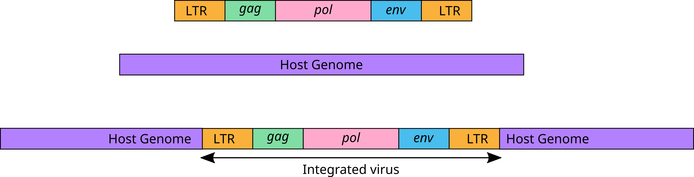
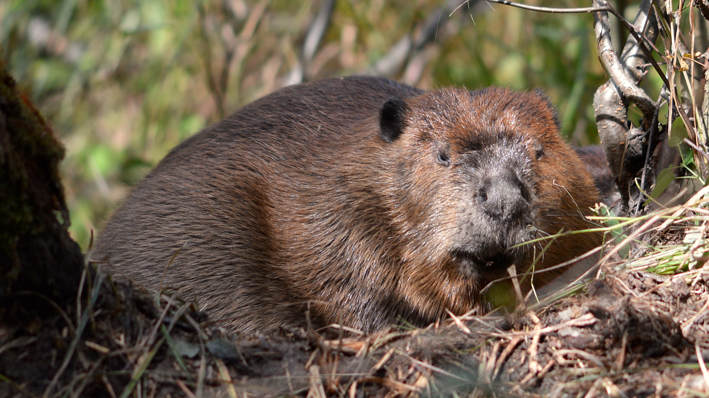

# Part 1: Introduction to Bioconductor and Sequence Analysis in R {#sec-p1_intro_bioconductor}

::: {.callout-note .partmenu #parts-0501}
## Sections
- @sec-ervs
- @sec-aims
- @sec-bioconductor
- @sec-get_sequence
- @sec-summary_0501
:::

:::{.callout-tip .objectives #objectives-0501}

#### Learning objectives

By the end of this part of the practical you will be able to:

* Describe the basic structure of a FASTA file.
* Use Bioconductor packages for biological sequence analysis.
* Read DNA sequences from a FASTA file into R.
* Examine the lengths of sequences in a `DNAStringSet`.
* Extract an individual sequence from a `DNAStringSet` using its identifier.

:::

## Sync your Git repository


For this practical, we recommend that you create two Quarto documents:

* `/beaver_ervs.qmd` - analysis of the pollinator dataset
* `/prac5_exercises.qmd` - general practice exercises

## Endogenous retroviruses {#sec-ervs .core}

[**Core**]{.core-text}

[↑ top](#)

Retroviruses are RNA viruses that replicate by converting their RNA genome into DNA. As part of their life cycle, retroviruses **integrate** this DNA into the genome of their vertebrate host, inserting a copy of their retroviral genome into the host genome.

{#fig-integration}

Usually, integration occurs in a somatic cell, so the integrated viral sequence is not inherited by the host's offspring. However, occasionally integration occurs in a germline cell and the integrated sequence is subsequently inherited by the host's offspring. These inherited retroviruses are known as **endogenous retroviruses** (ERVs).

Although integration into a germline cell is rare for any individual virus infection, over millions of years of evolution these events accumulate and become relatively common, for example, 8% of the human genome is derived from ERVs.

Endogenous retroviruses are interesting partly because, after integration, they evolve at the slow evolutionary rate of the host instead of the very fast rate we see for viruses. This means that viruses which integrated millions, or even hundreds of millions of years ago, can still resemble the ancient circulating virus. Endogenous retroviruses are one of our best sources of information about the evolutionary history of retroviruses and are sometimes referred to as "molecular fossils" of historical viruses.

Endogenous retroviruses in humans have been studied extensively, but ERVs in many other vertebrate species remain poorly characterised. For example, recent analyses have revealed that the genome of the North American beaver, *Castor canadensis*, contains a very large number of endogenous retroviruses, but nobody has looked at these in detail. 


{#fig-beaver width="50%"}

## The Practical {#sec-aims .core}

[**Core**]{.core-text}

[↑ top](#)

The aim of this practical is to generate new biological knowledge by analysing endogenous retrovirus sequences from the North American beaver, using bioinformatics techniques. We will upload the annotations generated during this practical to a new publicly available database of mammalian endogenous retroviruses, for the research community to use in the future.

### Input {#sec-input_beavers .core}

Our start point will be regions of the beaver genome which have previously been identified as likely containing ERVs. Each student will characterise one ERV region, and together the class will build a larger collection of well-characterised ERVs.

### Steps {#sec-steps_beavers .core}

In order to characterise the ERVs we will:

* Isolate the sequences from the ERV-like regions.
* Identify open reading frames (ORFs) in the sequences.
* Determine whether these ORFs resemble retroviral genes and, if so, which genes.
* Find the closest related retroviruses using BLAST.
* Build a multiple sequence alignment.
* Build a phylogenetic tree. [(Extension)]{.extension-text}

### Output {#sec-output_beavers .core}

At the end of the practical you can upload your results to a public database to be used by the research community.

## Bioconductor {#sec-bioconductor .core}

[**Core**]{.core-text}

[↑ top](#)

Bioconductor is a collection of R packages, datasets and workflows which are specific for analysing biological data.

{#fig-bioconductor width="50%"}

We are going to use several Bioconductor packages for biological sequence analysis:

* [Biostrings](https://bioconductor.org/packages/release/bioc/html/Biostrings.html)
* [ORFik](https://www.bioconductor.org/packages//release/bioc/vignettes/ORFik/inst/doc/ORFikOverview.html)
* [msa](https://www.bioconductor.org/packages/release/bioc/html/msa.html)
* [ggtree](https://www.bioconductor.org/packages/release/bioc/html/ggtree.html)

Import these packages into your `beaver_ervs.qmd` Quarto document. We will also need the `gt` and `tidyverse` libraries.

::: {.callout-note .copycode #copy-libs_ervs}

### Include this code

Include this code in your `beaver_ervs.qmd` Quarto file:

```{r setup0501, output=FALSE}
library(Biostrings)
library(ORFik)
library(msa)
library(ggtree)
library(ape)
library(DECIPHER)

library(gt)
library(tidyverse)
```

:::

## Isolate sequences from the ERV-like regions {#sec-get_sequence .core}

[↑ top](#)

You have been provided with sequence data from the beaver genome in FASTA format as `data/C_canadensis_erv_regions.fasta`. This file contains the DNA sequence of 365 regions of the beaver genome which have previously been identified as potentially containing ERVs. 

FASTA is a simple text-based format commonly used for storing biological sequences, such as DNA, RNA or protein sequences.

Each sequence in a FASTA file consists of two parts:

1. A **sequence identifier** (or name), which begins with a `>` symbol.
2. On the following line or lines, the **biological sequence** itself.

A FASTA file can contain one or many sequences. Each sequence begins with an identifier line starting with `>`, followed by the sequence itself on one or more lines.

e.g. 

```text
>Sequence1
AGCTATGCTAGCTAGCTAGCTA
>Sequence2
TTCAGCTGATTCTGATCTACTA
```

Open the FASTA file provided in the data directory as `data/C_canadensis_ervs.fasta` in a text editor on your computer. 

::: {.callout-exercise #ex-fasta .core}

### Examine your FASTA file

[**Core**]{.core-text}

What is the name of the second sequence in the file?

::: {.callout-answer collapse="true" #ex-fasta_ans}
`Ccan_ERV_2`
:::
:::


First, we want to read the FASTA file. The Biostrings function `readDNAStringSet()` can do this.

::: {.callout-note .copycode #copy-read_fasta}

### Include this code 

Include this code in your `beaver_ervs.qmd` Quarto file.

```{r read_fasta}
beaver_fasta <- readDNAStringSet("data/C_canadensis_ervs.fasta")
```

:::

This reads our FASTA file into a variable type called a `DNAStringSet`, which is specifically designed for working with DNA sequences.

```{r see_fasta}
print(beaver_fasta)
```

We can access the sequence identifiers using the function `names()`.

```{r print_names}
print(names(beaver_fasta))
```

::: {.callout-exercise #ex-lengths_beavers .core}

### Accessing sequence lengths

[**Core**]{.core-text}

You can access the lengths of the sequences using the function `width()`, with your DNAStringSet variable as the argument.

Using R functions, find out:

* How long is the longest sequence?
* How long is the shortest sequence?
* What is the mean sequence length?

::: {.callout-answer collapse="true" #ex-lengths_beavers_ans}

How long is the longest sequence?

```{r lengths_beavers_ans1}
print(max(width(beaver_fasta)))
```

How long is the shortest sequence?

```{r lengths_beavers_ans2}
print(min(width(beaver_fasta)))
```

What is the mean sequence length?

```{r lengths_beavers_ans3}
print(mean(width(beaver_fasta)))
```

:::
:::

In the spreadsheet [here](xxx) there is a list of the beaver ERV regions - the same ones that are in your FASTA file. As a group, we want to try to analyse as many of these as possible. Each student will characterise one ERV region, and together the class will build a larger collection of annotated ERVs.

::: {.callout-important #note-choose_erv}
Please choose any available region and put your CRSID next to it on the spreadsheet, so others know that it is taken. Each sequence has a unique ID. Please note the ID for your sequence. Wherever you are asked later for your [**ERV_ID**]{.orange-text}, this is the number you need.
:::

Access your specific sequence using this unique ID as an index - `beaver_fasta["ERV_ID"]`, replacing `ERV_ID` with the ID of the region you just selected.

e.g. 

```{r get_seq}
current_erv <- beaver_fasta["Ccan_ERV_1"]

print(current_erv)
```

## Review {#sec-summary_0501}

[↑ top](#)

::: {.callout-note #note-summary_0501}

### Summary

* Endogenous retroviruses provide information about viral evolution.
* Bioconductor provides tools for analysing biological data in R.
* DNA sequences are often stored in FASTA files.
* We can import DNA sequences into R using `readDNAStringSet()`.
* Sequences are then stored as a `DNAStringSet`.
* We can select individual sequences using their unique identifiers.

:::

Remember to save your work before moving on to Part 2.


