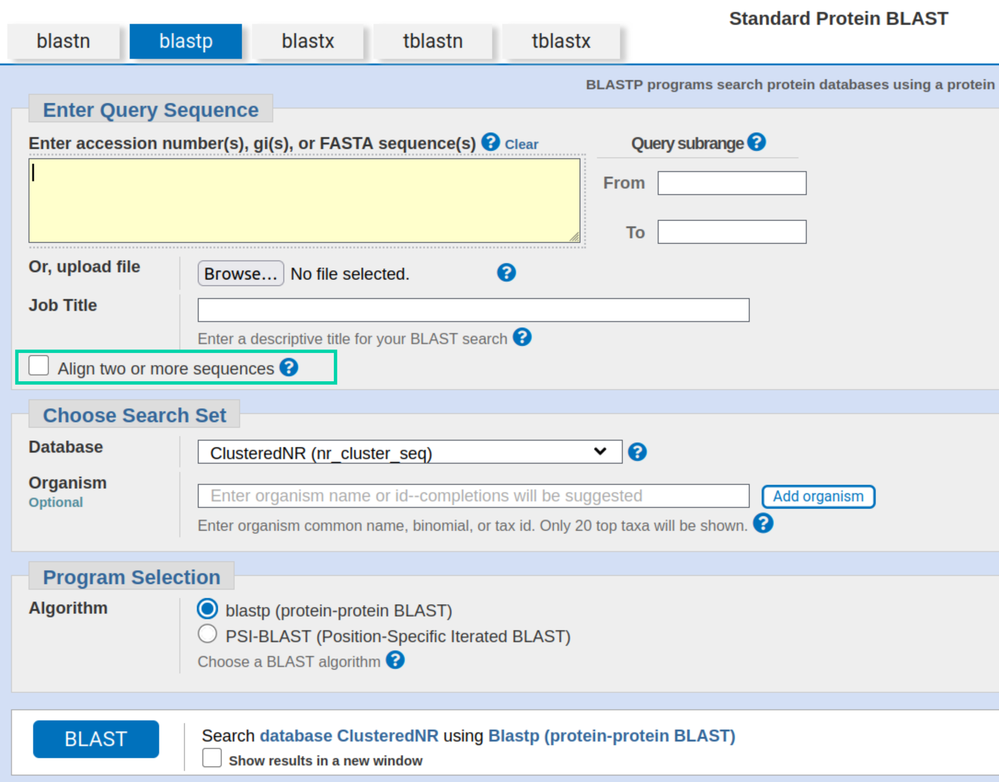
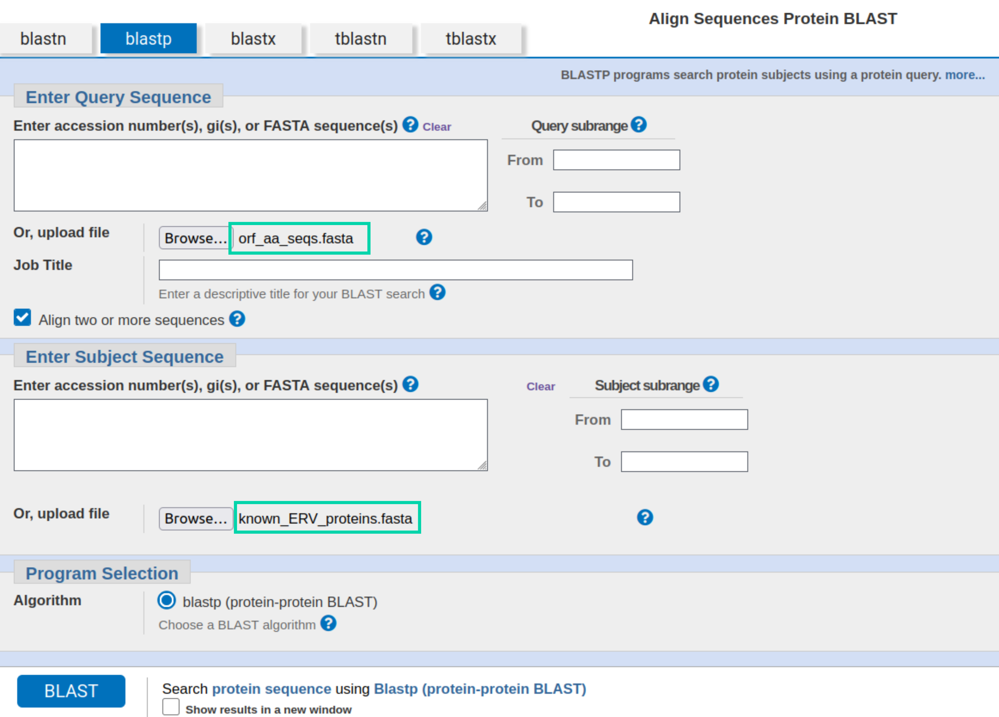
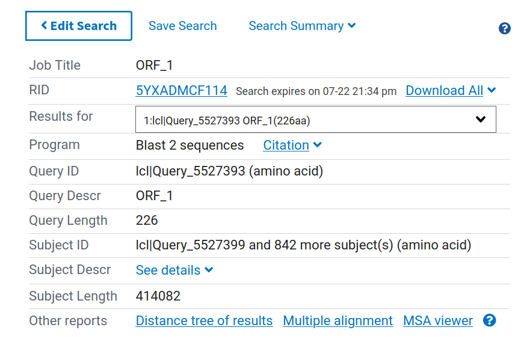
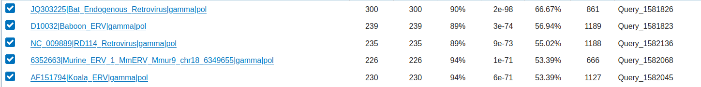
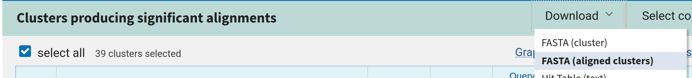

# Part 3: Identifying Sequences with BLAST {#sec-p3_blast}

::: {.callout-note .partmenu #parts-0503}

## Sections

- @sec-run_blast
- @sec-blast_results
- @sec-process_blast
- @sec-summary_0503

:::

:::{.callout-tip .objectives #objectives-0503}
#### Learning objectives
By the end of this part of the practical you will be able to:

* Use BLASTp to find proteins related to a sequence of interest.
* Interpret the results of a BLAST search.
* Extract and organise information from BLAST results.

:::

```{r setup0503, include=FALSE}
library(ORFik)
library(tidyverse)
library(gt)
beaver_fasta <- readDNAStringSet("data/C_canadensis_ervs.fasta")
current_erv <- beaver_fasta["Ccan_ERV_1"]
orfs <- findORFs(current_erv, minimumLength = 200)[[1]]
orf_names <- paste0("Ccan_ERV_1_ORF_", seq(1, length(orfs)))
names(orfs) <- orf_names
orf_seqs <- extractAt(current_erv, orfs)[[1]]
orf_aa_seqs <- translate(orf_seqs)
```

## Finding related sequences using BLAST {#sec-run_blast}

Now we have our amino acid sequences, we want to check if they are derived from retroviruses. We can do this using the online [BLAST server](https://blast.ncbi.nlm.nih.gov/Blast.cgi), with the BLASTp algorithm, which compares protein sequences with protein sequences.

We will compare our ORF sequences with a database of known retrovirus proteins to find out:

* Which retroviral genes we can identify.
* What type of retrovirus they are derived from.
* What are the most closely related known retroviruses?

A FASTA file of the amino acid sequences of known retroviral genes has been provided for you in `data/known_ERV_proteins.fasta`. 

On the BLASTp homepage, first select the checkbox "Align 2 or more sequences". This is because both our query sequences and our database sequences are stored in local FASTA files. The alternative is to search against one of the large online databases provided by NCBI.

{#fig-blast}

Your query sequences are the sequences you want to identify - your putative ERV ORFs. Click the "Browse..." button in the query sequence section and choose the FASTA file you just created - `output/orf_aa_seqs.fasta`. 

The subject sequences are the database you would like to compare to - the known retrovirus gene sequences. Click the "Browse..." button in the subject sequence section and choose the FASTA file of known retrovirus sequences - `data/known_ERV_proteins.fasta`.

{#fig-blast2}

Otherwise, the default options are OK. Click the "BLAST" button.

## BLAST Results {#sec-blast_results}

Once BLAST has finished running, you should see something like this:

{#fig-blastresults}

The dropdown box next to "Results for" allows you to choose which of your ORFs you would like to see the results for.

::: {.callout-note #note-no_blast_results}
It's possible that some of your ORFs will have no results, if so that's fine - that just means that specific ORF is unlikely to be derived from a retrovirus.
:::

Further down on the page, you should see a table showing all of the database sequences (or the top 100, if there are more than 100) which were significantly more similar to your query sequence than would be expected by chance.

{#fig-blasttable}

The columns in this table are as follows:

| Column | Meaning |
|---|------|
| **Cluster Representative Sequence** | The ID and name of this subject sequence. |
| **Max Score** | The highest local alignment score for a single high-scoring segment between your query and this subject sequence. **Higher is better.** |
| **Total Score** | The combined score of all aligned segments between your query and this subject sequence. **Higher is generally better.** |
| **Query Cover** | The percentage of your query sequence that is included in the alignment. **Higher is better.** |
| **E value** | The expected number of matches of this quality that could occur by chance in a database of this size. **Lower is better; values close to zero indicate more significant matches.** |
| **Per. Ident** | The percentage of aligned positions that are identical between your query and the matching sequence. **Higher is better.** |
| **Acc. Len** | The total length of this subject sequence in the database. |
| **Accession** | The unique identifier for this subject sequence in the database, which can be used to retrieve more information about it. |


When evaluating BLAST results, you should consider several columns together. In general, a good match will have a **high query cover**, **high percentage identity**, and a **low E value**. 

The subject retrovirus sequence names also provide some information. They are formatted as `identifier|name|genus|gene`, where:

* `identifier` is a unique identifer for the sequence
* `name` is the name of the retrovirus 
* `genus` is **gamma**, **beta**, **alpha**, **epsilon**, **delta**, **lenti** or **spuma** - these are the different **genera** of retroviruses - the taxonomic groups to which they belong.
* `gene` is **gag**, **pol** or **env** - the retroviral gene which matches this ORF

For example, if I had the results below:

{#fig-orf1}

Then my results for this ORF are:

* Most similar sequence name: Bat endogenous retrovirus
* Most similar sequence accesion: JQ303225
* Most similar retroviral genus: gamma
* Most similar retroviral gene: pol


::: {.callout-exercise #ex-blast_res_df}
Record the most similar sequence name for each ORF in an R data frame with two columns - `name` and `most_similar_sequence_id` (as we did in @sec-data_frames). Name the data frame variable `blast_res`.

::: {.callout-answer collapse="true" #ex-blast_res_df_ans}

```{r blast_res_df_ans}
blast_res <- tibble(
  name = names(orfs),
  most_similar_sequence_id = c(
    "JQ303225|Bat_Endogenous_Retrovirus|gamma|gag",
    "JQ303225|Bat_Endogenous_Retrovirus|gamma|pol",
    "AY099324|Porcine_ERV_B|gamma|env",
    "JQ303225|Bat_Endogenous_Retrovirus|gamma|gag",
    "JQ303225|Bat_Endogenous_Retrovirus|gamma|gag"
  )
)
```

:::

:::
::: {.callout-important #note-save_blast}
At this point, please save the BLAST results from the web server onto your computer in FASTA format.

To do this, for each of your query sequences, select `Download` at the top of the hit table, then select `FASTA (aligned clusters)`.

{#fig-blast_save}
This will save a file on your computer named `seqdump.txt` Move this file to your `output` folder for this practical and rename it as <code>Ccan\_ERV\_<span style="color: red;">j</span>\_ORF\_<span style="color: blue;">i</span>_refs.fasta</code>, replacing <span style="color: red;">j</span> with your ERV ID and <span style="color: blue;">i</span> with your ORF ID.

You'll need to repeat this process for each of your ORFs.
:::


## Processing BLAST Results {#sec-process_blast}

Your results should currently look something like this:

```{r show_blast_tab}
gt(blast_res)
```

You can use the R function `separate_wider_delim` to split the name column of the data frame you created in @ex-blast_res_df into multiple columns, based on the "|" delimiter, as follows:


```{r split_df_col}
blast_expanded <- blast_res |>
  separate_wider_delim(
    most_similar_sequence_id,
    delim = "|",
    names = c("accession", "description", "genus", "gene")
  )

gt(blast_expanded)
```

The information about the position of the ORFs within the longer sequence is currently contained in an IRanges object, `orfs`.


```{r show_iranges}
print (orfs)
```


Let's convert it to a data frame so we can manipulate it more easily. We can do this with the `tibble` function.

```{r orf_data_frame}
orf_df <- tibble(
  name = names(orfs),
  orf_start = start(orfs),
  orf_end = end(orfs),
  orf_width = width(orfs)
)

gt(orf_df)
```

::: {.callout-exercise #ex-blast_res_merge}
Merge this new data frame with information about your ORFs (`orf_df`) with the data frame with information about your BLAST results (`blast_expanded`) (as we did in @sec-merge). Name the resulting data frame variable `blast_combined`. View the result with `gt()`.

::: {.callout-answer collapse="true" #ex_blast_res_merge_ans}

```{r blast_res_merge_ans}
blast_combined <- full_join(blast_expanded, orf_df)

gt(blast_combined)
```

:::
:::

### Select longest ORFs

We only want to continue with the longest ORF for each retroviral gene. We can identify these with the `group_by()` and `slice_max()` data frame functions.

We use the argument `n = 1` with `slice_max()` to say that we only want the single best result and `with_ties = FALSE` to say to choose either arbitrarily if two are the same length.

The `ungroup()` function converts the grouped data frame back into a standard data frame.

```{r longest_orfs}
identified_orf_df <- blast_combined |>
  group_by(gene) |>
  slice_max(orf_width, n = 1, with_ties = FALSE) |>
  ungroup()

gt(identified_orf_df)
```

:::{.callout-important #note-ervs_identified}
You should have a maximum of three sequences left, one each for the **gag**, **pol** and **env** genes. It's possible one of these genes will be missing - some of the ERVs may be too degraded for every gene to be recognisable. You shouldn't have more than one ORF left for any gene.

We'll refer to these sequences from here forward as your **identified ERV ORFs** for each gene.
:::

Let's save this table using the `write_csv()` function.

```{r write_longest_orfs}
write_csv(identified_orf_df,
          "output/identified_orfs.tsv")
```

We can also make a new FASTA file containing only the sequences for your identified ERV ORFs.

First, we get only the ORF name column from our identified ERV ORF table.

```{r get_name_col}
name_col <- identified_orf_df |>
  pull(name)

print(name_col)
```

We can then use this variable to subset our ORF amino acid sequences, which stored earlier in our `AAStringSet` object named `orf_aa_seqs`.


```{r get_long_orfs}
identified_orf_seqs <- orf_aa_seqs[name_col]
```

::: {.callout-exercise #ex-save_long_orfs}
Save this new set of your identified ERV ORF sequences for each gene to a FASTA file in your output directory named `output/identified_orf_aa_seqs.fasta`, as we did for the full set of ORFs in @sec-save.

::: {.callout-answer collapse="true" #ex-save_long_orfs_ans}

```{r save_long_orfs_ans}
writeXStringSet(identified_orf_seqs,
                "output/identified_orf_aa_seqs.fasta")
```

:::
:::


## Review {#sec-summary_0503}

At this stage, we know quite a lot about our ERVs:

* Which retroviral genes are present.
* The location of the longest ORF for each gene within our source sequence.
* Which retroviral genus each gene is likely to be derived from.
* Which known retrovirus each gene is most similar to.

There are several things here which could mean your results are extra interesting:

* Genes from more than one different genus in your identified ERV ORF set - this suggests that the retrovirus could be a [**recombinant**](https://www.nature.com/articles/35052098) generated by recombination between two different viruses.
* Most ERVs in mammals are of the **gamma**, **beta** or **spuma** genus - **alpha** and **epsilon** like ERVs are rarer and **delta** and **lenti** like ERVs are very rare so any non-gamma/beta ERVs in beavers would be very interesting.

However, even if neither of these are true, you are still most likely the first scientist to find out anything about your specific ERV!

[↑ top](#)

::: {.callout-note #note-summary_0503}

### Summary

* BLAST uses local alignment to identify sequences in a database which are similar to a query.
* BLAST results include various important information
* Database columns can be split on a delimiter using `separate_wider_delim()`.
* `slice_max()` can be used to select rows from a grouped data frame with the largest value in a specific column.

:::

Remember to save your work before moving on to Part 4.


