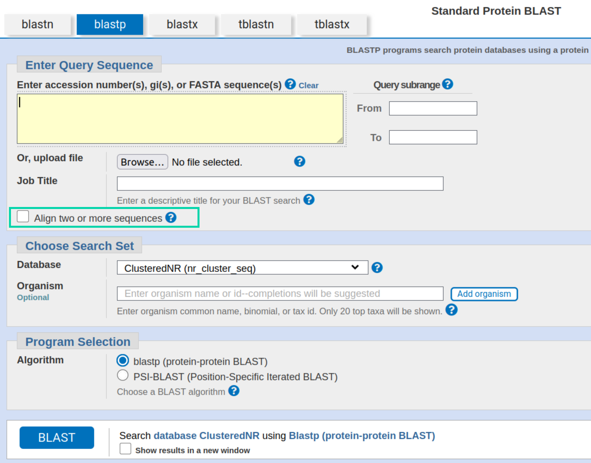
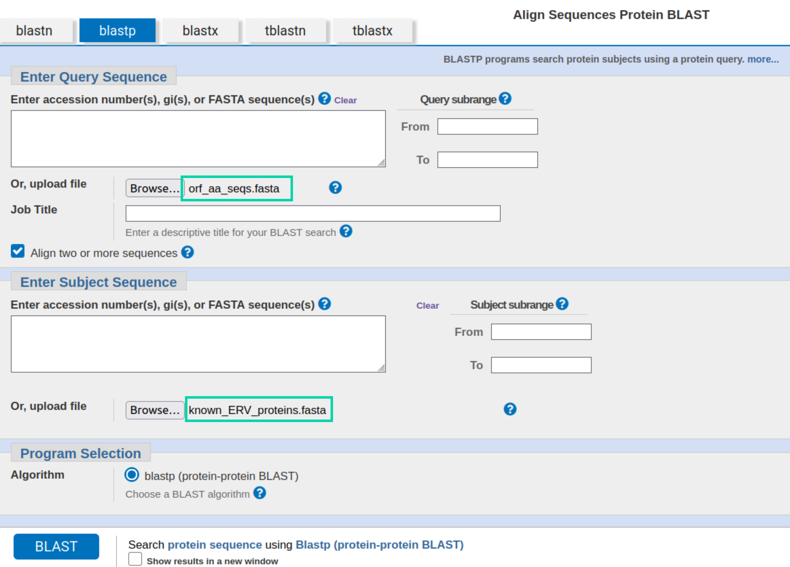
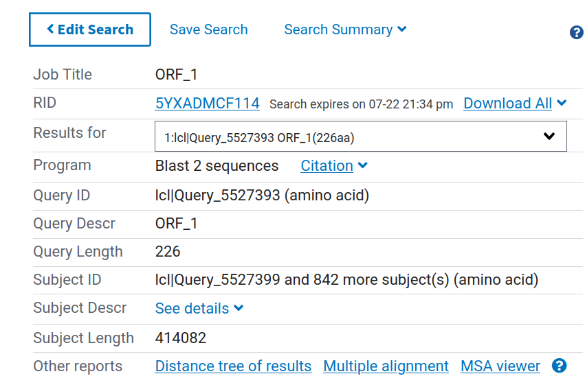
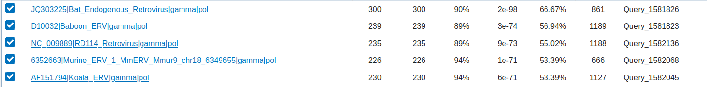
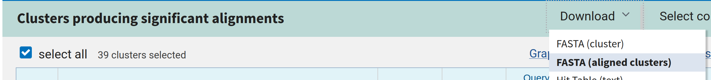

# Part 3: Identifying Sequences with BLAST {#sec-p3_blast}

::: {.callout-note .partmenu #parts-0503}

## Sections

- @sec-run_blast
- @sec-blast_results
- @sec-process_blast
- @sec-join_orf_blast
- @sec-select_longest
- @sec-summary_0503

:::

:::{.callout-tip .objectives #objectives-0503}
#### Learning objectives
By the end of this part of the practical you will be able to:

* Use BLASTp to find proteins related to a sequence of interest.
* Interpret the results of a BLAST search.
* Extract and organise information from BLAST results.
* Use BLAST results to identify likely retroviral genes and genera.

:::

```{r setup0503, include=FALSE}
library(ORFik)
library(tidyverse)
library(gt)
library(Biostrings)

beaver_fasta <- readDNAStringSet("data/C_canadensis_ervs.fasta")
current_erv <- beaver_fasta["Ccan_ERV_1"]
orfs <- findORFs(current_erv, minimumLength = 200)[[1]]
orf_names <- paste0("Ccan_ERV_1_ORF_", seq(1, length(orfs)))
names(orfs) <- orf_names
orf_seqs <- extractAt(current_erv, orfs)[[1]]
orf_aa_seqs <- translate(orf_seqs)
```

## Finding related sequences using BLAST {#sec-run_blast .core}

[**Core**]{.core-text}

[↑ top](#)

Now we have our amino acid sequences, we want to check if they are derived from retroviruses. We can do this using the online [BLAST server](https://blast.ncbi.nlm.nih.gov/Blast.cgi), with the BLASTp algorithm, which compares protein sequences with protein sequences.

We will compare our ORF sequences with a database of known retrovirus proteins to find out:

* Which retroviral genes we can identify.
* What type of retrovirus they are derived from.
* What are the most closely related known retroviruses?

A FASTA file of the amino acid sequences of known retroviral genes has been provided for you in `data/known_ERV_proteins.fasta`. 

::: {.callout-exercise #ex-blast .core}

### BLAST your sequences

[**Core**]{.core-text}

On the BLASTp homepage, first select the checkbox "Align 2 or more sequences". This is because both our query sequences and our database sequences are stored in local FASTA files. The alternative is to search against one of the large online databases provided by NCBI.

{#fig-blast}

Your query sequences are the sequences you want to identify - your putative ERV ORFs.

Click the "Browse..." button in the query sequence section and choose the FASTA file you just created - `output/orf_aa_seqs.fasta`. 

The subject sequences are the database you would like to compare to - the known retrovirus gene sequences. Click the "Browse..." button in the subject sequence section and choose the FASTA file of known retrovirus sequences - `data/known_ERV_proteins.fasta`.

{#fig-blast2}

Otherwise, the default options are OK. Click the "BLAST" button.

:::

## BLAST Results {#sec-blast_results}

[↑ top](#)

Once BLAST has finished running, you should see something like this:

{#fig-blastresults}

The dropdown box next to "Results for" allows you to choose which of your ORFs you would like to see the results for.

::: {.callout-note #note-no_blast_results}
It's possible that some of your ORFs will have no results, if so that's fine - that just means that specific ORF is unlikely to be derived from a retrovirus.
:::

Further down on the page, you should see a table showing the database sequences with the strongest matches to your query sequence (or the top 100, if there are more than 100).

The columns in this table are as follows:

| Column | Meaning |
|---|------|
| **Cluster Representative Sequence** | The ID and name of this subject sequence. |
| **Max Score** | The highest local alignment score for a single high-scoring segment between your query and this subject sequence. **Higher is better.** |
| **Total Score** | The combined score of all aligned segments between your query and this subject sequence. **Higher is generally better.** |
| **Query Cover** | The percentage of your query sequence that is included in the alignment. **Higher is better.** |
| **E value** | The expected number of matches of this quality that could occur by chance in a database of this size. **Lower is better; values close to zero indicate more significant matches.** |
| **Per. Ident** | The percentage of aligned positions that are identical between your query and the matching sequence. **Higher is better.** |
| **Acc. Len** | The total length of this subject sequence in the database. |
| **Accession** | The unique identifier for this subject sequence in the database, which can be used to retrieve more information about it. |


When evaluating BLAST results, you should consider several columns together. In general, a good match will have a **high query cover**, **high percentage identity**, and a **low E value**. 

For the purposes of this practical, we will use the **Max score** column to choose our best hits. Max Score, otherwise known as **bit score**, reflects both the extent and quality of the single best alignment between the query and subject sequences, with higher scores indicating better matches.

The subject retrovirus sequence names also provide some information. They are formatted as `identifier|name|genus|gene`, where:

* `identifier` is a unique identifier for the sequence
* `name` is the name of the retrovirus 
* `genus` is **gamma**, **beta**, **alpha**, **epsilon**, **delta**, **lenti** or **spuma** - these are the different **genera** of retroviruses - the taxonomic groups to which they belong.
* `gene` is **gag**, **pol** or **env** - the retroviral gene which matches this ORF

For example, if I had the results below:

{#fig-orf1}

Then my results for this ORF are:

* Best match sequence name: Bat endogenous retrovirus
* Best match sequence accession: JQ303225
* Best match retroviral genus: gamma
* Best match retroviral gene: pol

::: {.callout-exercise #note-save_blast .core}

### Save your BLAST results

[**Core**]{.core-text}

Please save the BLAST results from the web server onto your computer in CSV and FASTA format.

First, towards the top of the page, click on "Download All", then "Hit Table(csv)". This will create a file with a unique ID followed by `-Alignment-HitTable.csv` (e.g. `B4U24K2W114-Alignment-HitTable.csv`).

Move this file to your `output` folder for this practical and rename it as <code>Ccan\_[ERV\_j]{.red-text}_alignment_table.csv</code>, replacing <code>[ERV_j]{.red-text}</code> with your ERV ID.

Next, for each of your query sequences, select `Download` at the top of the hit table, then select `FASTA (aligned clusters)`. You'll need to repeat this part for each of your ORFs.

{#fig-blast_save}


Each time, it will save a file on your computer named `seqdump.txt`. Move this file to your `output` folder for this practical and rename it as <code>Ccan\_[ERV\_j]{.red-text}\_ORF\_[i]{.orange-text}_refs.fasta</code>, replacing <code>[ERV_j]{.red-text}</code> with your ERV ID and <code>[i]{.orange-text}</code> with your ORF ID.

:::

## Processing BLAST Results {#sec-process_blast .core}

[**Core**]{.core-text}

::: {.callout-exercise #ex-read_blast_csv .core}

### Read the BLAST CSV output

[↑ top](#)

The CSV file we outputted from BLAST doesn't have a header row, but we can add it manually by running `read_csv()` with the argument <code>col_names = [vec]{.red-text}</code>, replacing <code>[vec]{.red-text}</code> with a vector of the column names.

Here are all of the column names for the data frame, as a vector.

```{r col_names_blast}
col_names = c(
    "query",
    "subject",
    "percent_identity",
    "alignment_length",
    "mismatches",
    "gap_opens",
    "query_start",
    "query_end",
    "subject_start",
    "subject_end",
    "e_value",
    "bit_score",
    "query_cover"
  )
```

In your `beaver_ervs.qmd` Quarto file, read the CSV file you saved containing the BLAST output into a variable, adding the `col_names = ` argument and this vector of column names.

::: {.callout-answer collapse="true" #ex-read_blast_csv_ans}

```{r read_blast_csv, message=FALSE}
blast_res <- read_csv("output/Ccan_ERV_1_alignment_table.csv",
                      col_names = col_names)
gt(head(blast_res))
```

:::
:::

The data frame you just read should currently look something like this:

```{r show_blast_tab}
gt(head(blast_res))
```

You can use the R function `separate_wider_delim` to split the `subject` column of the data frame  based on the "|" delimiter, so that accession, description, genus and gene are different columns.

::: {.callout-note .copycode #copy-expand_df}

### Include this code 

Include this code in your `beaver_ervs.qmd` Quarto file.

```{r split_df_col}
blast_expanded <- blast_res |>
  separate_wider_delim(
    subject,
    delim = "|",
    names = c("accession", "description", "genus", "gene")
  )

gt(head(blast_expanded))
```

:::

### Join BLAST results with ORF details {#sec-join_orf_blast .core}

You already have the details of your ORFs from @sec-orfs, with the variable name `orfs`.

This is an `IRanges()` object, in which ORF names are accessible using the function `names()`, start positions with the function `start()`, end positions with the function `end()` and lengths with the function `width()`.

e.g.
```{r get_info_iranges}
print(end(orfs))
```
::: {.callout-exercise #ex-dataframe_orfs .core}

### Create ORF data frame

[**Core**]{.core-text}

In your `beaver_ervs.qmd` Quarto file

* Create a new data frame in the variable `orf_df` using the function `tibble()`, with four columns:

  * `query`, containing the output of `names(orfs)`.
  * `orf_start` containing the output of `start(orfs)`.
  * `orf_end` containing the output of `end(orfs)`.
  * `orf_width` containing the output of `width(orfs)`
* Join this data frame with your BLAST output (`blast_expanded`) using an `inner_join()` and store the output as a new variable `blast_combined`.

::: {.callout-answer collapse="true" #ex-dataframe_orfs_ans}

[Create a new data frame in the variable `orf_df` using the function `tibble()`, with four columns]{.blue-text}

* [`query`, containing the output of `names(orfs)`.]{.blue-text}
* [`orf_start` containing the output of `start(orfs)`.]{.blue-text}
* [`orf_end` containing the output of `end(orfs)`.]{.blue-text}
* [`orf_width` containing the output of `width(orfs)`]{.blue-text}

```{r dataframe_orfs_ans1}
orf_df <- tibble(
  query = names(orfs),
  orf_start = start(orfs),
  orf_end = end(orfs),
  orf_width = width(orfs)
)
gt(head(orf_df))
```

[Join this data frame with your BLAST output (`blast_expanded`) using an `inner_join()`.]{.blue-text}

```{r dataframe_orfs_ans2, message=FALSE}
blast_combined <- inner_join(blast_expanded, orf_df)

gt(blast_combined)
```

:::
:::

## Select longest ORFs and best hits {#sec-select_longest .core}

[**Core**]{.core-text}

[↑ top](#)

For this analysis, where we have more than one hit for the same ORF, we will retain the highest scoring hit. Then, if we have identified more than one ORF as the same retroviral gene, we will retain the longest ORF. 

We can identify these with the `group_by()` and `slice_max()` data frame functions. `group_by()` will group the data frame by a specific column, then `slice_max()` will return the `n` rows with the highest value in another column, for each group.

We use the argument `n = 1` with `slice_max()` to say that we only want the single best result and `with_ties = FALSE` to say to choose either arbitrarily if there are two equally good best results.

The `ungroup()` function converts the grouped data frame back into a standard data frame.

::: {.callout-note .copycode #copy-longest}

### Include this code 

Include this code in your `beaver_ervs.qmd` Quarto file to find the highest scoring hit for each ORF.

```{r longest_orfs}
best_hit_df <- blast_combined |>
  group_by(query) |>
  slice_max(bit_score, n = 1, with_ties = FALSE) |>
  ungroup()

gt(best_hit_df)
```

:::

::: {.callout-exercise #ex-filter_by_gene .core}

### Find the longest ORF by gene

[**Core**]{.core-text}

We only want to keep the longest ORF for each retroviral gene.

In your `beaver_ervs.qmd` Quarto file
* Group `best_hit_df` by `gene`.
* Take the row with the single highest value from the `orf_width`, choosing arbitrarily if there are ties.
* Ungroup using `ungroup()`.
* Store the output in a variable `identified_orf_df`.
* Save the resulting data frame as `output/identified_orfs.csv`.

::: {.callout-answer collapse="true" #ex-filter_by_gene_ans}

```{r filter_by_gene_ans}
identified_orf_df <- best_hit_df |>
  group_by(gene) |>
  slice_max(orf_width, n = 1, with_ties = FALSE) |>
  ungroup()

# Save the resulting data
write_csv(identified_orf_df,
          "output/identified_orfs.csv")

gt(identified_orf_df)
```

:::
:::

:::{.callout-important #note-ervs_identified}

You will most likely have exactly three sequences left, one each for the **gag**, **pol** and **env** genes. It's possible one of these genes will be missing - some of the ERVs may be too degraded for every gene to be recognisable. You shouldn't have more than one ORF left for any gene.

:::

We'll refer to these sequences from here forward as your **identified ERV ORFs** for each gene.

::: {.callout-exercise #ex-examine_blast .core}

### Look at your results

[**Core**]{.core-text}

Examine the data frame you have just generated. Are all three genes most closely related to the same virus, or to different viruses?

Search online for the viruses you have identified. Based on what you can find out about them, are these relationships expected or unexpected?

:::


We should make a new FASTA file containing only the sequences for your identified ERV ORFs.

First, we get only the ORF name column from our identified ERV ORF table.

::: {.callout-exercise #ex-get_orf_name .core}

### Extract identified ORF names

[**Core**]{.core-text}

In your `beaver_ervs.qmd` Quarto file, extract the identified ERV names from `identified_orf_df` using the `pull()` function. They will be in the column named `query`.

::: {.callout-answer collapse="true" #ex-get_orf_name_ans}

```{r get_name_col}
name_col <- identified_orf_df |>
  pull(query)

print(name_col)
```
:::
:::

We can then use this variable to subset our ORF amino acid sequences, which we stored earlier in our `AAStringSet` object named `orf_aa_seqs`.

::: {.callout-note .copycode #copy-get_orfs_longest}

### Include this code 

Include this code in your `beaver_ervs.qmd` Quarto file.

```{r get_long_orfs}
identified_orf_seqs <- orf_aa_seqs[name_col]
```

:::

::: {.callout-exercise #ex-save_long_orfs .core}

### Save your ORFs

[**Core**]{.core-text}

Save this new set of your identified ERV ORF sequences for each gene to a FASTA file in your output directory named `output/identified_orf_aa_seqs.fasta`, as we did for the full set of ORFs in @sec-save.

::: {.callout-answer collapse="true" #ex-save_long_orfs_ans}

```{r save_long_orfs_ans}
writeXStringSet(identified_orf_seqs,
                "output/identified_orf_aa_seqs.fasta")
```

:::
:::


## Review {#sec-summary_0503}

[↑ top](#)

At this stage, we know quite a lot about our ERVs:

* Which retroviral genes are present.
* The location of the longest ORF for each gene within our source sequence.
* Which retroviral genus each gene is likely to be derived from.
* Which known retrovirus each gene best matches.

There are several things here which could mean your results are extra interesting:

* Genes from more than one different genus in your identified ERV ORF set - this suggests that the retrovirus could be a [**recombinant**](https://www.nature.com/articles/35052098) generated by recombination between two different viruses.
* Most ERVs in mammals are of the **gamma**, **beta** or **spuma** genus - **alpha** and **epsilon** like ERVs are rarer and **delta** and **lenti** like ERVs are very rare so any non-gamma/beta ERVs in beavers would be very interesting.

However, even if neither of these are true, you are still most likely the first scientist to find out anything about your specific ERV!

[↑ top](#)

::: {.callout-note #note-summary_0503}

### Summary

* BLAST uses local alignment to identify database sequences that are similar to a query sequence.
* BLAST matches can be evaluated using measures including **E value**, **query coverage**, **percentage identity** and **alignment score**.
* Columns containing structured information can be split using `separate_wider_delim()`.
* Information from different data frames can be combined using `inner_join()`.
* `group_by()` and `slice_max()` can be used to select rows with the largest value within each group.
* Bioinformatics results can be organised into standardised tables and sequence files so that results from multiple analyses can be combined.

:::

Remember to save your work before moving on to Part 4.


