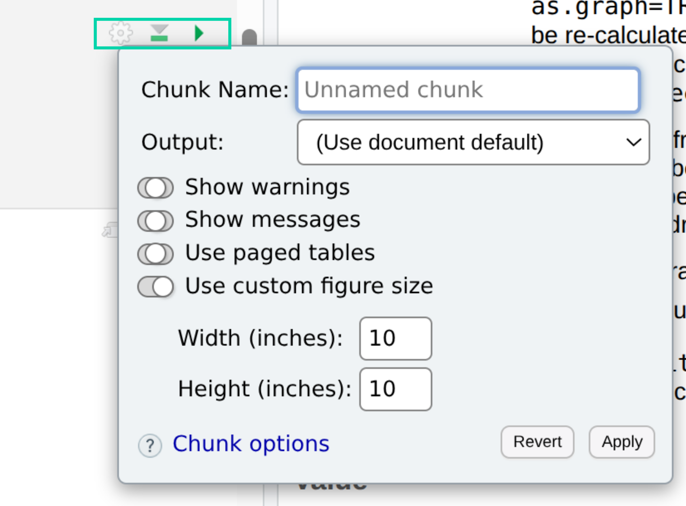

# Part 4: Multiple Sequence Alignment and Phylogeny {#sec-p4_msa_phylogeny}

::: {.callout-note .partmenu #parts-0504}
## Sections
- @sec-alignment
- @sec-phylogeny
- @sec-visualise_phylogeny
- @sec-summary_0504
:::

:::{.callout-tip .objectives #objectives-0504}
#### Learning objectives
By the end of this part of the practical you will be able to:

* Construct multiple sequence alignments of related sequences.
* Build phylogenetic trees
* Visualise phylogenetic trees.

:::

```{r read_fasta_again, include=FALSE, warning=FALSE}
library(ORFik)
library(tidyverse)
library(gt)
library(msa)
library(treeio)
library(ggtree)

identified_orf_df <- read_csv("output/identified_orfs.tsv")
identified_orf_seqs <- readAAStringSet("output/identified_orf_aa_seqs.fasta")
```

## Build multiple sequence alignments {#sec-alignment}

Now, for each retroviral gene, we have identified an ORF, its location and sequence, and have used BLASTp to identify its most similar known retroviral proteins and likely genus.

```{r show_orf_tab}
gt(identified_orf_df)
```


We can now align each gene sequence with the protein sequences of the same gene from other retroviruses  in a **multiple sequence alignment** and then build a **phylogeny** to see the evolutionary relationships between our sequences and their relatives.

To build these multiple sequence alignments, we first need to build `AAStringSet` objects for each gene, containing the ORF we identified for that gene along with the sequences of known retrovirus proteins from the same gene and genus, which we identified earlier using BLASTp.

I will take you through this process with one of my ORFs, `Ccan_ERV_1_ORF_4`, which is a `gag` gene from the `gamma` genus.

First, I will create an `AAStringSet` with just this one sequence.

```{r current_orf}
identified_current <- identified_orf_seqs["Ccan_ERV_1_ORF_4"]

print(identified_current)
```
Then, I will read file `output/Ccan_ERV_1_ORF_4.fasta`, generated earlier when I saved my BLAST output as a FASTA file, into a second `AAStringSet` with the `readAAStringSet()` function.

```{r current_refs}
refs_current <- readAAStringSet("output/Ccan_ERV_1_ORF_4_refs.fasta")
```

I can combine these two `AAStringSet`s using the `c` (concatenate) function.

```{r current_combined}
combined_current <- c(identified_current, refs_current)

print(combined_current)
```

Now I can generate a multiple sequence alignment for these sequences directly in R, using the `msa()` function. We will use the MSA tool [Muscle](https://pmc.ncbi.nlm.nih.gov/articles/PMC390337/).

`msa()` outputs a different type of variable (called a `MsaAAMultipleAlignment`), but we can convert it back to an `AAStringSet` with the `as()` function.


```{r align}
combined_current_aligned <- msa(combined_current, method = "Muscle")
combined_current_aligned_ss <- as(combined_current_aligned, "AAStringSet")
```
I will  save the aligned sequences into a new FASTA file, in my output directory, named as <code><span style="color: orange;">gene</span>\_Ccan\_ERV\_<span style="color: red;">j</span>\_ORF\_<span style="color: blue;">i</span>.fasta</code>, replacing <span style="color: orange;">gene</span> with the gene I am currently analysing (gag, pol or env), <span style="color: red;">j</span> with my ERV ID and <span style="color: blue;">i</span> with my ORF ID.

```{r save_alignment}
writeXStringSet(combined_current_aligned_ss, "output/gag_Ccan_ERV_1_ORF_4.fasta")
```

You can look at this file directly in a text editor, however it's quite difficult to see details of the alignment in this format. Alternatively, you can upload the sequence to an online alignment viewer, such as [Alignment Viewer](https://alignmentviewer.org/).

::: {.callout-note #note-alignment_ervs}
Retroviruses, especially endogenous retroviruses, are very divergent, so the sequences might not look to be particularly well aligned - don't worry, this is expected.
:::

::: {.callout-exercise #ex-build_msas}
Repeat the steps above for each of the ORF sequences in your `identified_orf_df` dataframe, so that you have one multiple sequence alignment for each gene.

Save all of the alignments in your output directory in FASTA format as <code><span style="color: orange;">gene</span>\_Ccan\_ERV\_<span style="color: red;">j</span>\_ORF\_<span style="color: blue;">i</span>.fasta</code>, replacing <span style="color: orange;">gene</span> with the gene you are currently analysing (gag, pol or env), <span style="color: red;">j</span> with your ERV ID and <span style="color: blue;">i</span> with your ORF ID.

:::

## Build phylogenies {#sec-phylogeny}

There are various ways we can create phylogenies from our sequences, including directly inside R. However, in R the options for tree-building algorithms are quite limited.

Instead, we can take our aligned sequences to an external web server to generate a phylogeny. Today we'll use the [IQTREE](https://www.hiv.lanl.gov/content/sequence/IQTREE/iqtree.html) web server.

IQTREE is a **maximum likelihood** approach to tree building which allows a specific **amino acid substitution** model to be specified.

Upload one of your multiple sequence alignments in the Input section.

{#fig-iqtree1}

In the Options section, choose an amino acid model, RtREV. We would ideally use the `find best and apply` option to find the best fitting model, however this takes a very long time to run. The RtREV model, based on a retrovirus specific amino acid substitution matrix, is a good compromise in this case.

Please also select `Simple midpoint` in the "Root tree" section, as we don't have a specific outgroup sequence in this case.

{#fig-iqtree2}

The default options are OK for our purposes for the other options, so choose **Submit**.

::: {.callout-note #note-alignment_warning}
You may see some warning messages that the sequence names in your phylogeny are not found in the alignment file - this is because IQTree replaces the `|` symbols in sequence names with `_` symbols, and is nothing to worry about.
:::

Once the tree-building algorithm has finished (this might take a couple of minutes), click on `Newick` in the results section - this will show your tree in [Newick format](https://en.wikipedia.org/wiki/Newick_format). Paste the text displayed on the next screen into an empty text file and save it in your `output` directory as <code><span style="color: orange;">gene</span>\_Ccan\_ERV\_<span style="color: red;">j</span>\_ORF\_<span style="color: blue;">i</span>.newick</code>, replacing <span style="color: orange;">gene</span> with the gene you are currently analysing (gag, pol or env), <span style="color: red;">j</span> with your ERV ID and <span style="color: blue;">i</span> with your ORF ID.

::: {.callout-exercise #ex-build_newick}
Repeat the steps above for each of the ORF sequences in your `identified_orf_df` dataframe, so that you have one Newick file for each gene. Save all of the alignments in NEWICK format with names formatted as above.

:::

## Visualise phylogenies {#sec-visualise_phylogeny}

Once the phylogenetic analyses are complete, we can then read our trees into R using the function `read.newick()`.

For example, for my `gag_Ccan_ERV_1_ORF_4.fasta` newick file:

```{r gag_gamma_newick}
current_newick <- read.newick("output/gag_Ccan_ERV_1_ORF_4.newick")
```

To visualise phylogenies in R, a good option is the `ggtree()` package, which works similarly to `ggplot()`.

First, we call the `ggtree()` function and give our new tree object as an argument.

```{r ggtree_basic}
ggtree(current_newick)
```
As you can see, this generates a basic tree, but the branch tips are not labelled.

To label them, we add the function `geom_tiplab()`. The `size` argument to `geom_tiplab()` sets the font size. As our tip labels are quite long, we also change the x axis limits to make some space.

::: {.callout-note #note-quarto_figsize}

Sometimes, the Quarto figure size will be too small to display your tree nicely, you can adjust this by clicking on the "Settings" button at the top of the code chunk and changing the `width` and `height` options.

{#fig-chunksize width="50%"}
:::

```{r fig.height=10, fig.width=10, warning=FALSE}
ggtree(current_newick) +
  geom_tiplab(size = 2) +
  coord_cartesian(xlim = c(0, 20))
```

You should be able to find your ERV gene in the phylogeny. However, it would be helpful to make it clearer, for example by changing the colour.

Here, we subset the tip labels to `label != "Ccan_ERV_1_ORF_4"` and `label == "Ccan_ERV_1_ORF_4"` and assign colours to each set. 

```{r ggtree_annotate, fig.width=10, fig.height=10, warning=FALSE}
ggtree(current_newick) +
  geom_tiplab(aes(subset = label != "Ccan_ERV_1_ORF_4"),
    color = "black", size = 2
  ) +
  geom_tiplab(aes(subset = label == "Ccan_ERV_1_ORF_4"),
    color = "red", size = 3
  ) +
  coord_cartesian(xlim = c(0, 20))
```

It's also good practice to add a scale bar to your tree. The scale bar represents evolutionary distance, in substitutions per site.

Change the x and y co-ordinates to move it around so it's not on top of your tree.

```{r ggtree_scale, fig.width=10, fig.height=10}
ggtree(current_newick) +
  geom_tiplab(aes(subset = label != "Ccan_ERV_1_ORF_4"),
    color = "black", size = 2
  ) +
  geom_tiplab(aes(subset = label == "Ccan_ERV_1_ORF_4"),
    color = "red", size = 3
  ) +
  coord_cartesian(xlim = c(0, 20)) +
  geom_treescale(x = 0, y = 0, fontsize = 3)
```

You can save your tree as a pdf using ggsave, again you may need to adjust the width and height to fit it nicely on the page, you can do this with the `width` and `height` arguments.

```{r save_tree, fig.width=10, fig.height=10}
tree_plot <- ggtree(current_newick) +
  geom_tiplab(aes(subset = label != "Ccan_ERV_1_ORF_4"),
    color = "black", size = 2
  ) +
  geom_tiplab(aes(subset = label == "Ccan_ERV_1_ORF_4"),
    color = "red", size = 3
  ) +
  coord_cartesian(xlim = c(0, 20)) +
  geom_treescale(x = 0, y = 0, fontsize = 3)

ggsave(
  "output/Ccan_ERV_1_ORF_4.pdf",
  plot=tree_plot,
  width = 10,
  height = 10
)
```

::: {.callout-exercise #ex-draw_trees}
Repeat the steps above for each of the ORF sequences in your `identified_orf_df` dataframe, so that you have one PDF tree for each gene.

Save all of the trees as PDFs in your output directory as <code><span style="color: orange;">gene</span>\_Ccan\_ERV\_<span style="color: red;">j</span>\_ORF\_<span style="color: blue;">i</span>.pdf</code>, replacing <span style="color: orange;">gene</span> with the gene you are currently analysing (gag, pol or env), <span style="color: red;">j</span> with your ERV ID and <span style="color: blue;">i</span> with your ORF ID.

:::

## Review {#sec-summary_0504}

::: {.callout-note #note-summary_0504}

### Summary

You have:

* `DNAStringSet` and `AAStringSet` objects can be concatenated with the `c()` function
* The `msa` function can be used to generate multiple sequence alignments from sets of biologist sequences.
* The IQ-TREE web server is a good way to construct maximum-likelihood phylogenies.
* `ggtree` is used to visualise and annotate phylogenetic trees.

:::

Remember to save your work before moving on to Part 5. As we're now finished with our main analysis, you can push your changes to GitHub.


