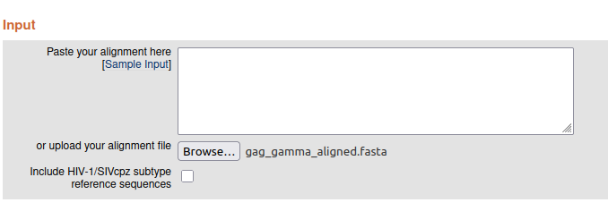
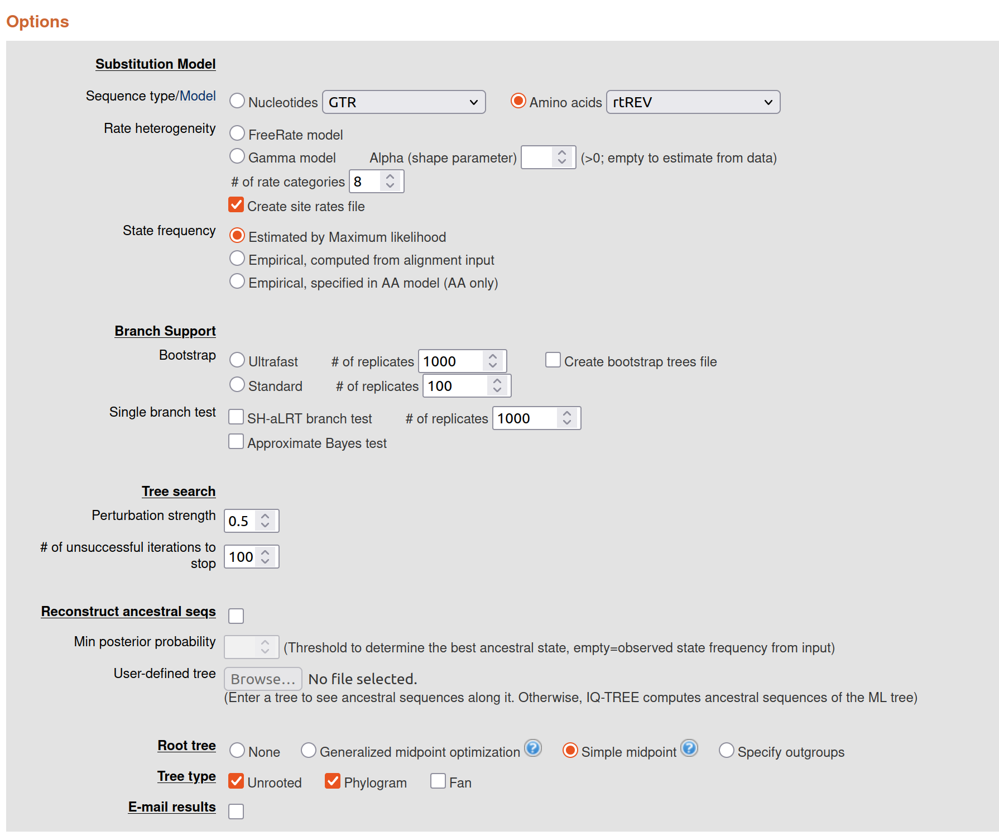

# Part 4: Multiple Sequence Alignment and Phylogeny {#sec-p4_msa_phylogeny}

::: {.callout-note .partmenu}
## Sections
- @sec-run_blast
- @sec-blast_results
- @sec-process_blast
- @sec-summary_0503
:::

:::{.callout-tip .objectives}
#### Learning objectives
By the end of this part of the practical you will be able to:

* Use BLASTp to find proteins related to a sequence of interest.
* Interpret the results of a BLAST search.
* Extract and organise information from BLAST results.

:::

```{r read_fasta_again, include=FALSE}
library(ORFik)
library(tidyverse)
library(gt)
library(msa)
library(treeio)
library(ggtree)

blast_longest <- read_csv("data/longest_orfs.tsv")
long_orfs <- readAAStringSet("data/long_orf_aa_seqs.fasta")
```

## Build multiple sequence alignments {#sec-alignment}

```{r show_orf_tab, echo=FALSE}
gt(blast_longest)
```

Now, for each retroviral gene, we have the location, sequence and genus of the longest related ORF in our ERV region. 

We can now align each gene sequence with other retrovirus proteins in a **multiple sequence alignment** and then build a **phylogeny** to see the evolutionary relationships between our sequences and their relatives.

To build these multiple sequence alignments, we first need to build `DNAStringSet` objects for each gene, containing the longest ORF we identified for that gene along with the sequences of known retrovirus proteins from the same gene and genus. 

Subsets of reference sequence proteins for each combination of gene and genus are available in the `data/subsets` folder. You will need the files for whichever combinations of gene and genus you found in your ERV region - in my case `gag_gamma`, `pol_gamma` and `env_gamma`.

I will take you through this process with one of my ORFs, `ORF_4`, which is a `gag` gene from the `gamma` genus.

First, I will first create an `AAStringSet` with just this one sequence.

```{r gag_gamma}
gag_gamma <- long_orfs['ORF_4']

print (gag_gamma)
```
Then, I will read file `data/subsets/gag_gamma.fasta` into a second `AAStringSet` with the `readAAStringSet()` function.

```{r gag_gamma_refs}
gag_gamma_refs <- readAAStringSet("output/gag.fasta")
```

I can combine these two `AAStringSet`s using the `c` (concatenate) function.

```{r gag_gamma_combined}
gag_gamma_combined <- c(gag_gamma, gag_gamma_refs)
```

Now I can generate a multiple sequence alignment for these sequences directly in R, using the `msa()` function. We will use the MSA tool [Muscle](https://pmc.ncbi.nlm.nih.gov/articles/PMC390337/).  `msa()` outputs a different type of variable (called a `MsaAAMultipleAlignment`), but we can convert it back to an `AAStringSet` with the `as()` function.


```{r align}
gag_gamma_aligned <- msa(gag_gamma_combined, method = "Muscle")
gag_gamma_aligned_ss <- as(gag_gamma_aligned, "AAStringSet")
```
Now I can save the aligned sequences into a new FASTA file.

```{r save_alignment}
writeXStringSet(gag_gamma_aligned_ss, "data/gag_gamma_aligned.fasta")
```

You can look at this file directly in a text editor, however it's quite difficult to see details of the alignment in this format. Alternatively, you can upload the sequence to an online alignment viewer, such as https://alignmentviewer.org/.

::: {.callout-note}
Retroviruses, especially endogenous retroviruses, are very divergent, so the sequences might not look to be particularly well aligned - don't worry, this is expected.
:::

::: {.callout-exercise #ex_build_msas}
Repeat the steps above for each of the ORF sequences in your `blast_longest` dataframe, so that you have one multiple sequence alignment for each gene. Save all of the alignments in FASTA format.

Make sure you use the correct **genus** for each gene, based on the `genus` column in your data frame.
:::

## Build phylogenies {#sec-phylogeny}

There are various ways we can create phylogenies from our sequences, including directly inside R. However, in R the options for tree-building algorithms are quite limited.

Instead, we can take our aligned sequences to an external web server to generate a phylogeny. Today we'll use the [IQTREE](https://www.hiv.lanl.gov/content/sequence/IQTREE/iqtree.html) web server.

IQTREE is a **maximum likelihood** approach to tree building which allows a specific **amino acid substitution** model to be specified.

Upload one of your multiple sequence alignments in the Input section.

{#fig-iqtree1}

In the Options section, choose an amino acid model, Blosum62. The ideal thing to do here would be to use the `find best and apply` option to find the best fitting model, however this takes a very long time to run. The Blosum62 model, based on the Blosum62 substitution matrix, is a good compromise between complexity and speed.

{#fig-iqtree2}

The default options are OK for our purposes for the other options, so choose **Submit**.

::: {.callout-note}
You may see some warning messages that the sequence names in your phylogeny are not found in the alignment file - this is because IQTree replaces the `|` symbols in sequence names with `_` symbols, and is nothing to worry about.
:::

Once the tree-building algorithm has finished (this might take a couple of minutes), click on `Newick` in the results section - this will show your tree in [Newick format](https://en.wikipedia.org/wiki/Newick_format). Paste the text displayed on the next screen into an empty text file and save it in your `output` directory as `gene_genus.newick`, replacing `gene` with the gene you are currently analysing and `genus` with the genus you are currently analysing.

Repeat this analysis for your MSA for each gene.

We can then read our trees into R using the function `read.newick()`.

For example, for my gag_gamma newick file:

```{r gag_gamma_newick}
gag_gamma <- read.newick('output/gag_gamma.newick')
```

## Visualise phylogenies

To visualise phylogenies in R, a good option is the `ggtree()` package, which works similarly to `ggplot()`.

First, we call the `ggtree()` function and give our new tree object as an argument.

```{r ggtree}
ggtree(gag_gamma)
```
As you can see, this generates a basic tree, but the branch tips are not labelled.

To label them, we add the function `geom_tiplab()`.

```{r ggtree}
ggtree(gag_gamma) +
  geom_tiplab()
```
This presentation isn't ideal.

```{r ggtree2}
ggtree(gag_gamma, layout='circular') +
  geom_tiplab(size=2)
```

::: {.callout-note}

### Summary

:::

Remember to save your work before moving on to Part 4.


