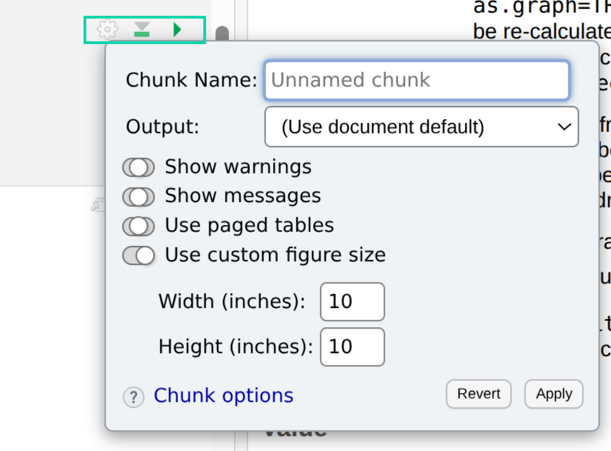

# Part 4: Multiple Sequence Alignment and Phylogeny {#sec-p4_msa_phylogeny}

::: {.callout-note .partmenu #parts-0504}
## Sections
- @sec-alignment
- @sec-phylogeny
- @sec-visualise_phylogeny
- @sec-summary_0504
:::

:::{.callout-tip .objectives #objectives-0504}
#### Learning objectives
By the end of this part of the practical you will be able to:

* Construct multiple sequence alignments of related sequences.
* Build phylogenetic trees.
* Visualise phylogenetic trees.

:::

```{r read_fasta_again, include=FALSE, warning=FALSE}
library(ORFik)
library(tidyverse)
library(gt)
library(msa)
library(ggtree)
library(ape)
library(DECIPHER)
library(treeio)
identified_orf_df <- read_csv("output/identified_orfs.csv")
identified_orf_seqs <- readAAStringSet("output/identified_orf_aa_seqs.fasta")
```

## Build multiple sequence alignments {#sec-alignment .core}

[**Core**]{.core-text}

[↑ top](#)

Now, for each retroviral gene, we have identified an ORF, its location and sequence, and have used BLASTp to identify its most similar known retroviral proteins and likely genus.

```{r show_orf_tab}
gt(identified_orf_df)
```


We can now align each gene sequence with the protein sequences of the same gene from other retroviruses  in a **multiple sequence alignment** and then build a **phylogeny** to see the evolutionary relationships between our sequences and their relatives.

To build these multiple sequence alignments, we first need to build `AAStringSet` objects for each gene, containing the ORF we identified for that gene along with the sequences of known retrovirus proteins from the same gene and genus, which we identified earlier using BLASTp.

I will take you through this process with one of my ORFs, `Ccan_ERV_1_ORF_4`, which is a `gag` gene from the `gamma` genus.

First, I will create an `AAStringSet` with just this one sequence.

```{r current_orf}
identified_current <- identified_orf_seqs["Ccan_ERV_1_ORF_4"]

print(identified_current)
```

Then, I will read the file `output/Ccan_ERV_1_ORF_4_refs.fasta`, generated earlier when I saved my BLAST output as a FASTA file, into a second `AAStringSet` with the `readAAStringSet()` function.

```{r current_refs}
refs_current <- readAAStringSet("output/Ccan_ERV_1_ORF_4_refs.fasta")
```

I can combine these two `AAStringSet`s using the `c` (concatenate) function.

```{r current_combined}
combined_current <- c(identified_current, refs_current)

print(combined_current)
```

Now I can generate a multiple sequence alignment for these sequences directly in R, using the `msa()` function. We will use the MSA tool [Muscle](https://pmc.ncbi.nlm.nih.gov/articles/PMC390337/).

`msa()` outputs a different type of variable (called a `MsaAAMultipleAlignment`), but we can convert it back to an `AAStringSet` with the `as()` function.


```{r align}
combined_current_aligned <- msa(combined_current, method = "Muscle")
combined_current_aligned_ss <- as(combined_current_aligned, "AAStringSet")
```

I will save the aligned sequences into a new FASTA file, in my output directory, named <code>[gene]{.orange-text}\_Ccan\_[ERV\_j]{.red-text}\_ORF\_[i]{.green-text}.fasta</code>, replacing <code>[gene]{.orange-text}</code> with the gene I am currently analysing (**gag**, **pol** or **env**), <code>[ERV_j]{.red-text}</code> with my ERV ID and <code>[i]{.green-text}</code> with my ORF ID.

```{r save_alignment}
writeXStringSet(combined_current_aligned_ss, "output/gag_Ccan_ERV_1_ORF_4.fasta")
```

You can look at this file directly in a text editor, however it's quite difficult to see details of the alignment in this format. Alternatively, you can upload the sequence to an online alignment viewer, such as [Alignment Viewer](https://alignmentviewer.org/).

::: {.callout-note #note-alignment_ervs}
Retroviruses, especially endogenous retroviruses, are very divergent, so the sequences might not look to be particularly well aligned - don't worry, this is expected.
:::

::: {.callout-exercise #ex-build_msas .core}

### Generate multiple sequence alignments

[**Core**]{.core-text}

Repeat the steps above for each of the three ORF sequences in your `identified_orf_df` data frame, so that you have one multiple sequence alignment for each gene.

* Create an `AAStringSet` with the single ORF sequence.
* Create a second `AAStringSet` based on the BLAST output for the same ORF sequence.
* Concatenate the two using `c()`
* Align using `msa()`.
* Convert back to `AAStringSet` format using `as()`.
* Save using `writeXStringSet()`.

Save all of the alignments in your output directory in FASTA format as <code>[gene]{.orange-text}\_Ccan\_[ERV\_j]{.red-text}\_ORF\_[i]{.green-text}.fasta</code>, replacing <code>[gene]{.orange-text}</code> with the gene you are currently analysing (**gag**, **pol** or **env**), <code>[ERV_j]{.red-text}</code> with your ERV ID and <code>[i]{.green-text}</code> with your ORF ID.

:::

## Build phylogenies {#sec-phylogeny .core}

[**Core**]{.core-text}

[↑ top](#)

There are various ways we can create phylogenies from our sequences. We will use a distance-based, neighbour-joining approach.

First, we create a distance matrix for our sequences, then we use the function `nj()` from the package `ape` to create a tree.

A distance matrix contains an estimate of the evolutionary distance between every pair of sequences in our alignment. Smaller distances indicate more similar sequences. The neighbour-joining method uses these distances to construct a tree in which more similar sequences tend to be grouped together.

I will again demonstrate this process with one of my ORFs, `Ccan_ERV_1_ORF_4`, which is a `gag` gene from the `gamma` genus. These are currently aligned with the related sequences we identified with BLAST and stored in my `combined_current_aligned_ss` variable.

First, I will read the relevant FASTA file. We use `readAAStringSet()` rather than `readDNAStringSet()` because our sequences are in amino acid format.

```{r read_fasta_aabin}
fasta_current <- readAAStringSet(
  "output/gag_Ccan_ERV_1_ORF_4.fasta")
```

Next, we make a distance matrix based on our aligned sequences, using the function `DistanceMatrix()`, with one argument, our new `fasta_current` variable.

```{r convert_aabin, message=FALSE}
distance_matrix <- DistanceMatrix(fasta_current)
```

Now, we're ready to make our neighbour-joining tree. This is very easy in R, just using the function `nj()`.

```{r make_tree}
tree <- nj(distance_matrix)
```

We can save it with the function `write.tree()`. The standard format for saving phylogenetic trees is called [Newick format](https://en.wikipedia.org/wiki/Newick_format) and has the suffix `.nwk`. 

```{r save_tree}
write.tree(tree, file = "output/gag_Ccan_ERV_1_ORF_4.nwk")
```

::: {.callout-exercise #ex-build_newick}

### Build phylogenetic trees

[**Core**]{.core-text}

Repeat the steps above for each of the ORF sequences in your `identified_orf_df` data frame, so that you have one Newick file for each gene.

* Read the amino acid alignment.
* Create a distance matrix.
* Build a neighbour-joining tree.
* Save the tree.

Save all of the trees in Newick format with names formatted as <code>[gene]{.orange-text}\_Ccan\_[ERV\_j]{.red-text}\_ORF\_[i]{.green-text}.nwk</code>, replacing <code>[gene]{.orange-text}</code> with the gene you are currently analysing (**gag**, **pol** or **env**), <code>[ERV_j]{.red-text}</code> with your ERV ID and <code>[i]{.green-text}</code> with your ORF ID.

:::


## Visualise phylogenies {#sec-visualise_phylogeny .core}

[**Core**]{.core-text}

[↑ top](#)

Once the phylogenetic analyses are complete, we can then read our trees into R using the function `read.newick()`.

For example, for my `output/gag_Ccan_ERV_1_ORF_4.nwk` Newick file:

```{r gag_gamma_newick}
current_newick <- read.newick("output/gag_Ccan_ERV_1_ORF_4.nwk")
```

To visualise phylogenies in R, a good option is the `ggtree()` package, which works similarly to `ggplot()`.

First, we call the `ggtree()` function and give our new tree object as an argument.

```{r ggtree_basic}
ggtree(current_newick)
```
As you can see, this generates a basic tree, but the branch tips are not labelled.

To label them, we add the function `geom_tiplab()`. The `size` argument to `geom_tiplab()` sets the font size. As our tip labels are quite long, we also change the x axis limits to make some space.

::: {.callout-note #note-quarto_figsize}

Sometimes, the Quarto figure size will be too small to display your tree nicely. You can adjust this by clicking on the "Settings" button at the top of the code chunk and changing the `width` and `height` options.

{#fig-chunksize width="50%"}
:::

```{r fig.height=10, fig.width=10, warning=FALSE}
ggtree(current_newick) +
  geom_tiplab(size = 2) +
  coord_cartesian(xlim = c(0, 20))
```

You should be able to find your ERV gene in the phylogeny. However, it would be helpful to make it clearer, for example by changing the colour.

Here, we subset the tip labels to `label != "Ccan_ERV_1_ORF_4"` and `label == "Ccan_ERV_1_ORF_4"` and assign colours to each set. 

```{r ggtree_annotate, fig.width=10, fig.height=10, warning=FALSE}
ggtree(current_newick) +
  geom_tiplab(aes(subset = label != "Ccan_ERV_1_ORF_4"),
    color = "black", size = 2
  ) +
  geom_tiplab(aes(subset = label == "Ccan_ERV_1_ORF_4"),
    color = "red", size = 3
  ) +
  coord_cartesian(xlim = c(0, 20))
```

It's also good practice to add a scale bar to your tree. The scale bar represents evolutionary distance, in substitutions per site.

Change the x and y co-ordinates to move it around so it's not displayed on top of your tree.

```{r ggtree_scale, fig.width=10, fig.height=10}
ggtree(current_newick) +
  geom_tiplab(aes(subset = label != "Ccan_ERV_1_ORF_4"),
    color = "black", size = 2
  ) +
  geom_tiplab(aes(subset = label == "Ccan_ERV_1_ORF_4"),
    color = "red", size = 3
  ) +
  coord_cartesian(xlim = c(0, 20)) +
  geom_treescale(x = 0, y = 0, fontsize = 3)
```

You can save your tree as a PDF using `ggsave()`, again you may need to adjust the width and height to fit it nicely on the page, you can do this with the `width` and `height` arguments.

```{r save_pdf_tree, fig.width=10, fig.height=10}
tree_plot <- ggtree(current_newick) +
  geom_tiplab(aes(subset = label != "Ccan_ERV_1_ORF_4"),
    color = "black", size = 2
  ) +
  geom_tiplab(aes(subset = label == "Ccan_ERV_1_ORF_4"),
    color = "red", size = 3
  ) +
  coord_cartesian(xlim = c(0, 20)) +
  geom_treescale(x = 0, y = 0, fontsize = 3)

ggsave(
  "output/gag_Ccan_ERV_1_ORF_4.pdf",
  plot=tree_plot,
  width = 10,
  height = 10
)
```

::: {.callout-exercise #ex-draw_trees .core}

### Visualise phylogenetic trees

[**Core**]{.core-text}

Repeat the steps above for each of the ORF sequences in your `identified_orf_df` data frame, so that you have one saved file for each gene.

* Read the tree into R using `read.newick()`.
* Plot the tree using `ggtree()`.
* Add tip labels.
* Adjust height and width.
* Identify your new ORF in red.
* Add a scale bar, move it so it doesn't overlap with the tree.
* Save as PDF.

Save all of the trees as PDFs in your output directory as <code>[gene]{.orange-text}\_Ccan\_[ERV\_j]{.red-text}\_ORF\_[i]{.green-text}.pdf</code>, replacing <code>[gene]{.orange-text}</code> with the gene you are currently analysing (**gag**, **pol** or **env**), <code>[ERV\_j]{.red-text}</code> with your ERV ID and <code>[i]{.green-text}</code> with your ORF ID.

:::

::: {.callout-exercise #ex-compare_phylogenies .core}

### Compare your phylogenies

[**Core**]{.core-text}

Compare the phylogenetic trees you generated for **gag**, **pol** and **env**.

Do your ERV sequences appear most closely related to the same retroviruses in all three trees? If not, what biological processes might explain why different retroviral genes show different relationships?

:::

## Review {#sec-summary_0504}

[↑ top](#)

::: {.callout-note #note-summary_0504}

### Summary

You have now completed the first ever phylogenetic analysis for your ORFs!

* Multiple sequence alignments arrange related sequences so that homologous positions are aligned.
* The `msa()` function can be used to generate multiple sequence alignments from sets of biological sequences.
* We can create a distance matrix for our sequences using `DistanceMatrix()`.
* The `nj()` function can be used to construct a neighbour-joining phylogenetic tree from a distance matrix.
* Phylogenetic trees can be saved in Newick format using `write.tree()`.
* `ggtree` can be used to visualise and annotate phylogenetic trees.

:::

Remember to save your work before moving on to Part 5. As we're now finished with our main analysis, you can push your changes to GitHub.


