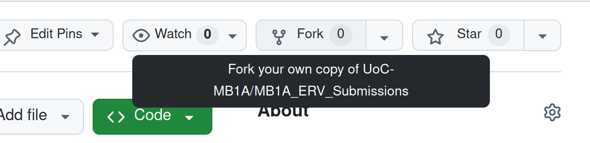
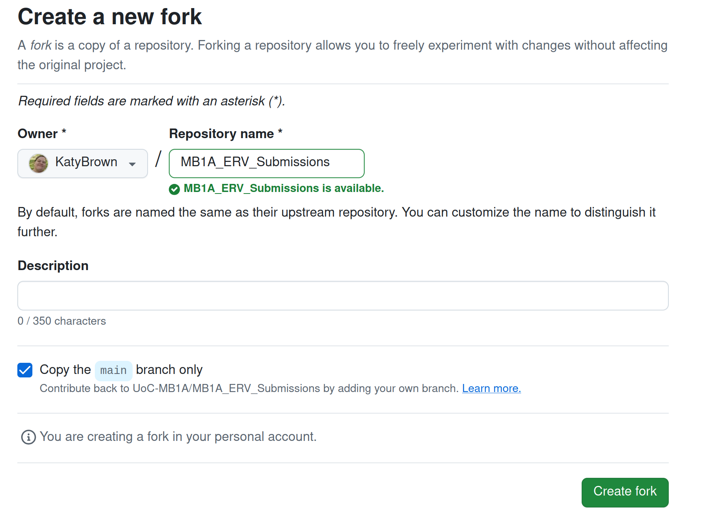
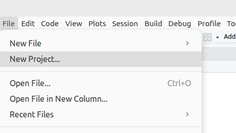
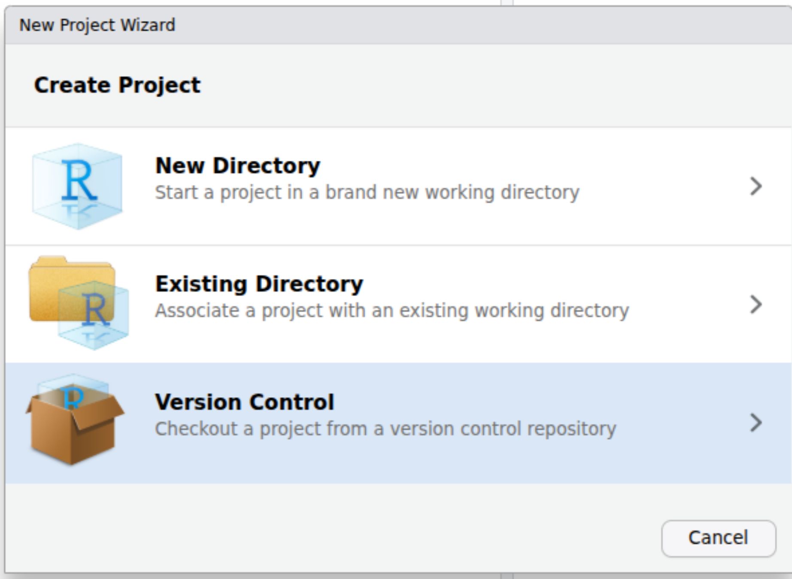
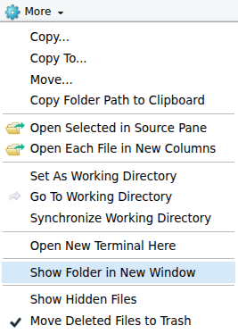
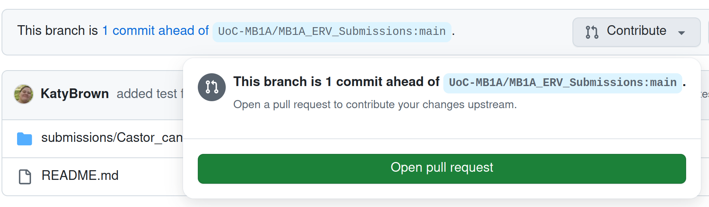
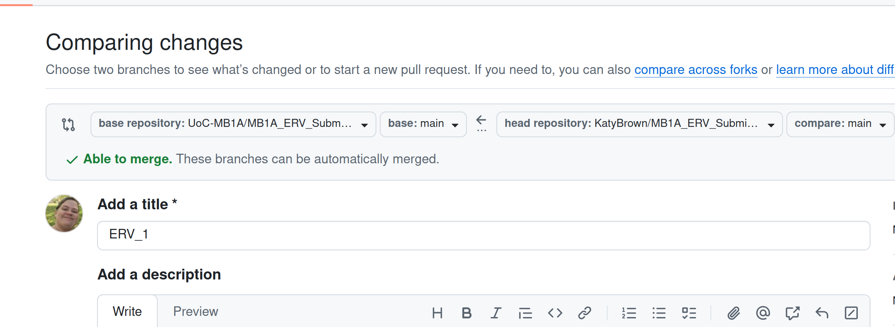

# Part 5: Share your results {#sec-p5_share_results}

::: {.callout-note .partmenu #parts-0505}
## Sections

- @sec-fork_ervs
- @sec-clone_ervs
- @sec-transfer_ervs
- @sec-push_ervs
- @sec-pull_request_ervs

:::

:::{.callout-tip .objectives #objectives-0505}

#### Learning objectives
By the end of this part of the practical you will have:

* Forked the MB1A_ERV_Submissions GitHub repository.
* Cloned your fork onto your computer using RStudio.
* Transferred your final results and analysis pipeline to the submission repository.
* Pushed your results to your GitHub fork.
* Created a Pull Request to contribute your results to the central MB1A_ERV_Submissions repository

:::

Now you're ready to share your results with the research community.

To do this, we'll copy our main output files into a second GitHub repository, linked to an online database. This is a separate repository from the `MB1A_Students_2026_2027` repository you usually use.

## Fork GitHub Repository {#sec-fork_ervs}

While logged in to your GitHub account in a web browser, navigate to the [ERV Submissions](https://github.com/UoC-MB1A/MB1A_ERV_Submissions) folder.

Click on the `Fork` button on your GitHub browser page.

{#fig-fork .screenshot width="100%"}

On the next page, you should see the following:

{#fig-newfork .screenshot width="100%"}

The default settings are fine for our purposes, choose `Create Fork`.

## Clone GitHub Repository {#sec-clone_ervs}

Now we want to import our new fork of the Git repository into RStudio.

To do this, in your RStudio session, select `File` > `New Project`.

{#fig-newrstudio .screenshot}

In the window which pops up, choose `Version Control`.

{#fig-newrstudio_vc width="70%"}

In the window which pops up, choose `Version Control`.

{#fig-newrstudio_vc width="70%"}

Select `Git - Clone a project from a Git repository`.

{#fig-new_rstudio_fromgit width="70%"}

Copy and paste the URL of your forked repository into the `Repository URL` box.

::: {.callout-important #note-use_fork_ervs}
Make sure you are using the URL for your forked repository, not the original! Your username should be in the URL. .
:::

The rest of the boxes should fill in automatically.

Click `Create Project`.

RStudio will download a copy of your repository (known as a **clone**) and open it as a new project.

## Transfer files {#sec-transfer_ervs}

You should now have two RStudio projects in different folders.

* Your `MB1A_Students_2026_2027` project, where you performed your analysis.
* Your `MB1A_ERV_Submissions` project, which you have just cloned from your GitHub fork.

You will now copy the final results of your analysis from the first project into the second.

To see where the new folder is saved on your computer, go to the `Files` - the bottom right corner of the RStudio interface. You may need to click on the `Files` tab.

Click on `More` then `Show Folder in a New Window`

{#fig-find_proj_folder .screenshot}

The `submission` subfolder inside this folder contains a folder for beaver ERV submissions, named `Castor_canadensis`. Inside this folder there is a subfolder for each ERV ID.

In your computer file system, navigate to the folder for your specific ERV ID.

From the folder where you were working earlier, the `MB1A_Practicals_2026_2027/materials/Practical_5_Bioinformatics` folder, copy the following from your `output` into the new repository folder for your specific ERV ID:

::: {.callout.important #note-copy_erv_output}
Do not copy the entire output folder. Only copy the files listed below.
:::

* Your `identified_orfs.tsv` data frame file.
* Your `identified_orf_aa_seqs.fasta` FASTA file.
* The multiple sequence alignment FASTA files for your identified retroviral ORFs.
* The Newick tree files for your identified retroviral ORFs.
* The PDF tree files for your identified retroviral ORFs.

From your main Practical_5 directory, please also copy:

* The Quarto document containing your analysis pipeline.

## Push changes to GitHub  {#sec-push_ervs}

In the `Git` panel in Rstudio, push your changes as usual:
1. Open the `Git` tab in RStudio.
2. Tick the files you have added to your submission.
3. Click `Commit` and write a short message describing your changes.
4. Click `Push` to save the changes to GitHub.
5. Visit your fork on your GitHub account and check that your changes are there.

## Make a pull request  {#sec-pull_request_ervs}

For this practical we have one extra step, as we want to import your results into the central submissions repository. 

To do this, you can make a "Pull Request". A Pull Request allows you to propose changes to another repository - in this case the central submissions repository, rather than your forked copy.

In this case, you will use a Pull Request to ask the owners of the central repository to include your results. Your results will be reviewed before they are added.

To make a pull request, Navigate to your fork on your GitHub account in your browser.

Click on the "Contribute" button then "Open pull request".

{#fig-pull_request}
Use your ERV ID as a title for your pull request, you don't need to add a description.

{#fig-pull_request_title}
Click the "Create pull request" button.

## Review {#sec-summary_0505}

[↑ top](#)

::: {.callout-note #note-summary_0505}

### Summary

You have now completed a full bioinformatics analysis of a putative endogenous retrovirus in the North American beaver genome, from identifying potential retroviral genes to investigating their evolutionary relationships.

You have:

* Identified potential retroviral open reading frames in your ERV sequence.
* Used BLASTp to identify the most similar known retroviral proteins.
* Determined which retroviral genes and genera are represented in your ERV.
* Compared your sequences with related retroviral proteins using multiple sequence alignment.
* Investigated the evolutionary relationships between your ERV genes and related retroviruses using phylogenetic analysis.
* Shared your results, analysis pipeline and supporting files with the research community through the ERV submissions repository.

You have therefore contributed a new analysis to a growing public resource of mammalian endogenous retroviruses. Your results can now be reviewed, combined with those generated by other students, and used by researchers interested in the evolution and diversity of endogenous retroviruses.

:::

