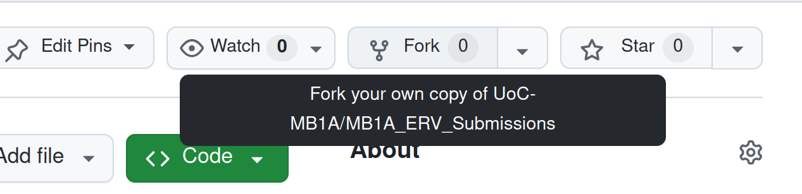
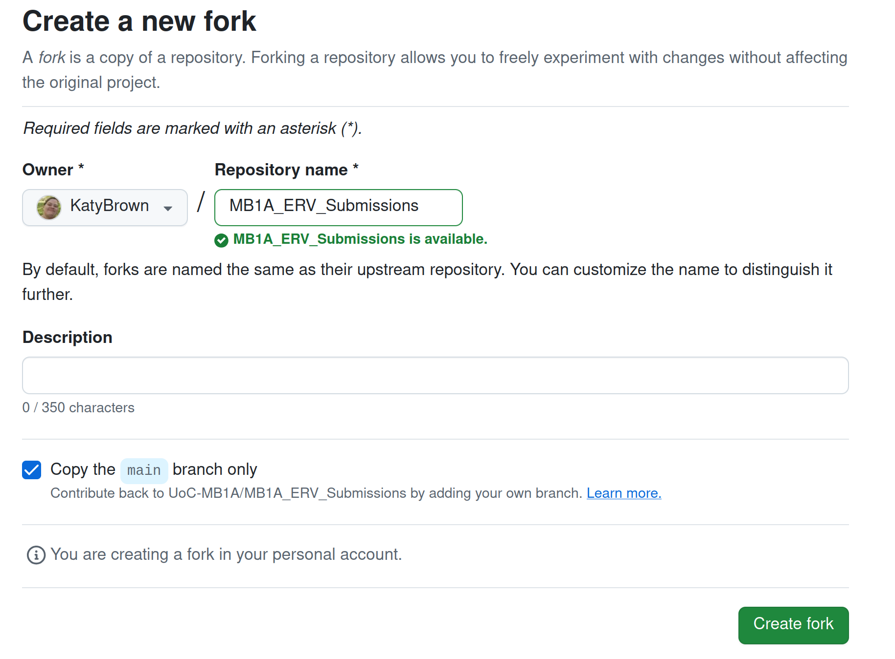
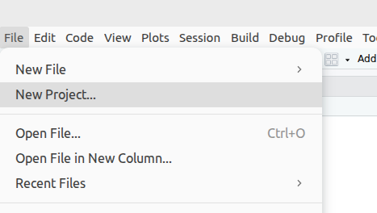
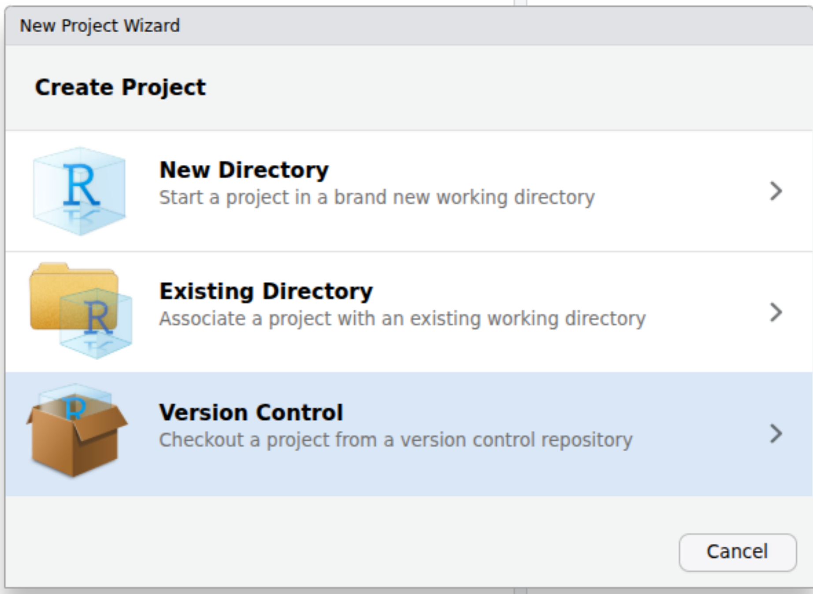
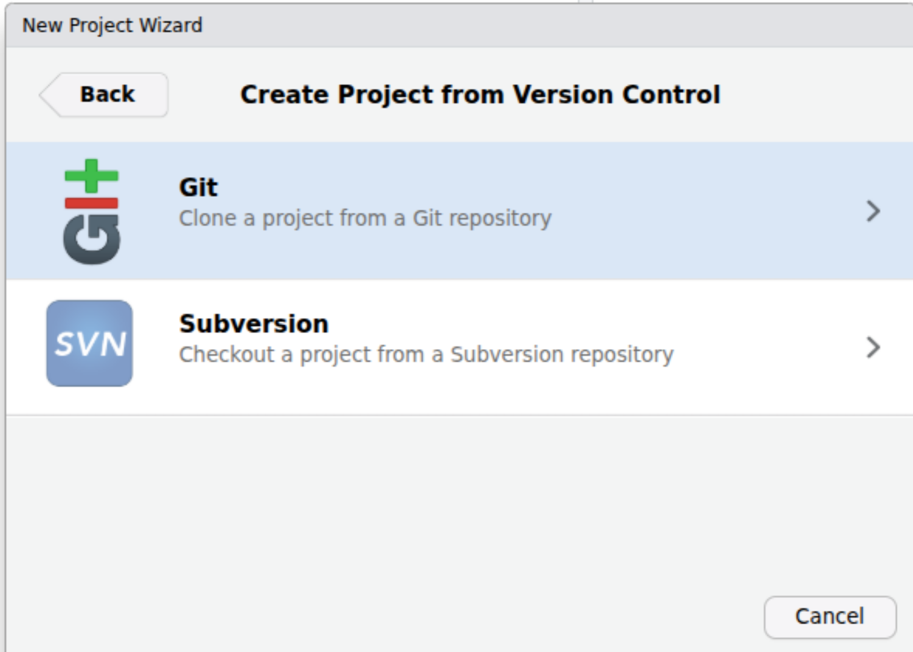
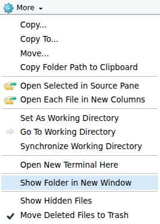
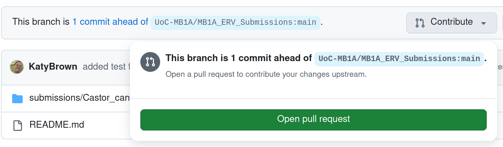
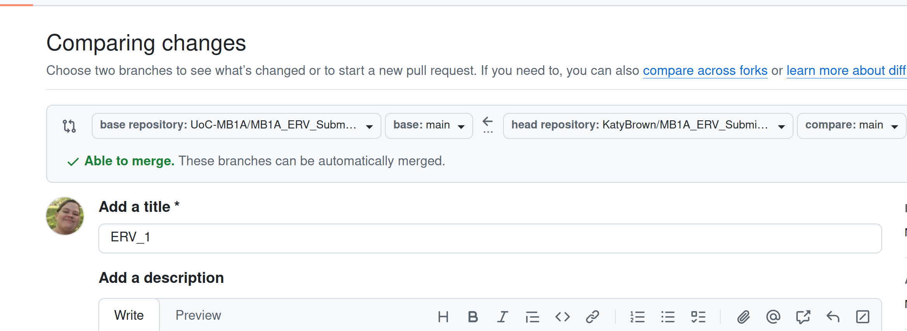

# Part 5: Share your results {#sec-p5_share_results}

::: {.callout-note .partmenu #parts-0505}
## Sections

- @sec-fork_ervs
- @sec-clone_ervs
- @sec-transfer_ervs
- @sec-push_ervs
- @sec-pull_request_ervs
- @sec-summary_0505
:::

:::{.callout-tip .objectives #objectives-0505}

#### Learning objectives
By the end of this part of the practical you will have:

* Forked the MB1A_ERV_Submissions GitHub repository.
* Cloned your fork onto your computer using RStudio.
* Transferred your final results and analysis pipeline to the submission repository.
* Pushed your results to your GitHub fork.
* Created a Pull Request to contribute your results to the central MB1A_ERV_Submissions repository

:::

Now you're ready to share your results with the research community.

To do this, we'll copy our main output files into a second GitHub repository, linked to an online database. This is a separate repository from the `MB1A_Students_2026_2027` repository you usually use.

## Fork GitHub Repository {#sec-fork_ervs .core}

[**Core**]{.core-text}

[↑ top](#)

While logged in to your GitHub account in a web browser, navigate to the [ERV Submissions](https://github.com/UoC-MB1A/MB1A_ERV_Submissions) repository.

Click on the `Fork` button on your GitHub browser page.

{#fig-fork .screenshot width="100%"}

On the next page, you should see the following:

{#fig-newfork .screenshot width="100%"}

The default settings are fine for our purposes, click `Create Fork`.

## Clone GitHub Repository {#sec-clone_ervs .core}

[**Core**]{.core-text}

[↑ top](#)

Now we want to import our new fork of the Git repository into RStudio.

To do this, in your RStudio session, select `File` > `New Project`.

{#fig-newrstudio .screenshot}

In the window which pops up, choose `Version Control`.

{#fig-newrstudio_vc width="70%"}

Select `Git - Clone a project from a Git repository`.

{#fig-new_rstudio_fromgit width="70%"}

On the GitHub page for your fork, click the green Code button and copy the HTTPS URL. Paste this into the `Repository URL` box.

::: {.callout-important #note-use_fork_ervs}
Make sure you are using the URL for your forked repository, not the original! Your username should be in the URL.
:::

The rest of the boxes should fill in automatically.

Click `Create Project`.

RStudio will download a copy of your repository (known as a **clone**) and open it as a new project.

## Transfer files {#sec-transfer_ervs .core}

[**Core**]{.core-text}

[↑ top](#)

You should now have two RStudio projects stored in different folders on your computer:

* Your `MB1A_Students_2026_2027` project, where you performed your analysis.
* Your `MB1A_ERV_Submissions` project, which you have just cloned from your GitHub fork.

You will now copy the final results of your analysis from the first project into the second.

First, find the `MB1A_ERV_Submissions` folder on your computer. In RStudio, open the `Files` tab in the bottom-right panel, click `More`, then select `Show Folder in New Window`.

{#fig-find_proj_folder .screenshot}

Inside the `MB1A_ERV_Submissions` folder, open the `submission` folder, then `Castor_canadensis`. Inside this folder, you will find a separate folder for each ERV ID.

Open the folder corresponding to **your ERV ID**.

Now find the folder containing the analysis you have been working on:

`MB1A_Students_2026_2027/Practical_5_Bioinformatics/output`

::: {.callout-important #note-copy_erv_output}
Do not copy the entire `output` folder. Only copy the files listed below.
:::

From the `output` folder, copy:

* `identified_orfs.csv`
* `identified_orf_aa_seqs.fasta`
* Your multiple sequence alignment FASTA files.
* Your Newick tree files.
* Your PDF tree files.

Paste these files into the folder for your ERV ID in `MB1A_ERV_Submissions`.

Finally, also copy your `beaver_ervs.qmd` file into the same folder.

## Push changes to GitHub {#sec-push_ervs .core}

[**Core**]{.core-text}

[↑ top](#)

Now commit and push your submission to your fork on GitHub, just as you have done throughout the practicals:

1. Open the `Git` tab in RStudio.
2. Tick the files you have added to stage them.
3. Click `Commit` and write a short message describing your changes.
4. Click `Push`.
5. Visit your fork on GitHub and check that your files are there.

## Make a pull request {#sec-pull_request_ervs .core}

[**Core**]{.core-text}

[↑ top](#)

Your results are now stored in **your fork** of the submissions repository. The final step is to submit them to the central `MB1A_ERV_Submissions` repository.

To do this, we will create a **pull request**. A pull request asks the owners of another GitHub repository to review changes you have made and, if appropriate, add them to their repository.

Navigate to your fork of `MB1A_ERV_Submissions` on GitHub.

Click `Contribute`, then `Open pull request`.

{#fig-pull_request}

Use your ERV ID as the title of your pull request. You don't need to add a description.

{#fig-pull_request_title}

Check that the pull request contains only the files for your ERV, then click `Create pull request`.

::: {.callout-note}
Your results will not be added to the central repository immediately. We will review your pull request before merging it.
:::

## Review {#sec-summary_0505}

[↑ top](#)

::: {.callout-note #note-summary_0505}

### Summary

You have now completed a full bioinformatics analysis of a putative endogenous retrovirus in the North American beaver genome, from identifying potential retroviral genes to investigating their evolutionary relationships.

You have:

* Identified potential retroviral open reading frames in your ERV sequence.
* Used BLASTp to identify the most similar known retroviral proteins.
* Identified likely retroviral genes and genera represented in your ERV.
* Compared your sequences with related retroviral proteins using multiple sequence alignment.
* Investigated the evolutionary relationships between your ERV genes and related retroviruses using phylogenetic analysis.
* Shared your results, analysis pipeline and supporting files with the research community through the ERV submissions repository.

You have therefore contributed a new analysis to a growing public resource of mammalian endogenous retroviruses. Your results can now be reviewed, combined with those generated by other students, and used by researchers interested in the evolution and diversity of endogenous retroviruses.

:::

