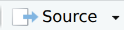

# Installation {#sec-install}

## Installing R and RStudio {#sec-install_r}

Prior to the practicals, you need to install two pieces of software on your computer - 
R, a programming language, and RStudio, which acts as a graphical interface for R.

Please try to do this, following the instructions below, before the first practical.

You will need:
- R - at least version 4.6.1 (2026-06-24)
- RStudio - at least version 2026.06.0


::: {.panel-tabset group="os"}
#### Windows 10/11

You can install R and RStudio using `winget`. Click the Windows key and search for *Windows PowerShell*, right-click on the app and choose **Run as administrator**. Then run the following commands:

``` powershell
winget install --id=RProject.R -e
winget install --id=RProject.Rtools -e
winget install --id=Posit.RStudio -e
```

Alternatively, you can manually download and install these programs using default options:

- [R](https://cran.r-project.org/bin/windows/base/release.html)
- [RTools](https://cran.r-project.org/bin/windows/Rtools/)
- [RStudio](https://www.rstudio.com/products/rstudio/download/#download)

#### macOS

To open a terminal, do one of the following:

- Click the Launchpad icon in the Dock, type Terminal in the search field, then click Terminal.

- In the Finder , open the /Applications/Utilities folder, then double-click Terminal.

Once you open a Terminal window, you can execute commands and run tools.

## Xcode Command Line Tools

We recommend installing the Xcode Command Line Tools, which makes several useful software utilities available.

In your terminal, run:

``` bash
xcode-select --install
```

## Homebrew

On macOS the `brew` package manager is a popular choice for installing packages as a user.

First, make sure to install Xcode as instructed in the previous section. Then, in your terminal, run:

``` bash
/bin/bash -c "$(curl -fsSL https://raw.githubusercontent.com/Homebrew/install/HEAD/install.sh)"
```

Then run type the following command:

``` bash
uname -m
```
Your screen should either say `arm64` or `x86_64`.

If it says `arm64`, run the following two commands:

``` bash
echo 'eval "$(/opt/homebrew/bin/brew shellenv)"' >> ~/.zprofile
```

``` bash
eval "$(/opt/homebrew/bin/brew shellenv)"
```

If it says `x86_64`, run the following two commands instead:

``` bash
echo 'eval "$(/usr/local/bin/brew shellenv)"' >> ~/.zprofile
```

``` bash
eval "$(/usr/local/bin/brew shellenv)"
```

Test your `brew` installation by installing the `wget` utility, which is used to download files from the internet:

``` bash
brew install wget
```

You can now install R and RStudio using `brew`. In your terminal, run:

``` bash
brew install --cask r
brew install --cask rstudio
```

Alternatively, you can manually download and install these programs using default options:

- [R](https://cran.r-project.org/bin/macosx/)
- [RStudio](https://www.rstudio.com/products/rstudio/download/#download)

#### Linux

- Go to the [R installation](https://cran.r-project.org/bin/linux/) folder and look at the instructions for your distribution.
- Download the [RStudio](https://www.rstudio.com/products/rstudio/download/#download) installer for your distribution and install it using your package manager.
:::

## Installing Packages

Now that you have RStudio installed, please download <a href="install_packages.R" download>this file</a> and open it in RStudio using `File` > `Open File...`.

Run all of the code in the file by clicking the {.inline-icon} button.

Lots of text will appear in the **Console** section at the bottom of your screen while the packages are being installed. Don't worry — this is normal!

If you are asked:

```text
Update all/some/none? [a/s/n]:
```
press the `a` key and then **Enter**.

Installation may take a while (potentially up to 30 minutes). Most of the GitHub setup in the following section can be carried out in the meantime, if you like (as far as **Cloning a repository with RStudio**).

If a package cannot be installed, you may see a message such as:

```text
installation of package ‘x’ had non-zero exit status
```

There will usually be more information about the problem above this message in the Console. If you feel confident, you can search online for the error message and try to resolve the problem yourself. If this doesn't work, or you are unsure what to do, please bring your computer to the **Practical 0** session and we will help you.
